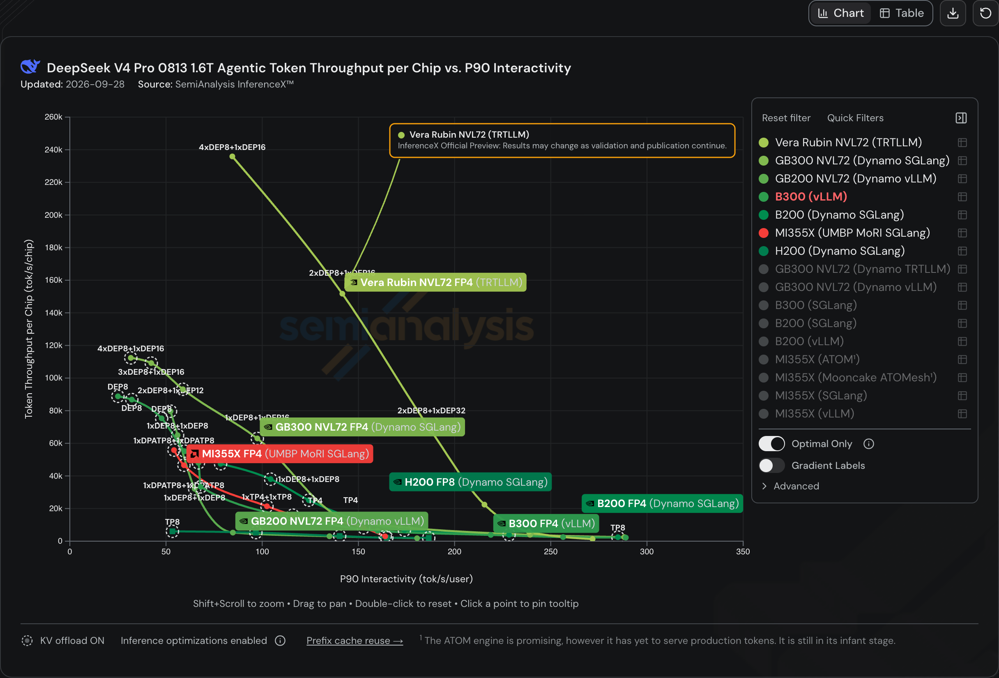
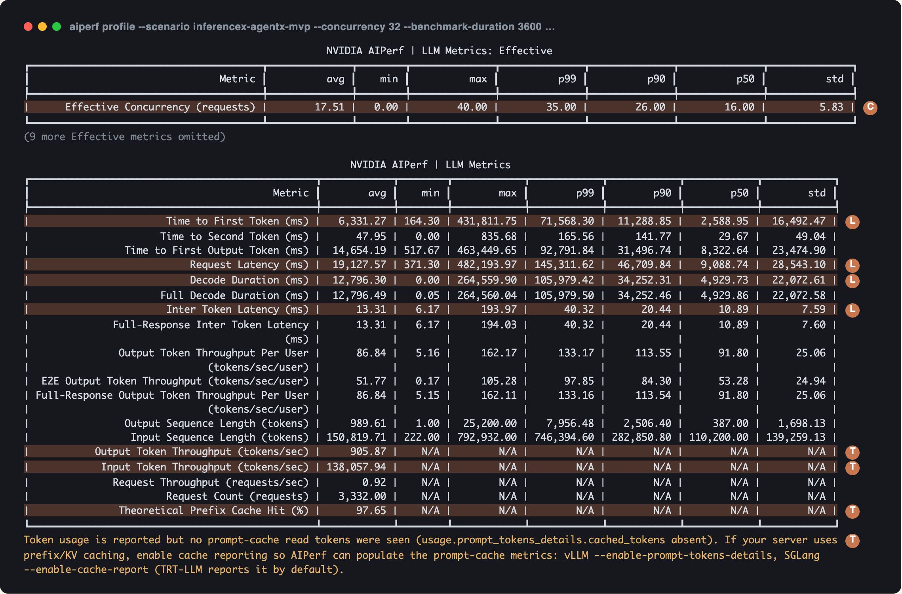
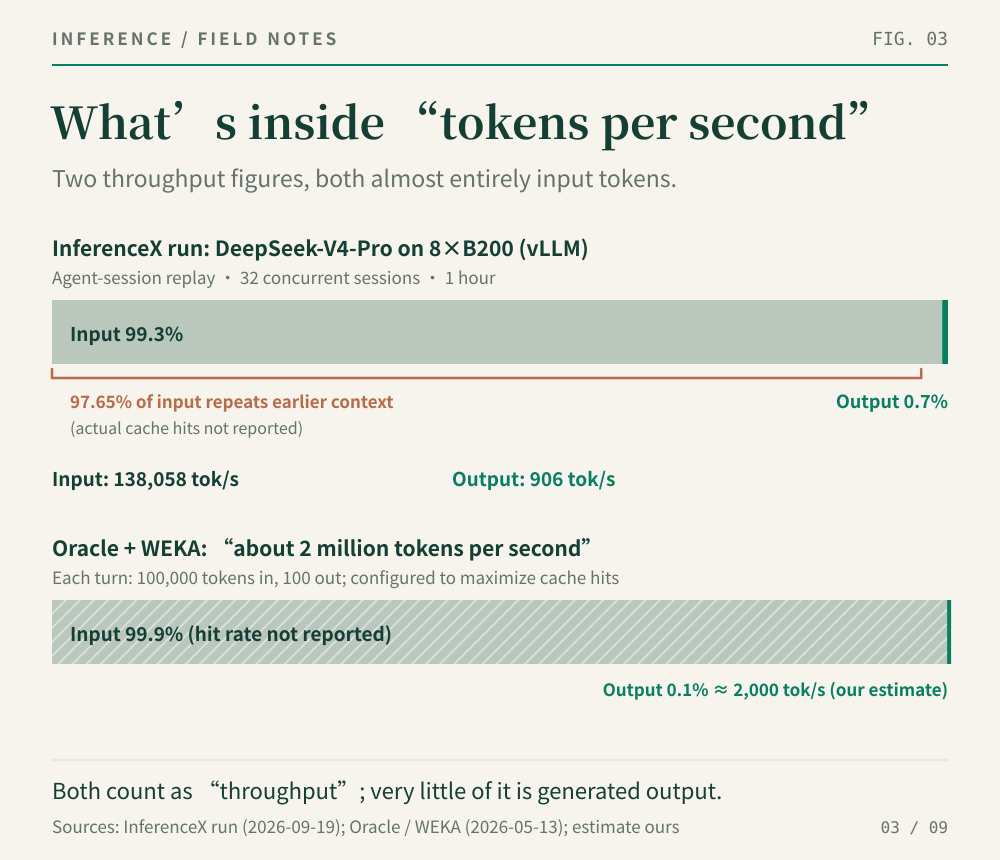
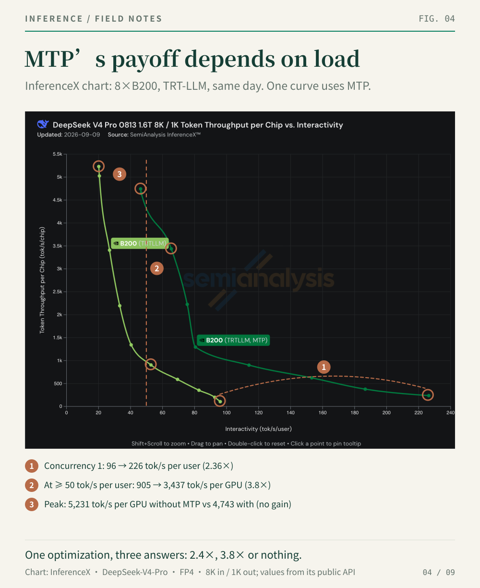
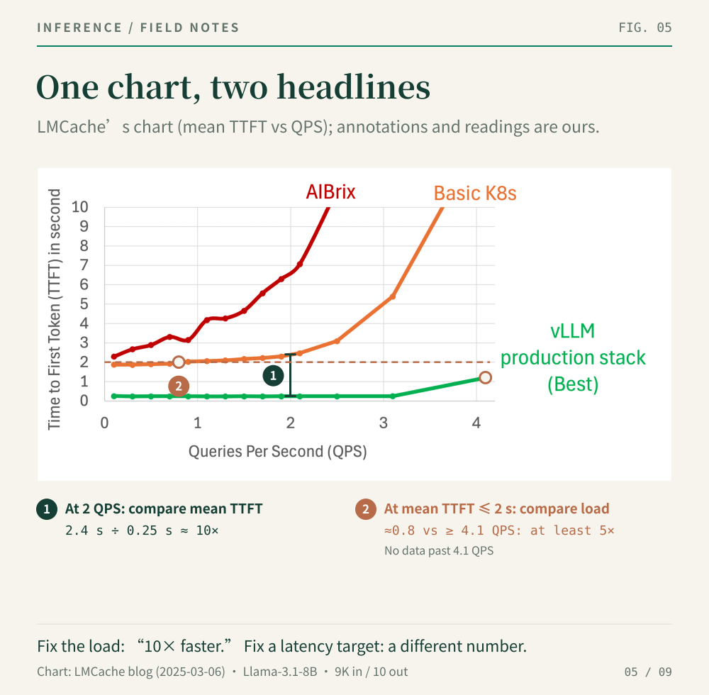
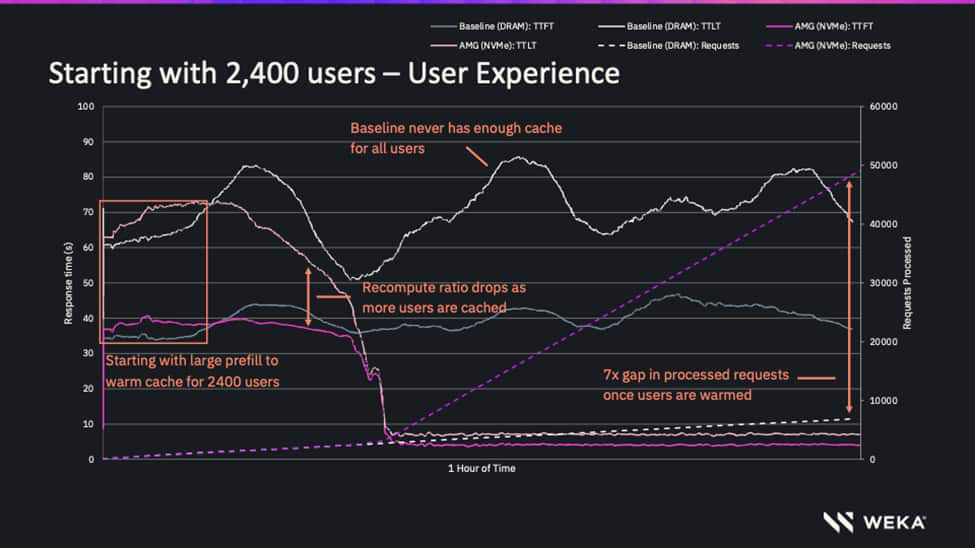
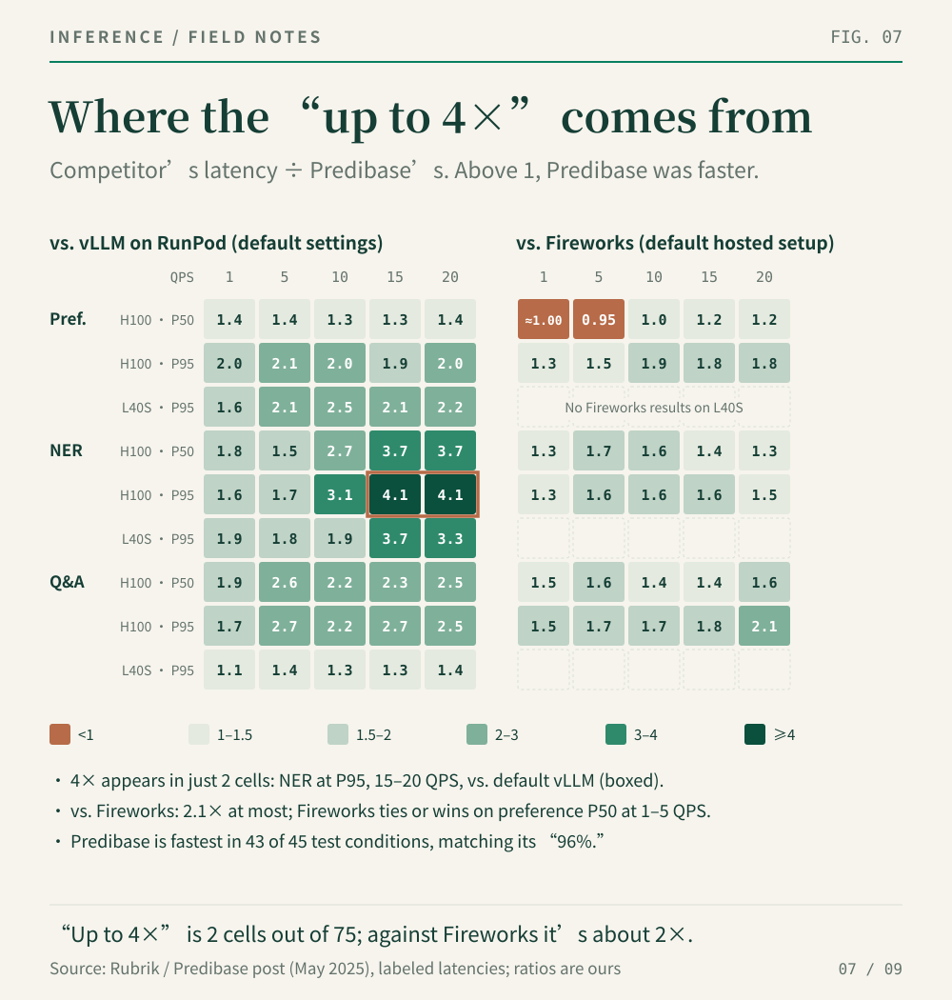
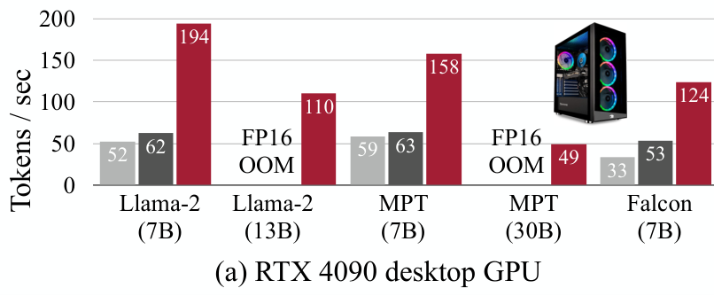
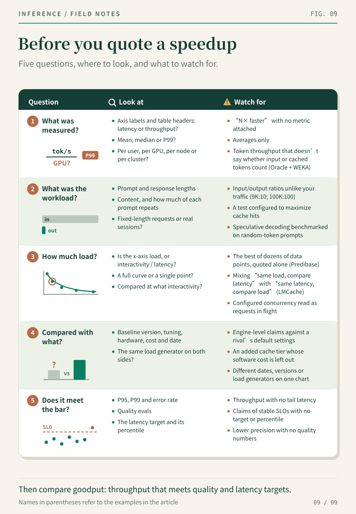

*How to read LLM inference benchmarks. Part 2 of our series on inference performance; Part 1 showed how one optimization can be "6.5× faster" and "2% slower" at the same time.*

## Summary

- Every inference performance number is a point on a curve that trades throughput per GPU against speed per user. A claim that doesn't say where on that curve it sits hasn't told you much.
- "Tokens per second" usually counts prompt tokens. In the agentic run we examined, prompts were more than 99% of all tokens processed.
- The concurrency you configure is not the load the server sees. A 32-session test averaged 17.5 requests in flight and peaked at 40.
- The same optimization can be 2.4× faster, 3.8× faster or no faster at all, depending on where you measure it.
- Before you trust a multiple, check the workload and the baseline. They explain most of the headline numbers we looked at.

## The problem

Inference performance claims are everywhere: 10× faster, 10× the throughput, up to 4× lower latency. Most of the ones we've read closely weren't wrong. They were incomplete. A benchmark result is really a table of conditions: model, hardware, software, prompt and response lengths, concurrency, latency percentiles, quality. A headline compresses that table into one number, and the conditions that got dropped are usually the ones that decide whether the number applies to you.

Two open projects have done a lot to put those conditions back. **AIPerf** is NVIDIA's open-source load generator for inference servers. It defines how each request is timed and summarized, and it keeps a record of every request it sends. **InferenceX** is an open benchmark run by SemiAnalysis. It publishes the model, hardware, software and test conditions behind every result, runs submissions under shared rules, and links each data point to the CI run that produced it. NVIDIA cites InferenceX data on its own blog, and AMD's MI355X is on its charts.

In this post we use both to build a way of reading benchmarks, then apply it to four public claims.

## Start with the curve

Batching is the central trade-off in LLM serving. Put more requests on a GPU at once and it does more total work, but each request gets a smaller share of it, so every user waits longer for each token. A serving system doesn't have a single speed. It has a curve.

InferenceX draws that curve directly. Figure 1 shows its results for DeepSeek-V4-Pro on its agentic workload.

*Figure 1 | InferenceX results for DeepSeek-V4-Pro on its agentic workload, updated 2026-09-28. [InferenceX](https://inferencex.semianalysis.com/inference)*

- **The y-axis is throughput per GPU**: input and output tokens per second for the whole deployment, divided by the number of GPUs it uses. This is how much work you get out of the hardware you're paying for.
- **The x-axis is interactivity**: once the first token arrives, how many output tokens per second each user receives. It's the inverse of time per output token (TPOT). InferenceX reports the P90 value, computed from the 90th-percentile inter-token latency, so about 90% of requests stream at least this fast.
- **Each point** is one configuration at one concurrency level. Labels like `TP8` (eight-way tensor parallelism) and `DEP8` (data-parallel attention with eight-way expert parallelism) describe how the model is split across GPUs; `2xDEP8+1xDEP16` means prompt processing and token generation run on separate groups of GPUs.
- **Each line** is a Pareto frontier: the points "for which no other measured point is better on both compared dimensions," in the words of the [InferenceX glossary](https://inferencex.semianalysis.com/glossary/pareto-frontier).

Up and to the right is better, and nobody gets to be up and to the right everywhere. The low-concurrency end of each line is fast for users and wasteful of GPUs; the high-concurrency end is the reverse. Which point matters depends on your service-level objective (SLO): the latency your product has to deliver, and at what percentile. The InferenceX glossary puts the consequence bluntly: "One maximum-throughput point cannot rank the complete system."

That gives us the first question to ask of any claim: **where on the curve was it measured?**

## Anatomy of a good measurement

To see what goes into a single point on that chart, take one public InferenceX run: DeepSeek-V4-Pro served by vLLM on eight NVIDIA B200 GPUs for one hour. AIPerf replayed a published set of real Claude Code sessions, keeping 32 sessions active at a time. The replay preserves each turn's prompt and response lengths, how much of each prompt repeats earlier context, and the pauses between requests; the prompt text itself is synthesized. The configs, logs and raw results are attached to the run on GitHub. Figure 2 is part of AIPerf's summary.

*Figure 2 | Part of AIPerf's console output for this run. Rows marked T concern tokens, L latency and C concurrency; the highlighting is ours. [Run record](https://github.com/SemiAnalysisAI/InferenceX/actions/runs/35434571418)*

Three things in this output are easy to miss and change how you read everything else.

### Input tokens dominate

The server processed about 138,000 input tokens per second and generated 906 output tokens per second (rows marked T). "This deployment handles 139,000 tokens per second" and "this deployment generates 906 tokens per second" are both true, and they describe very different machines from a buyer's point of view.

Agents are prompt-heavy by nature: every turn resends the conversation so far. AIPerf measures how much of that is repetition with a metric called Theoretical Prefix Cache Hit. Here it's 97.65%, meaning almost every input token had already been seen earlier in the session and could, with a big enough cache, be reused rather than recomputed. (How many were actually reused, we can't tell: the server didn't report cache hits, and AIPerf says so at the bottom of its output.)

This matters for any claim quoted in total tokens per second. Figure 3 puts our run next to a public claim we'll return to later, Oracle and WEKA's "about 2 million tokens per second."

*Figure 3 | Top: our example run. Bottom: the Oracle and WEKA workload, 100 output tokens for every 100,000 input tokens. The output rate for Oracle and WEKA is our estimate, assuming the headline counts input and output tokens together.*

### Configured concurrency is not load

We asked for 32 sessions. AIPerf's Effective Concurrency (row C) measures what the server actually saw: the number of requests in flight, averaged over time. It averaged 17.5, sat at 16 or below for half the hour, and peaked at 40.

Both deviations come from how agents behave. While an agent runs a tool and waits for the result, it isn't calling the model, so the server idles. And a main agent can launch several subagents at once, each sending its own requests, so a 32-session limit can put more than 32 requests on the server. If you size capacity from the concurrency setting alone, you'll be wrong in both directions.

### Split the tail

P99 latency is the threshold 99% of requests come in under. Here, median request latency was 9.1 seconds and P99 was 145 seconds (rows marked L). That tail has two possible sources: the wait for the first token (TTFT), and everything after it, which AIPerf reports as Decode Duration, the interval from the first streamed token to the last. One detail: this model runs with thinking enabled, and AIPerf's TTFT counts the first reasoning token. The first token of the visible answer is reported separately as Time to First Output Token, with a median of 8.3 seconds.

Both halves have long tails. Decode Duration's P99 is 106 seconds, and the explanation is simple: the 1% of requests with the longest decode had a median of more than 11,000 output tokens. TTFT's P99 is 72 seconds, and here the simple explanation fails. You'd guess the slowest first tokens came from the longest prompts. They didn't. The slowest 1% by TTFT had prompts of ordinary length, while the 1% with the longest prompts had a median TTFT of 2.7 seconds. The public data doesn't say what did cause the tail, but it does show why a single P99 isn't enough, and why per-request records are worth keeping.

### From requests to a point on the curve

Our run is in Figure 1's data set, although the B200 vLLM series is hidden in the default view. Its coordinates come straight from the AIPerf output:

| Run | Interactivity (P90, tok/s per user) | Throughput (tok/s per GPU) |
|---|---|---|
| 32 sessions | about 49 (1000 ÷ its 20.44 ms P90 inter-token latency) | about 17,000 |
| 64 sessions, same sweep | about 75 | about 35,000 |

The 64-session run beats it on both axes, so the 32-session run isn't on the frontier. That's the relationship between the two tools: AIPerf measures every request, and InferenceX turns each run into a point and keeps the ones worth keeping.

## One optimization, three answers

Here's what the curve does to a speedup claim. Figure 4 compares two InferenceX configurations: DeepSeek-V4-Pro on eight B200s, the same TensorRT-LLM container, measured the same day (June 12, 2026), with 8,000-token prompts and 1,000-token responses. One uses MTP (Multi-Token Prediction), a small module that ships with DeepSeek models and drafts extra tokens for speculative decoding. The other doesn't. Both sweep the same parallelism layouts.

*Figure 4 | InferenceX chart with our annotations. Light green: MTP off. Dark green: MTP on. For these fixed-length tests, the x-axis is median interactivity. Values under the chart come from the InferenceX API.*

How much faster is MTP? Pick a point:

- **One request at a time:** each user gets 226 tokens per second instead of 96. That's **2.36×**.
- **At a latency target** of at least 50 tokens per second per user (median): the best configuration without MTP delivers 905 tokens per second per GPU; the best with MTP delivers 3,437. That's **3.8×**, although part of it comes from MTP letting a more aggressive parallelism layout (DEP8) meet the target. Compare TP8 with TP8 and the gain is about 1.9×.
- **At peak throughput:** the best measured without MTP is 5,231 tokens per second per GPU, at concurrency 512, where users get about 20 tokens per second each. The best with MTP is 4,743, at concurrency 256, the highest it was tested. **No gain.**

All three are true. Speculative decoding spends spare GPU compute to generate and verify draft tokens. At low load that compute would otherwise sit idle, so users see much faster streaming. At high load there's nothing spare, and the extra work competes with ordinary decoding. If you run an interactive product, MTP is a big win. If you run offline batch jobs, this data gives you no reason to turn it on.

## Workload decides more than you'd think

The requests you test with shape the result as much as the system does, and speculative decoding is where that's easiest to see. A draft token is only useful if the main model accepts it, and acceptance depends on what's being written. The MTP comparison above uses InferenceX's fixed-length tests, which feed the model random tokens as prompts. A model continuing gibberish may accept drafts at a very different rate than one writing code or chat, so don't expect those multiples to carry over unchanged.

InferenceX has two responses. First, it has been moving its GPU time from fixed-length tests to replayed agent sessions like our example run. Its 1K/1K scenario is essentially retired, 8K/1K has been dropped for DeepSeek-V4-Pro and a few other models, and the site notes that "CI capacity was reallocated to agentic coding and multi-turn chat scenarios."

Second, for agentic runs it takes acceptance out of the submitter's hands. When every submitter measured acceptance with their own draft model, the results mostly compared draft models, not systems. InferenceX now assigns each combination of model, thinking mode and draft length a single "golden" acceptance length (the average number of tokens a sequence advances per verification step), measured on the coding prompts in SPEED-Bench, and throughput runs use synthetic acceptance calibrated to it. Our example run used 3.77. As the project's documentation puts it, InferenceX "is evaluating inference-system performance, not the ability to fine-tune a benchmark-specific speculative head." The flip side: those results are comparable with each other, not with your deployment, where acceptance depends on your traffic.

A related rule covers every speculative decoding submission: "serve the draft as it ships," at its published precision. A cheaper, lower-precision draft would quietly lower real acceptance rates, and the target model's quality evals wouldn't catch it.

## Four claims, read closely

None of the four posts below is wrong. Each one supports something narrower than its headline, and the gap is instructive.

### LMCache: "10X faster ... in prefill-heavy workloads"

In March 2025, the vLLM team and the LMCache team at the University of Chicago reported that vLLM Production Stack "performs 10X faster and more cost-efficient, in prefill-heavy workloads," than a basic Kubernetes deployment of vLLM and than AIBrix. The qualifier is doing a lot of work. The test used Llama-3.1-8B, and each request was a document plus a question: about 9,000 input tokens and 10 output tokens. Documents came from a pool of 70, and each showed up in about 14 requests. Production Stack and AIBrix got 120 GB of memory per instance for KV cache offloaded from the GPU; the baseline had no such cache and didn't route requests to the instance holding their cache.

*Figure 5 | LMCache's chart of mean TTFT against queries per second (QPS), with our annotations and approximate readings.*

Read the chart vertically and you get the headline: at 2 QPS, mean TTFT is about 2.4 seconds for the baseline and 0.25 for Production Stack. (The post doesn't say which load its 10× refers to, but this is the natural candidate.) The more revealing point is at the far left. At 0.1 QPS, with the system nearly idle, the ratio is already about 1.9 to 0.25. Queueing can't produce that. Skipping the document's prefill on a cache hit can. The gain comes from reuse, and it scales with how often your documents repeat.

Read the chart horizontally and you get a different multiple. With a target of 2 seconds mean TTFT, the baseline crosses the line at about 0.8 QPS, while Production Stack is still at 1.2 seconds at its last measured point, 4.1 QPS. That's at least 5× the load, with the true maximum unmeasured.

What we'd want next: tail latency (the chart shows means only), longer responses, a sweep of cache hit rates from low to high, and numbers behind "more cost-efficient."

**Supports:** when long documents repeat across requests, keeping their KV cache and routing requests to it removes most of the prefill work.

### Oracle and WEKA: "about 2 million tokens per second"

In May 2026, Oracle and WEKA published a long-context test on 9 servers with 72 H100s, running several four-way tensor-parallel instances of MiniMax-M2.5 (NVFP4). The baseline kept KV cache in GPU memory plus about 8.64 TiB of host DRAM. WEKA's Augmented Memory Grid (AMG) used 287 TiB of pooled NVMe storage, built from drives already in the servers. Each simulated user sent 100,000 tokens per turn and got 100 back, and the tests were "configured to maximize potential cache hit rate."

The summary table reports 10× for throughput (under 200,000 vs. about 2 million tokens per second) and for maximum concurrent users (about 600 vs. more than 5,000), and 7× for requests completed and tokens served in a one-hour, 2,400-user test.

*Figure 6 | From the [Oracle post](https://blogs.oracle.com/ai-and-datascience/scaling-long-context-inference-on-oci-with-wekas-augmented-memory-grid): 2,400 users over one hour. Solid lines are TTFT and TTLT (time to last token), left axis, in seconds; dashed lines are cumulative completed requests, right axis. Pink is AMG, grey-white the baseline.*

The time series is the most informative part of the post. For about 20 minutes, both systems are warming their caches and even AMG's TTFT sits at 35 to 40 seconds. Once warm, AMG drops to about 5 seconds while the baseline stays between 35 and 45. Most of the gap in completed requests opens up after that point.

Now go back to Figure 3. With 100 output tokens per 100,000 input, 99.9% of "2 million tokens per second" is prompt, most of it presumably served from NVMe rather than recomputed; the post doesn't give a hit rate. If the headline counts both, the cluster generated roughly 2,000 tokens per second, about 28 per GPU. The post calls the result "a 10x gain in raw output," which is a stretch for a number that's almost all input. It also doesn't say which test the 10× throughput comes from, and it doesn't match the hour-long run: 5 billion tokens in an hour averages about 1.39 million per second, roughly 7× the baseline. The post says repeatedly that SLOs stayed intact without saying what they were.

The hardware comparison is clean, since both sides use the same servers. What's missing is the cost of the software and a comparison with simply adding host memory.

**Supports:** when long-context KV cache outgrows GPU and host memory, a large NVMe cache tier lets the same GPUs sustain far more sessions. It's a capacity result, not a 10× jump in what each GPU computes.

### Predibase: "up to 4x faster"

In May 2025, a month before Rubrik agreed to acquire it, Predibase published a comparison of its hosted inference service with Fireworks' and with open-source vLLM on RunPod, claiming "up to 4x faster" latency and the lowest latency "96% of the time." The tasks were short: preference matching (about 350 tokens in, 50 out), named-entity recognition (about 120 in, 25 out) and single-turn Q&A (about 50 in, 100 out), each on an 8B-class model with LoRA adapters, on a single H100 or L40S, from 1 to 20 QPS. Fireworks and vLLM "were run using their self-serve deployment options with default configurations without doing any internal optimizations."

The results were spread over nine bar charts, so we turned every labeled latency into a ratio.

*Figure 7 | Competitor latency divided by Predibase latency, computed from the values labeled in [Predibase's charts](https://www.rubrik.com/blog/ai/25/llm-inference-benchmarks-predibase-fireworks-vllm). Orange cells: the competitor was faster. "Pref." is preference matching.*

The 4× shows up in exactly two cells: named-entity recognition at P95, at 15 and 20 QPS, against default vLLM. Against Fireworks, the biggest gap is about 2.1×, and on preference matching at P50 Fireworks ties at 1 QPS and wins at 5. Predibase is fastest in 43 of 45 test conditions, which matches its "96%."

The load deserves a second look too. The post says the advantage "was especially apparent at higher loads," but the sweep stops at 20 QPS, and Predibase's speculative decoder, Turbo LoRA, "is applied when the GPU has spare capacity and disabled when the GPU is fully saturated." Without GPU utilization numbers, we can't tell how close to saturation the "higher loads" were.

**Supports:** if you want a hosted service that works out of the box for short tasks at moderate load, Predibase's defaults had the lowest latency in almost every condition tested. It doesn't show that its engine is 4× faster than a tuned competitor.

### AWQ: "a 3-4× performance boost compared to FP16"

AWQ (Activation-aware Weight Quantization), from Song Han's group at MIT, compresses model weights from 16 bits to 4 and ships with an inference framework, TinyChat. The paper, first posted in June 2023, reports TinyChat running 2.7× to 3.9× faster than the Hugging Face FP16 implementation on an RTX 4090 across Llama-2, MPT and Falcon, at batch size 1 with a 4-token prompt and 200 generated tokens, using median latency.

*Figure 8 | Panel (a) of Figure 9 from the [AWQ paper](https://arxiv.org/html/2306.00978v6) (version 6), cropped to remove the shared legend. Bars in each group: Hugging Face FP16 (light grey), TinyChat's optimized FP16 (dark grey) and TinyChat with 4-bit AWQ weights (red), in tokens per second.*

The paper is refreshingly clear about where the speed comes from, and the figure lets you split it. For Llama-2-7B, kernel fusion alone takes FP16 from 52 to 62 tokens per second; the 4-bit kernels add another 3.1× on top. For Falcon-7B, the paper notes that the official implementation didn't handle the KV cache correctly, so TinyChat's FP16 alone goes from 33 to 53. Some of the headline belongs to the software stack, not the quantization method. If you're evaluating AWQ for your own serving stack, compare against a tuned FP16 baseline.

Quality moves a little. On WikiText-2, perplexity for Llama-2 7B, 13B and 70B rises from 5.47, 4.88 and 3.32 to 5.60, 4.97 and 3.41, and the paper's coding and math evaluations show 4-bit AWQ close to FP16. Your own evals are still the final word. InferenceX treats quality the same way: in its fixed-length tests, configurations must pass GSM8K (DeepSeek-V4's threshold is 91%) before they're merged, and its legends state precision. In Figure 1, the H200 runs FP8 and the Blackwell GPUs run FP4. Its agentic tests don't have an equivalent gate yet.

**Supports:** for a single user, 4-bit AWQ weights with TinyChat's kernels generate 2.7× to 3.9× faster than the Hugging Face FP16 reference on an RTX 4090, at a small perplexity cost, with part of the gain coming from kernel fusion.

## Before you quote a speedup

Here's the whole method on one card.

*Figure 9 | Five questions to ask of any inference performance claim. Names in parentheses point to the examples above.*

If you want practice, here are four more:

- [InferenceX: "Rubin NVL72 Agentic Inference: 67x better Performance per Dollar"](https://inferencex.semianalysis.com/blog/vera-rubin-nvl72-agentic-inference). Compare the banner on the InferenceX home page with the post. What's the denominator, and at what interactivity does 67× hold?
- [NVIDIA: "New SemiAnalysis InferenceX Data Shows NVIDIA Blackwell Ultra Delivers up to 50x Better Performance and 35x Lower Costs for Agentic AI"](https://blogs.nvidia.com/blog/data-blackwell-ultra-performance-lower-cost-agentic-ai/). Compared with what, per what, and where on the curve?
- [LMSYS: "Deploying DeepSeek with PD Disaggregation and Large-Scale Expert Parallelism on 96 H100 GPUs"](https://www.lmsys.org/blog/2025-05-05-large-scale-ep/), which reports 52,300 input and 22,300 output tokens per second per node. Which nodes produced which number, and what does that come to per GPU?
- [LMSYS: "Deploying DeepSeek on GB200 NVL72 with PD and Large Scale EP (Part II): 3.8x Prefill, 4.8x Decode Throughput"](https://www.lmsys.org/blog/2025-09-25-gb200-part-2/). What's the baseline?

A good test of whether you've read a claim properly: can you restate it in one sentence that includes the workload, the load, the baseline and what happened to quality?

## What's next

In Part 3 we'll hold ourselves to the same standard. We've spent the past few months optimizing GLM and Kimi-K3 on NVIDIA B300, with InferenceX as our baseline, and we'll report it the way this post asks everyone else to: starting from the baseline, showing full curves, and measuring goodput against an explicit SLO.

---

*Sources: [NVIDIA AIPerf](https://github.com/ai-dynamo/aiperf) and its [metrics reference](https://github.com/ai-dynamo/aiperf/blob/main/docs/metrics-reference.md); the [InferenceX site](https://inferencex.semianalysis.com/inference), [repository](https://github.com/SemiAnalysisAI/InferenceX) and [example run](https://github.com/SemiAnalysisAI/InferenceX/actions/runs/35434571418); [LMCache / vLLM Production Stack](https://blog.lmcache.ai/en/2025/03/06/open-source-llm-inference-cluster-performing-10x-faster-than-sota-oss-solution/); [Oracle / WEKA](https://blogs.oracle.com/ai-and-datascience/scaling-long-context-inference-on-oci-with-wekas-augmented-memory-grid); [Rubrik / Predibase](https://www.rubrik.com/blog/ai/25/llm-inference-benchmarks-predibase-fireworks-vllm); [AWQ](https://arxiv.org/abs/2306.00978).*
