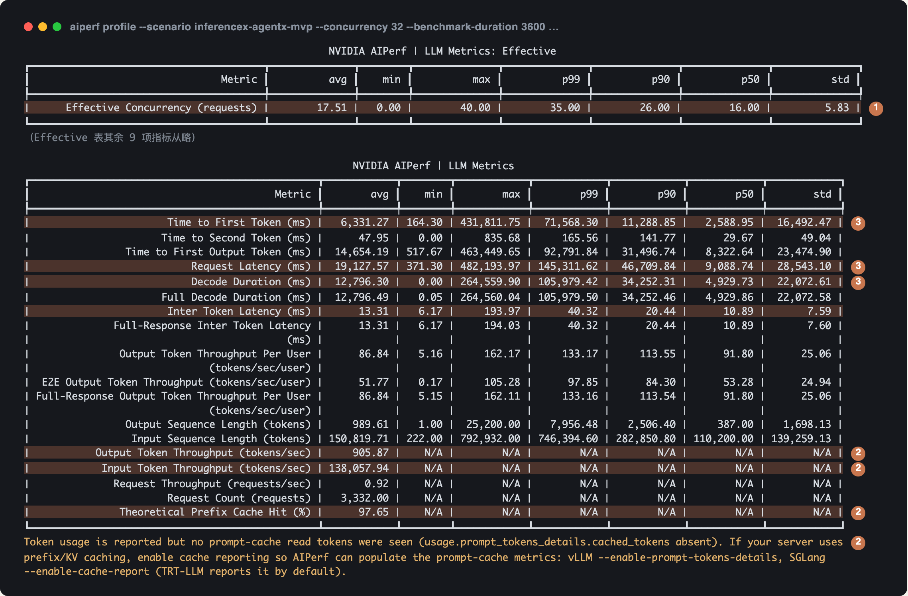
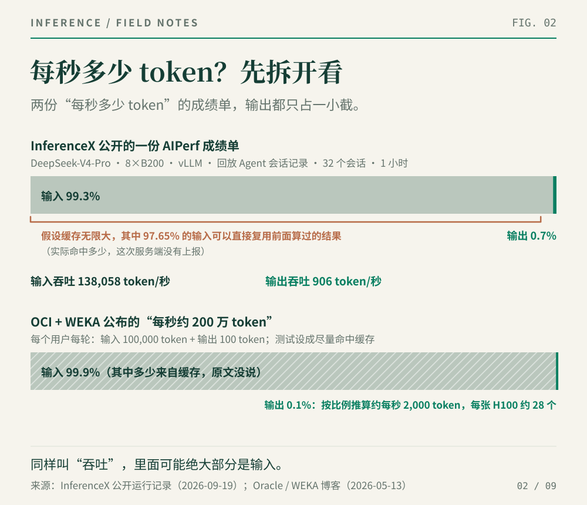
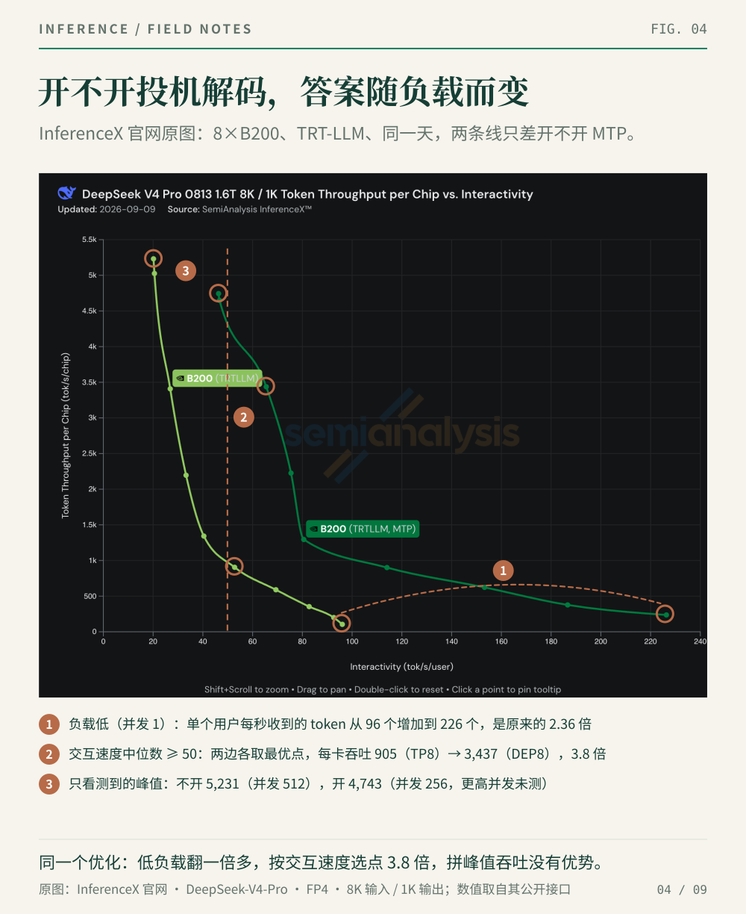
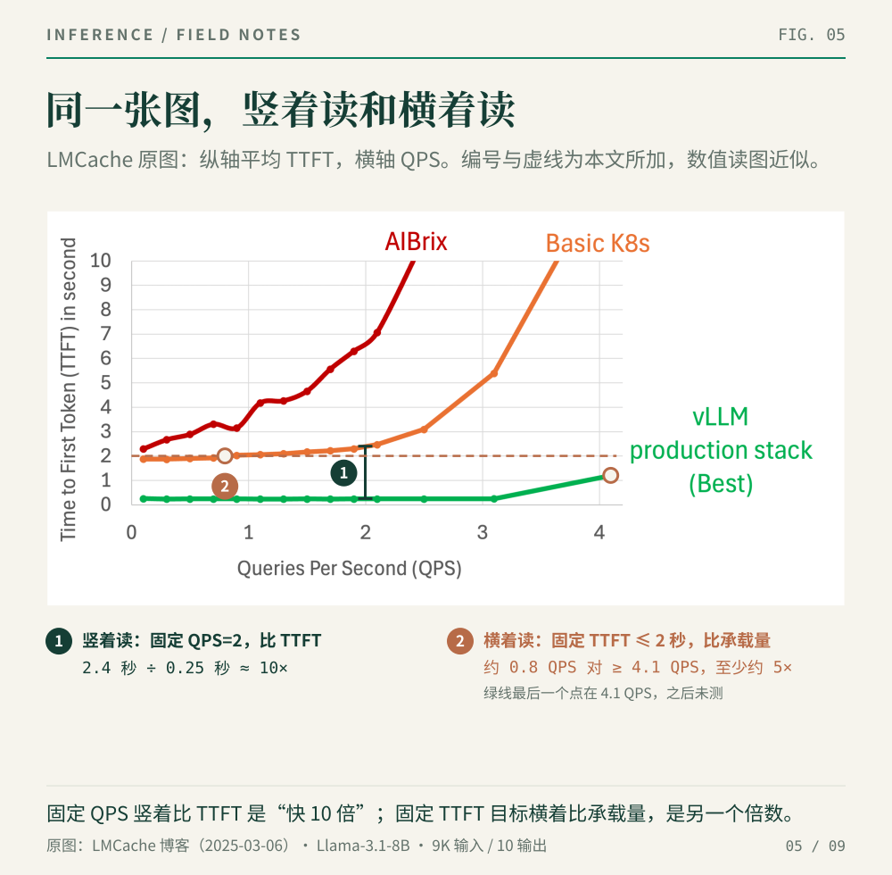
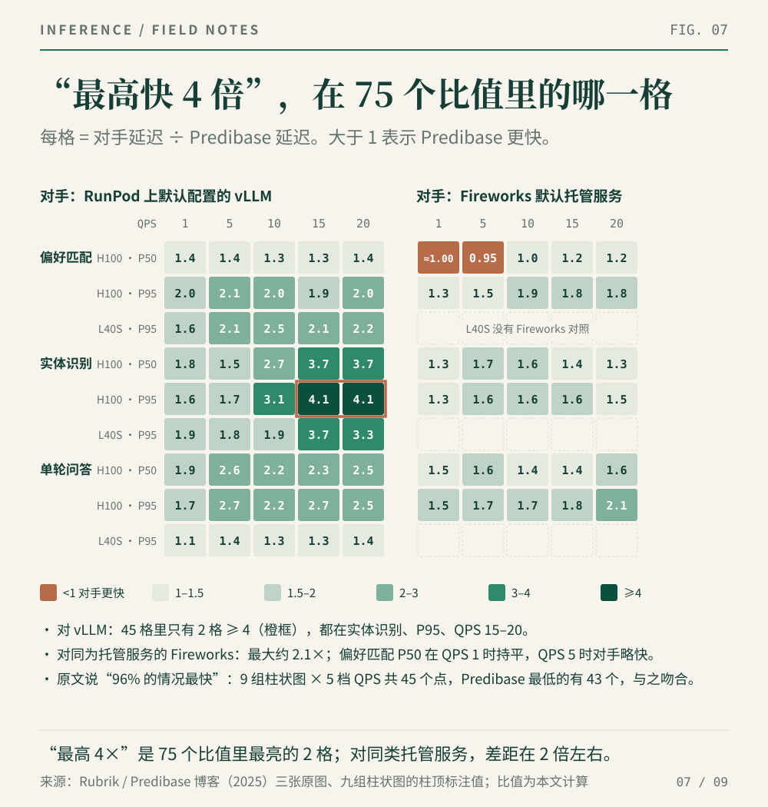
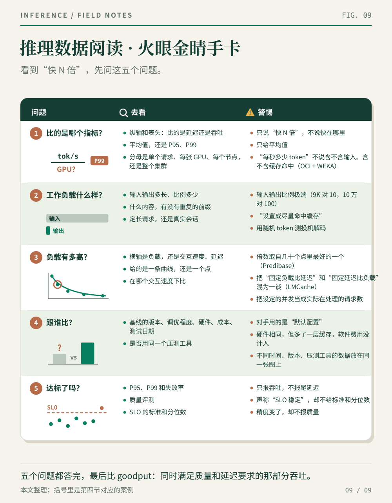

> 不以规矩，不成方圆。上一篇讲的是怎样拆开一个性能数字；这一篇先看业内给测试定了哪些规矩，再拿这些规矩去检验几份公开的性能报告。

上一篇里，同样是 EAGLE-3 投机解码，测出来的加速比有 6.47 倍，有 2.30 倍，有 1.38 倍，还有 0.98 倍。这些数字可能都没错，只是各自回答的问题不同。上一篇把性能写成了一个函数：

```text
Performance = f(Model, Workload, Load, System, Resources, Quality, SLO)
```

其中 Workload（工作负载）和 Load（负载）只差两个字，说的却是两回事：工作负载指**请求是什么样的**，比如输入输出多长、有没有重复的前缀；负载指**请求有多少**，比如并发量、请求速率。

上一篇只展开了其中三项：工作负载、负载和 SLO。剩下的四项——模型、系统、资源、质量——光看一份报告，读者很难核实：用的是哪个模型，调了哪些开关，用了多少硬件，回答质量有没有下降，往往只能听作者一面之词。

好在业内已经有了两样公认的东西：一把尺子，一座擂台。尺子是 NVIDIA 开源的压测工具 **AIPerf**，规定每条请求怎么计时、结果怎么汇总；擂台是 SemiAnalysis 运营的开放基准测试平台 **InferenceX**，把模型、硬件、软件、工作负载和负载都写进公开的配置，让各家在相同条件下测试，每个成绩都能查到出处。NVIDIA 的官方博客引用它的数据，AMD 的 MI355X 也在上面提交成绩。标题问的“武林大会”，不是华山论剑那样，各门各派自己登顶亮剑；眼下的事实就是 InferenceX 这张榜单：老老实实按它的规则提交，等它来评测。

这一篇分三步：先读一份公开的 AIPerf 测试结果，再看擂台上的一组真实对比，最后用这些规矩，拆解四份号称“快 N 倍”的公开报告。

## 一、先认尺子：读一份 AIPerf 测试结果

下面这份结果来自 InferenceX 公开的一次测试：8 张 B200，用推理框架 vLLM 运行 DeepSeek-V4-Pro 模型，回放 SemiAnalysis 公开的一批 Claude Code 编程会话记录，同时跑 32 个会话，测一小时。回放保留的是每一轮的长度、前缀复用和请求间隔，提示词的文字由工具重新生成。配置、日志和结果文件都附在 GitHub 的测试记录里。图 1 是 AIPerf 的原始输出，节选了其中两张表。



*图 1｜AIPerf 原始输出（节选），来自 InferenceX 公开测试记录。编号和底色为本文所加。[测试记录](https://github.com/SemiAnalysisAI/InferenceX/actions/runs/35434571418)*

表里的 Time to First Token（首 token 延迟，TTFT）和 Request Latency（请求延迟，即端到端延迟），上一篇都讲过。有一点要注意：这次开了思考模式，AIPerf 的 TTFT 把思考 token 也算作第一个 token；到第一个正式回答 token 的时间另记为 Time to First Output Token，中位数 8.3 秒。下文的 TTFT 沿用 AIPerf 的口径。下面借这份输出，再讲三件上一篇没有讲透的事。

**① 同时跑 32 个会话，不等于任何时候都有 32 条请求在处理。** 好比八合里牛肉火锅发出去 32 个号，每个号是一桌客人。但不是每桌每时每刻都在点菜：有的桌正涮着、聊着，暂时不叫服务员；有的桌几拨人各点各的，一下子来好几张单。后厨同一时刻接到的单子，时多时少。第一张表里的 Effective Concurrency，统计的是每个时刻正在处理的请求有多少条，再按时间取平均。结果是：平均 17.5 条；一半的时间里不超过 16 条；最多时有 40 条，比 32 还多。少的时候，是因为回放保留了原会话里两次请求之间的间隔：Agent 在执行工具、等待结果，这段时间不向模型发请求。多的时候，是因为主 Agent 会同时派出几个子 Agent，各自发请求，而 32 限制的是会话数，不是请求数。

**② “每秒多少 token”，先看算的是哪些 token。** 推理像一个巨大的消化系统：吃进去多少（输入），又合成了多少能被人体吸收的营养（输出），一入一出都重要。输入吞吐（Input Token Throughput）是每秒 13.8 万个 token，输出吞吐（Output Token Throughput）只有每秒 906 个，输入占了 99% 以上。第二张表的最后一行还有一个数：理论前缀缓存命中率（Theoretical Prefix Cache Hit）97.65%。意思是：假如缓存无限大、从不淘汰，这批请求的输入里有 97.65% 是之前算过的前缀，可以直接复用，不必重新计算。多轮对话每一轮都要把之前的对话记录再发一遍，重复自然很多。至于这次实际命中了多少，服务端没有上报，AIPerf 在输出末尾专门提示了这一点。



*图 2｜上：这次测试处理的 token，输入占 99.3%，输出只占 0.7%。下：后文 OCI + WEKA 案例的“每秒约 200 万 token”，构成类似而且更极端：每轮 10 万个输入 token，只对应 100 个输出 token。本图根据两份材料中的数字绘制，原材料没有对应的图。*

同一次测试，说“每秒处理 13.9 万个 token”（输入加输出）没错，说“每秒生成 906 个 token”也没错，但这两句话说的完全不是一回事。

**③ P99 很长，要拆开看长在哪里。** 先说 P99：把所有请求按耗时从短到长排好，排在第 99% 位置的那一条的耗时就是 P99。换句话说，100 条请求里只有最慢的 1 条比它还慢，它看的是最慢的那一小撮请求。这次请求延迟的 P50 是 9.1 秒，P99 是 145 秒。一条请求的耗时分两段：先等第一个 token（TTFT），再等从第一个 token 到最后一个 token 的这段时间。后一段在 AIPerf 里叫 Decode Duration，等于请求延迟减去 TTFT。两段都有长尾。Decode Duration 的 P99 是 106 秒，原因是有些回答本身就长。TTFT 的 P99 是 72 秒，但最慢的并不是输入最长的请求：TTFT 最慢的那 1% 请求，输入长度和整体差不多；输入最长的那 1% 请求，TTFT 的中位数反而只有 2.7 秒。至于到底为什么慢，这份公开数据给不出答案；而只看请求延迟的 P99，连慢在前一段还是后一段都分不清。

这些拆分，靠的是 AIPerf 导出的逐条请求记录和服务端指标。尺子统一了，记录又齐全，不同的测试才能放在一起比，一个数字也才能追到底。

还要说明一点：这次测试开了投机解码，但接受长度（每做一次验证，平均能确认几个 token）被人为固定为 3.77。这是 InferenceX 的规定，原因第三节再讲。

## 二、再看擂台：InferenceX 上的一张图

下面这张图截自 InferenceX 官网，是 DeepSeek-V4-Pro 在 Agent 场景下的成绩，各家的硬件和软件都在上面。


*图 3｜InferenceX 官网原图，2026-09-28 更新。横轴是 P90 交互速度，纵轴是每张卡每秒处理的 token 数。[InferenceX](https://inferencex.semianalysis.com/inference)*

这张图和上一篇的性能地图是同一种读法，只是横轴换了：上一篇用 P99 端到端延迟，越往左越好；这里用交互速度，越往右越好。纵轴都是每张 GPU 的吞吐。所以越靠右上越好：交互速度越快越好，GPU 吞吐越高越好，右上为王。先看坐标轴和标注：

- **横轴**是交互速度（interactivity），也就是上一篇说的 1 ÷ TPOT：首 token 出来以后，每位用户每秒能看到多少个输出 token。这里取 P90，即 90% 的请求至少有这么快。
- **纵轴**是每张卡每秒处理的 token 数（tok/s/chip），就是上一篇的 tokens/s/GPU，分母是这个方案用到的全部 GPU。它算的是输入加输出；第一节说过，Agent 场景里输入占了 99% 以上，想看生成能力，要切换到只算输出的视图。
- **每个点**是某个部署方案在某个并发下的实测结果。点旁边的标签说明模型怎样切到多张卡上：`TP8` 是 8 卡张量并行；`DEP8` 是注意力部分用 8 卡数据并行、专家部分用 8 卡专家并行；`2xDEP8+1xDEP16` 这类写法是 P/D 分离：处理输入的 prefill 和逐个生成 token 的 decode 交给不同的 GPU 组，加号前面是 prefill，后面是 decode。
- **每条线**：打开右侧的“Optimal Only”（只显示最优）后，图上只留下这样的点：在同样的交互速度下，没有别的方案每张卡的吞吐更高。把这些点连起来就是图上的线，业内叫帕累托前沿。Agent 场景还多一道门槛：这些点在把 TTFT 也算进去的“E2E 归一化交互速度”上也必须处于前沿，免得只把 decode 调快、TTFT 却变差的方案混进来。

第一节那次测试，在这张图上是哪个点？横坐标就是 1000 ÷ ITL 的 P90（图 1 里是 20.44 毫秒），约 49；纵坐标是每秒处理的输入加输出 token 除以 8 张卡，约 1.7 万。它不在前沿上：同一轮测试里，并发 64 的点交互速度约 75、每卡吞吐约 3.5 万，两项都更好；而且官网默认没有勾选 B200 (vLLM) 这一组，所以图 3 里看不到它。AIPerf 记下每一条请求，InferenceX 把一次测试压成图上的一个点，再把许多点连成线，两者就是这样接上的。

再看 InferenceX 公开的配置规范和贡献规则，可以归纳出六条规矩：

1. **工作负载贴近真实业务。** 定长请求（比如 8K 输入、1K 输出）条件整齐，差别只来自系统，这是上一篇说的控制变量；代价是离真实业务远。而我们的武林大会 InferenceX，正在把算力转给回放 Agent 会话的场景：1K/1K 基本停测，DeepSeek-V4-Pro 等模型的 8K/1K 也停了。第一节那种请求——输入动辄十几万 token、大多是重复前缀、夹着执行工具的空档——定长测试模拟不出来。看到定长测试的成绩，先问一句：自己的业务也这么整齐吗？
2. **同一张图，尽量用同一把尺子。** 在定长场景里，vLLM 和 SGLang 各自使用自家的压测实现。在 DeepSeek-V4-Pro 的 8K/1K 页面上同时勾选两家，官网会提示：两家的数字不能直接比较。在 Agent 场景里，两家都用 AIPerf 压测，官网就把它们画在同一张图上。
3. **看整条曲线，不看单点。** 每个方案通常要在一串并发下测试，官网把结果连成曲线。InferenceX 在术语表里写得很明白：只凭一个最大吞吐点，没法给整个系统排名，要看完整的帕累托曲线，并在同样的交互速度下比较。武林大会要早上比、中午比、晚上比，晴天比、下雨比、下刀子也要比，才公平，才能让人心服口服。
4. **分子分母写清楚。** 纵轴除了每张卡的总吞吐，还可以切换成只算输入或只算输出的吞吐、每兆瓦的吞吐，以及成本和能耗类指标。口径不同、不能直接比较的，页面上会加注说明。
5. **质量设及格线。** 在定长场景里，单机方案要在最高一档和中间一档并发上各做一次 GSM8K 评测（一套小学数学应用题），DeepSeek-V4 的及格线是 91%。新方案想合并进测试代码库，必须附上评测通过的记录。Agent 场景的质量门槛还没立起来：多数模型的评测要手动开启，自动跑的工具调用评测暂不设及格线。
6. **每个成绩都能查到出处。** 每个点都由 GitHub 上公开的自动化流程（GitHub Actions）跑出来，点击就能跳到对应的配置、日志和结果文件。下一篇我们拿 InferenceX 当验证基准，看重的正是这一条：我们的数字，别人也能复核。足球比赛现在都有 VAR（视频助理裁判）了，AI 大模型这样的高科技，不更得做到 24×7 都能复现？

## 三、擂台上的一组对比：投机解码到底能快多少

规矩讲完了，来看一组真实的对比。同样是 8 张 B200，同一个 DeepSeek-V4-Pro 模型，同一个 TensorRT-LLM（下称 TRT-LLM）镜像，同一天（2026 年 6 月 12 日）测试，每条请求 8K 输入、1K 输出。两边测的是同样几种并行方式（低并发用 TP8，高并发用 DEP8），差别只在开不开 MTP。MTP（Multi-Token Prediction，多 token 预测）是 DeepSeek 模型自带的一个小预测模块，可以直接用来生成投机解码的草稿。这基本就是上一篇 EAGLE-3 实验在擂台上的版本。

InferenceX 官网可以直接调出这两条线。图 4 是官网原图，编号和虚线是我们加的。



*图 4｜InferenceX 官网原图，编号和虚线为本文所加。浅绿线不开 MTP，深绿线开 MTP。定长场景的横轴是交互速度的中位数（图 3 是 P90）。图下三行数字取自 InferenceX 的公开数据接口。*

同一个优化，在同一张图上能读出三个答案：

- **① 负载低**：并发为 1 时，单个用户每秒收到的 token 从 96 个增加到 226 个，是原来的 2.36 倍。
- **② 限定交互速度**：要求交互速度的中位数不低于每秒 50 个 token，两边各自挑最好的点：不开 MTP，每张卡每秒最多处理 905 个 token（TP8）；开了 MTP，能处理 3,437 个（DEP8），是原来的 3.8 倍。这 3.8 倍里包含了换并行方式的收益：开了 MTP，才能在这个交互速度下用上 DEP8。只比 TP8，约 1.9 倍。
- **③ 只看峰值吞吐**：不开 MTP 测到的最高是每张卡每秒 5,231 个 token（并发 512），这时交互速度只剩约 20；开 MTP 最高测到 4,743 个（并发 256），更高的并发没有测。

三个答案里哪个算数，要看你的 SLO。如果业务对交互速度有②那样的要求，开 MTP 非常划算；如果是离线批处理，只追求峰值吞吐，在测到的范围内开 MTP 没有优势。这就是上一篇说的：先定好 SLO，再谈快不快。

这和上一篇 E2E Networks 那张表说的是同一件事：batch 为 4 时，加速比是 2.30 倍；batch 为 32 时，只有 0.98 倍。负载低的时候，GPU 有空闲的算力，生成和验证草稿用的是本来闲着的那部分；负载一高，这些额外的计算就要和正常的生成抢算力。

还有一个上一篇提过的变量：草稿能不能被接受，取决于内容。这组对比是定长场景，输入是随机 token，模型接着一串乱码往下写，草稿猜中的概率未必和真实业务一样。所以上面这些倍数，换到真实业务里未必成立。

到了 Agent 场景，InferenceX 干脆不用实测的接受长度。它的文档说得很直白：各家用自己的草稿模型实测，接受长度就取决于谁的草稿模型更会猜，成绩没法横向比较；而它要比的是推理系统本身。所以它规定接受长度统一：每个“模型 × 思考模式 × 草稿长度”只对应一个标准接受长度，在 SPEED-Bench 编程类的真实题目上测得；测吞吐时，服务端直接按这个值接受草稿（vLLM 里是 `synthetic_acceptance_length` 参数）。第一节那次测试对应的标准值就是 3.77。反过来说，Agent 场景的成绩是在统一的接受长度下跑出来的，自己部署时的接受长度取决于真实流量，两者不能直接对标。

另一条规矩对所有投机解码方案都适用：草稿模型按原样使用，发布时是什么精度就按什么精度跑，不许私自量化。精度降低的损失会落在接受率上，而目标模型的质量评测测不出来。

上一篇里，同一个 Llama-3.1-8B 模型，在五项任务上的加速比从 3.65 倍到 4.85 倍不等，差别就来自内容。擂台把这个变量固定下来，比较的才是系统本身。

## 四、用这些规矩，拆解四份公开报告

擂台之外，每天都有新的性能报告发布。下面这四份报告，我们不评判数字本身，只按前面讲的方法问几个问题：统计的是什么，负载是一个点还是一条曲线，对手是谁，质量和 SLO 有没有达标。

### LMCache 的“快 10 倍”：是竖着读出来的

2025 年 3 月，vLLM 团队和芝加哥大学的 LMCache 团队联合发布了一组 vLLM Production Stack 的测试，文章称 Production Stack 比基础的 vLLM 部署方式和 AIBrix 都“快 10 倍”。测试设置如下：模型是 Llama-3.1-8B；每条请求由一份文档加一个问题组成，约 9K 个输入 token，只输出 10 个 token；文档从 70 份里抽取，每份文档平均被提问约 14 次；Production Stack 和 AIBrix 的每个实例都配了 120GB 内存，用来存放从显存中移出的 KV cache（键值缓存）；基线方案（Kubernetes + vLLM）没有这层缓存，也不按缓存位置分配请求。图的纵轴是**平均** TTFT，横轴是 QPS（每秒请求数）。



*图 5｜LMCache 原图，编号和虚线为本文所加。①竖着读：固定负载，比较 TTFT；②横着读：固定 TTFT 目标，比较能承受多高的负载。*

**竖着读**：QPS 为 2 时，基线的 TTFT 约 2.4 秒，Production Stack 约 0.25 秒，前者约是后者的 10 倍。原文没有注明 10 倍取自哪个 QPS，标题应当就是这样读出来的。图上 AIBrix 的曲线更高，同一 QPS 下差得更多。

再看最左边。QPS 只有 0.1 时，系统几乎空闲，两边已经是 1.9 秒对 0.25 秒，前者将近是后者的 8 倍。可见这 10 倍主要不是高负载下排队拉开的：文档占了 9K 输入的绝大部分，缓存命中后，只需要计算末尾的问题。这部分收益有多大，取决于文档被重复提问多少次，而这是由工作负载决定的。

**横着读**：画一条“平均 TTFT 不超过 2 秒”的线。基线在 QPS 约 0.8 时就超过了这条线；Production Stack 测到最后一个测试点（QPS 4.1），TTFT 也只有 1.2 秒，能承受的请求速率至少是基线的 5 倍。同一张图，竖着读是 10 倍，横着读至少 5 倍，而且这个倍数取决于 SLO 定在哪里。原文还有一组实验，把每段对话加长到 40 轮，同一份文档被反复使用的次数更多，测得的差距也更大。

对照上一篇的五步再检查一遍，还缺三样东西：只有平均 TTFT，没有 P95、P99；输出只有 10 个 token，没有测长回答；最关键的是，没有把缓存命中率从低到高逐档测一遍。此外，原文还说它“更省钱”，文中却没有给出成本数据。

这份报告能支持的结论是：**在输入长、输出短、同一批文档被反复提问的场景下，保留 KV cache，并把请求分配到持有对应缓存的实例上，可以省掉大部分重复的 prefill 计算。**

### OCI + WEKA 的“吞吐 10 倍”：算进去的是哪些 token

2026 年 5 月，Oracle 云（OCI）和存储厂商 WEKA 联合发布了一份长上下文推理测试：9 台服务器、72 张 H100，运行多组 4 卡张量并行的 MiniMax-M2.5（NVFP4 精度）。基线方案只把 KV cache 放在显存和主机内存里，其中主机内存约 8.64 TiB；WEKA 的 Augmented Memory Grid（下称 AMG）用 NVMe 固态盘组成了 287 TiB 的缓存层。每个模拟用户每轮输入 10 万个 token、输出 100 个 token，测试特意设置成尽量命中缓存。

原文的汇总表写着（前为基线，后为 AMG，括号内是原文标注的倍数）：最大并发用户数 600 对 5,000 以上（10 倍）；吞吐不到每秒 20 万个 token 对约 200 万个（10 倍）；一小时内完成的请求数约 6,700 对 47,000 以上、处理的 token 数 7 亿对 50 亿（都是 7 倍）。


*图 6｜Oracle 博客原图：2,400 个用户、一小时的测试。实线是 TTFT 和 TTLT（完成整段回答的时间），对应左轴，单位为秒；虚线是累计完成的请求数，对应右轴。粉色是 AMG，灰白色是基线。[Oracle 原文](https://blogs.oracle.com/ai-and-datascience/scaling-long-context-inference-on-oci-with-wekas-augmented-memory-grid)*

这张图值得仔细看。开始的二十分钟左右，两边都在做大量 prefill，为缓存预热，AMG 的 TTFT 也有 35 到 40 秒；缓存预热完成后，AMG 的 TTFT 降到 5 秒左右，基线则一直在 35 到 45 秒之间波动。完成请求数的 7 倍差距，主要是在预热之后拉开的。

先看分子，也就是吞吐里算了哪些 token。回到图 2 的下半部分：每轮 10 万个输入 token 只对应 100 个输出 token，所以“每秒约 200 万 token”里 99.9% 是输入。测试又特意设置成尽量命中缓存，所以这些输入的 KV cache 应当大多是从 NVMe 读回来的，而不是由 GPU 重新算出来的（原文没有给出命中率）。按比例推算，输出约为每秒 2,000 个 token，平均到每张 H100 约 28 个。所以“吞吐 10 倍”更准确的说法是：**同一批 GPU，每秒能接收的上下文 token 是原来的 10 倍。**

再看分母，也就是投入了多少硬件。这一点报告交代得很规范：OCI 这款 H100 裸金属服务器本身就带 16 块 3.84 TiB 的本地 NVMe 盘，基线的机器上也有，只是没有用来存 KV cache。所以这 10 倍不是多买硬件换来的，而是 WEKA 的软件把闲着的盘用起来，通过 RDMA 网络组成了一层缓存。报告没有计入这层软件本身的费用，也没有和“增加主机内存”的方案做对比。

最后看汇总表里的倍数来自哪里。7 倍来自那场一小时、2,400 个用户的测试；并发用户数的 10 倍，来自原文所说的另一场“不设上限”的测试。吞吐的 10 倍原文没说来自哪场：按一小时处理 50 亿 token 折算，平均每秒约 139 万，只有基线的 7 倍左右。一张汇总表里，混着不同实验的结果。原文多次强调“SLO 保持稳定”，但没有给出 SLO 的具体标准，图上也没有说明延迟是平均值还是某个分位数。能看出趋势，却没法按 SLO 判断是否达标。

这份报告能支持的结论是：**当长上下文的 KV cache 在显存和主机内存里都放不下时，再加一层足够大、足够快的缓存，同一批 GPU 就能承接多得多的会话。** 这是容量上的提升，不能说成 H100 的算力提高了 10 倍。

### Predibase 的“最高快 4 倍”：4 倍出现在哪里

2025 年 5 月，Predibase（同年被 Rubrik 收购）发布了一份推理引擎测试，把自家的托管服务与 Fireworks 的托管服务、部署在 RunPod 上的开源 vLLM 做了比较，结论是“最高快 4 倍”“96% 的情况下延迟最低”。三项任务都是短请求：偏好匹配约 350 个输入 token、50 个输出 token；实体识别（NER）约 120 个输入、25 个输出；单轮问答约 50 个输入、100 个输出。模型都是 8B 级别，挂载同一组 LoRA 微调适配器；硬件是单张 H100 或 L40S；QPS 从 1 测到 20，报告 P50 和 P95 延迟。

原文是三张图、共九组柱状图，“4 倍”出现在哪一组、哪根柱子上，需要逐一比较才知道。我们把每根柱子上标注的毫秒数，换算成“对手的延迟是 Predibase 的几倍”：



*图 7｜根据 Predibase 原文九组柱状图上标注的数值换算。左侧的对手是部署在 RunPod 上、使用默认配置的 vLLM；右侧是 Fireworks 的默认托管服务。橙框内是达到 4 倍的两格。[Predibase 原文](https://www.rubrik.com/blog/ai/25/llm-inference-benchmarks-predibase-fireworks-vllm)*

换算成网格之后，“4 倍”的位置就很清楚了：只出现在实体识别任务、P95、QPS 为 15 和 20 的两格里，对手是默认配置的 vLLM。和同样是托管服务的 Fireworks 相比，对手的延迟最多是 Predibase 的 2.1 倍左右；在偏好匹配任务的 P50 上，QPS 为 1 时两者持平，QPS 为 5 时 Fireworks 略快。“96%”与 45 个测试点里赢了 43 个吻合。

再看负载和对手。原文说优势“在高负载时尤其明显”，但 QPS 最高只有 20，每条请求也只有几百个 token。对一张 H100 上的 8B 模型来说，这个负载并不高：用 QPS 乘以延迟粗略估算，同一时刻在处理的请求只有十条左右。Predibase 用的 Turbo LoRA，是针对用户任务专门训练的草稿模型；原文自己也写明，它在 GPU 有空闲算力时启用、满载时关闭。这个负载区间，正是它发挥作用的地方。对手 vLLM 用的则是“默认设置，未做任何内部优化”。

这份报告能支持的结论是：**如果团队想开箱即用，那么在这三类短任务和这个负载范围内，Predibase 默认的托管服务在大多数测试条件下延迟更低（偏好匹配的两处例外见上）。** 这对选型有参考价值，但证明不了推理引擎本身快 4 倍。要回答那个问题，得让各家花同样的调优功夫、各自调到最好再比，或者在同一套系统里把各项优化逐一打开、关闭，分别测试。

### AWQ 的“快 3 倍”：质量有没有变

AWQ（激活感知权重量化）是 MIT 韩松团队 2023 年提出的量化方法，把模型权重从 16 位压缩到 4 位，还配套推出了推理框架 TinyChat。原文在 RTX 4090 上测得，Llama-2、MPT、Falcon 三个系列模型的生成速度，是 HuggingFace FP16 实现的 2.7 到 3.9 倍。测试条件是 batch 为 1、输入 4 个 token、生成 200 个 token，取延迟的中位数，属于典型的单机单用户场景。


*图 8｜AWQ 论文原图 Figure 9 的 (a) 部分（RTX 4090），截取时去掉了横跨三张子图的图例。每组三根柱子依次是 HuggingFace FP16（浅灰）、TinyChat 优化过的 FP16（深灰）、TinyChat 4 位量化（红），单位是每秒生成的 token 数；“FP16 OOM”表示 16 位模型显存放不下。[AWQ 原文](https://arxiv.org/html/2306.00978)*

理解这个倍数，要看两点。一是对手：HuggingFace 的 FP16 实现是没有做内核融合的参考版本。看图 8 的 Llama-2-7B：光做 FP16 内核融合，就从每秒 52 个 token 提到 62 个；在这个更强的基线上，量化后的矩阵乘法内核再带来 3.1 倍。Falcon-7B 更明显：原文说它的官方实现 KV cache 有问题，光换成 TinyChat 的 FP16 就从 33 提到 53。所以这 3 倍是整套软件一起带来的，不能全算在量化算法头上。二是质量：按原文自己的数据，Llama-2 7B、13B、70B 的困惑度（perplexity，越低越好）分别从 5.47、4.88、3.32 升到 5.60、4.97、3.41。变化不大，但不是零。

擂台的做法是给质量设及格线：量化模型可以参加比较，但方案合并前要附上评测通过的记录，比如定长场景里 DeepSeek-V4 在 GSM8K 上的及格线是 91%。跨硬件比较时，图例也会标明精度，比如图 3 里 H200 用的是 FP8、Blackwell 用的是 FP4，一眼就能看出来。

这份报告能支持的结论是：**在 batch 为 1 的单用户场景下，4 位权重量化配合 TinyChat 的内核，能让 RTX 4090 上的生成速度达到 HuggingFace FP16 参考实现的 2.7 到 3.9 倍，困惑度略有上升；其中一部分收益来自内核融合等工程优化，不全是量化本身。**

### 四份报告一览

| 报告 | 出处与时间 | 原文怎么说 | 这份报告能支持的结论 |
|---|---|---|---|
| LMCache / vLLM Production Stack | [LMCache 博客](https://blog.lmcache.ai/en/2025/03/06/open-source-llm-inference-cluster-performing-10x-faster-than-sota-oss-solution/)，2025-03-06 | 标题：“Open-Source LLM Inference Cluster Performing 10x FASTER than SOTA OSS Solution” | 输入长、输出短、同一批文档被反复提问时，保留 KV cache 并按缓存位置分配请求，能省掉大部分重复的 prefill 计算 |
| OCI + WEKA | [Oracle 博客](https://blogs.oracle.com/ai-and-datascience/scaling-long-context-inference-on-oci-with-wekas-augmented-memory-grid)，2026-05-13 | 汇总表：吞吐、最大并发用户数都是“10X” | 长上下文的 KV cache 在显存和主机内存里放不下时，加一层大而快的缓存，同一批 GPU 能承接多得多的会话；这是容量上的提升，不是算力提高了 10 倍 |
| Predibase | [Rubrik 博客](https://www.rubrik.com/blog/ai/25/llm-inference-benchmarks-predibase-fireworks-vllm)，2025-05-28 | “Up to 4x Faster Latency”；“96% of the time” 延迟最低 | 开箱即用时，在这三类短任务和这个负载范围内，Predibase 默认的托管服务大多数情况下延迟更低；证明不了推理引擎本身快 4 倍 |
| AWQ / TinyChat | [arXiv 论文](https://arxiv.org/abs/2306.00978)，2023-06-01 | “a 3-4× performance boost compared to FP16” | batch 为 1 的单用户场景下，4 位量化加 TinyChat 内核，在 RTX 4090 上达到 HuggingFace FP16 参考实现的 2.7–3.9 倍，困惑度略升；部分收益来自内核融合 |

## 五、推理数据阅读之火眼金睛手卡

以后再看到“快 N 倍”，可以拿出这张手卡，按五个问题找证据：每一行是一个问题，“去看”告诉你去原文哪里找，“警惕”列出常见的坑。



*图 9｜推理数据阅读手卡。括号里是第四节中对应的案例；goodput 即有效吞吐。*

### 留几道踢馆题

下面四篇文章，本文没有拆解过，数字也都来自真实实验。可以拿这张手卡试一试：

- [InferenceX：Rubin NVL72 Agentic Inference: 67x better Performance per Dollar](https://inferencex.semianalysis.com/blog/vera-rubin-nvl72-agentic-inference)：先看官网首页的横幅怎么写，再到正文里找 67 倍的分母是什么、在哪个交互速度下成立。
- [NVIDIA：Blackwell Ultra 在 InferenceX 上“性能最高提升 50 倍、成本最多降到 1/35”](https://blogs.nvidia.com/blog/data-blackwell-ultra-performance-lower-cost-agentic-ai/)：50 倍的分母是什么，换成每张 GPU 呢？和谁比？在曲线的哪一段？
- [LMSYS：96 张 H100 运行 DeepSeek，每个节点每秒 5.23 万个输入 token、2.23 万个输出 token](https://www.lmsys.org/blog/2025-05-05-large-scale-ep/)：用了 P/D 分离，这两个数分别是哪类节点测的？换成按卡、按整套 96 张卡算，又是多少？
- [LMSYS：GB200 NVL72 上 prefill 快 3.8 倍、decode 快 4.8 倍](https://www.lmsys.org/blog/2025-09-25-gb200-part-2/)：基线用的是什么硬件、什么配置？

读的时候不妨先放下结论，回答完五个问题，再用一句话概括：**它证明了什么，还有什么没有覆盖到。** 如果这句话里自然带上了工作负载、负载高低、对手和质量这几项条件，就说明已经把这份报告读透了。

## 两篇合起来看

上一篇解决的是“一个性能数字在说什么”：找基线，看工作负载，看负载，弄清快的是哪个指标、SLO 有没有达标。

这一篇解决的是“两个性能数字能不能放在一起比”：用同一把尺子测量每条请求，把比较的条件事先写清楚，测出完整的曲线，在同样的交互速度下比较，质量评测不过关的方案不收。这些规矩，AIPerf 和 InferenceX 已经写好了。

评价一个推理系统，不看倍数有多大，而看每个结果能不能讲清四件事：**测的是什么，在什么条件下测的，满足了哪些约束，别人能不能复核。**

剧透一下本系列下一篇：自己的狗粮自己吃。我们把这套规矩用在自己身上，回顾过去几个月在 B300 上对 GLM 和 Kimi-K3 的优化。按这一篇的标准，故事不该从最好看的那个点讲起，而要从基线和瓶颈讲起，最后落到完整的曲线和满足 SLO 的有效吞吐上。

---

*主要来源：[NVIDIA AIPerf](https://github.com/ai-dynamo/aiperf) 及其[指标说明](https://github.com/ai-dynamo/aiperf/blob/main/docs/metrics-reference.md)；[InferenceX 官网](https://inferencex.semianalysis.com/inference)、[开源仓库](https://github.com/SemiAnalysisAI/InferenceX)（贡献规则、评测门槛、标准接受长度文档）与[公开测试记录](https://github.com/SemiAnalysisAI/InferenceX/actions/runs/35434571418)；[LMCache / vLLM Production Stack 测试](https://blog.lmcache.ai/en/2025/03/06/open-source-llm-inference-cluster-performing-10x-faster-than-sota-oss-solution/)；[Oracle / WEKA 长上下文测试](https://blogs.oracle.com/ai-and-datascience/scaling-long-context-inference-on-oci-with-wekas-augmented-memory-grid)；[Rubrik / Predibase 推理测试](https://www.rubrik.com/blog/ai/25/llm-inference-benchmarks-predibase-fireworks-vllm)；[AWQ](https://arxiv.org/html/2306.00978)。*
