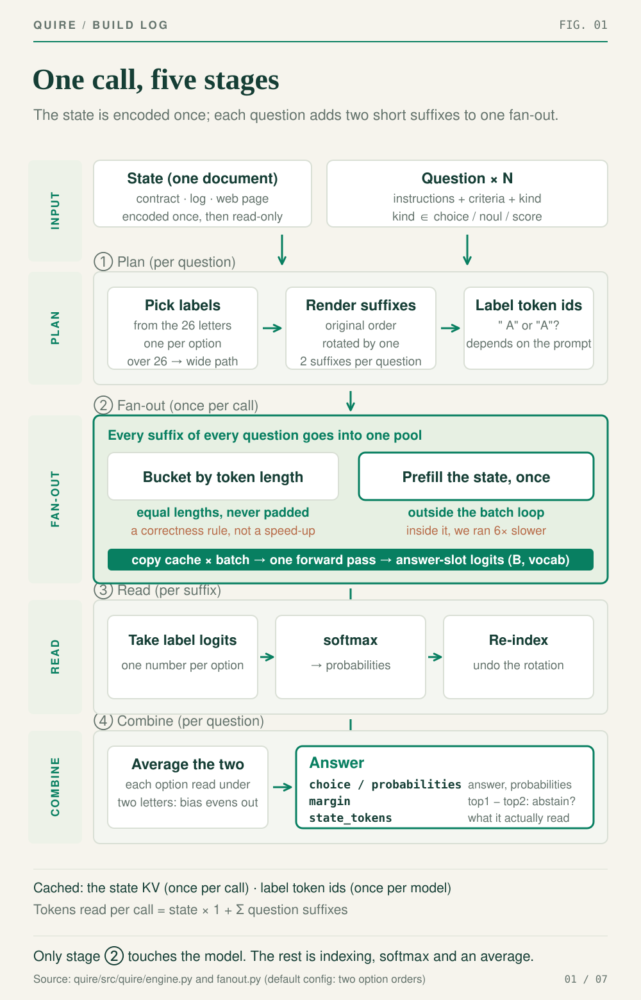
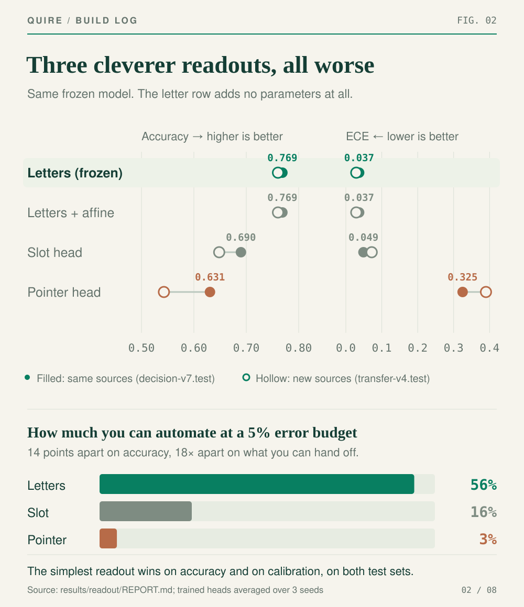
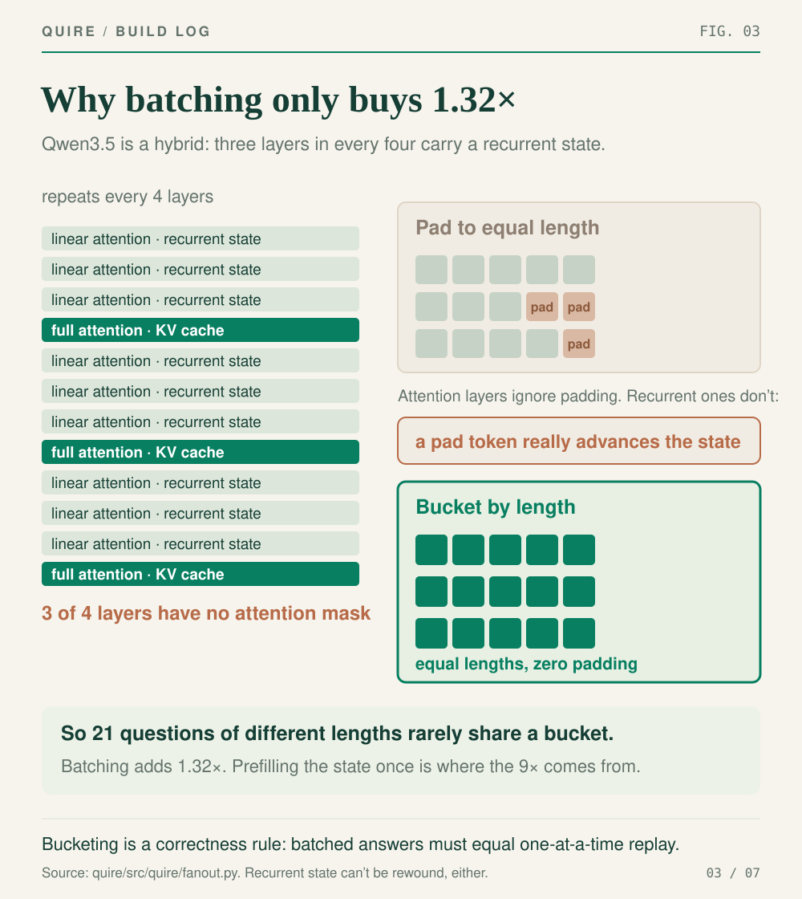
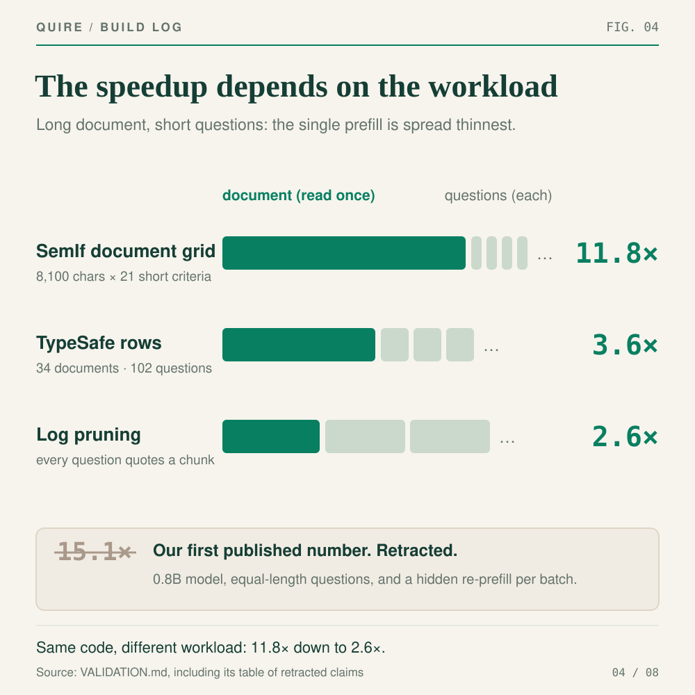
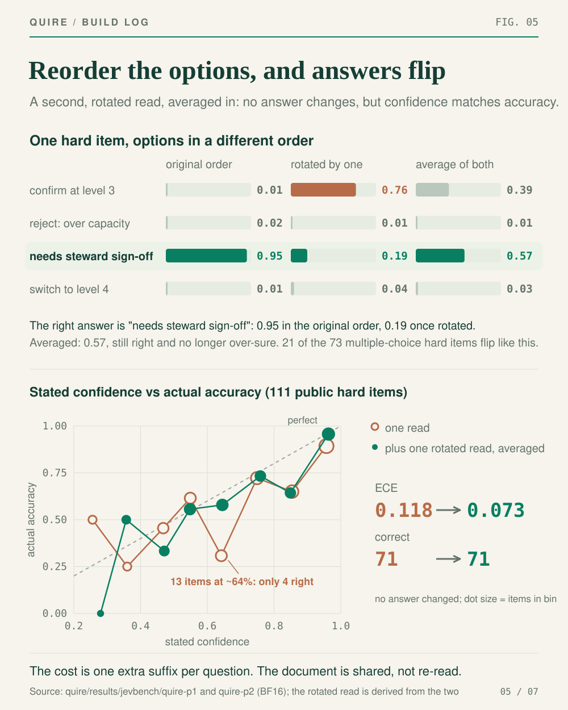
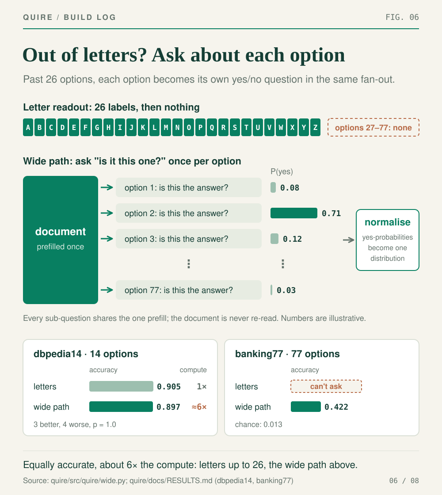
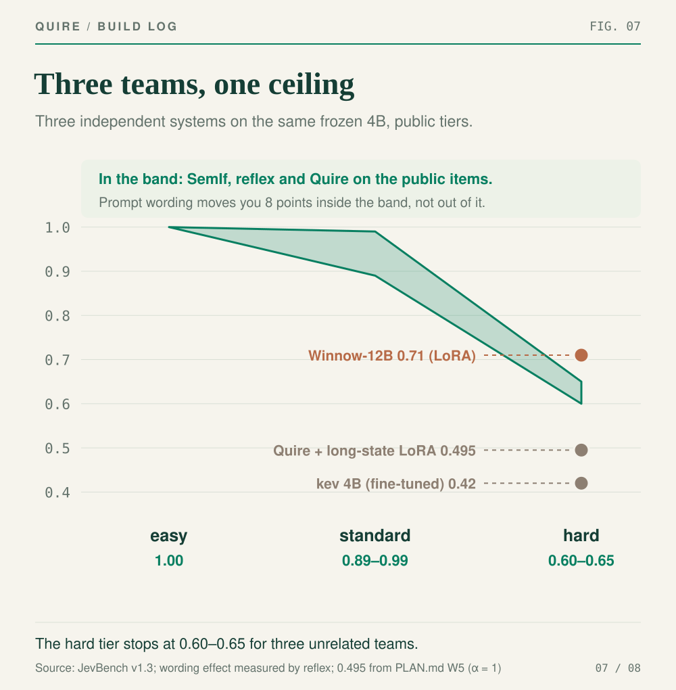
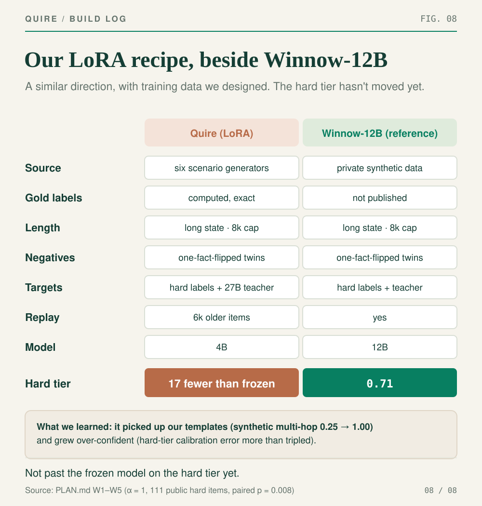

A few days ago we [wrote (in Chinese)](/posts/jev-system-one-explained/) about [Jev](https://typesafe.ai/blog/introducing-system-one-models-and-jev), TypeSafe's new "System One" model, which answers typed questions by reading probabilities off a language model instead of generating text. We ended that post by promising to build one ourselves.

We did. It's called **Quire**, and the code is at [github.com/aflowx/quire](https://github.com/aflowx/quire).

Quire doesn't chat and doesn't write. You hand it a document and a batch of multiple-choice questions, and it returns a probability for every option of every question without generating a single token. It runs on [Qwen3.5-4B](https://huggingface.co/Qwen/Qwen3.5-4B), unmodified.

We built it to answer two questions that are impossible to settle from the outside.

**How much of Jev comes from the architecture, and how much from the model?** TypeSafe doesn't publish Jev's parameter count, and its headline 0.883 isn't accuracy: it's agreement with a reference built from GPT-6 Astra and Claude Fable 5.1 answers. So when Jev is fast, is that the "read the probabilities" pattern, or just a much smaller model than the ones it's compared against? The only way we could see to separate the two was to build the same architecture on a model whose size we know.

**What is each design decision actually worth?** Some of it might be doing the heavy lifting and some of it might just look clever. We wanted to measure each piece.

Here's the answer up front: **the speed and the calibration come from the architecture, and they reproduce on a laptop. Judgement on the hardest questions comes mostly from the model, and we haven't caught up there yet. We're working on it with LoRA fine-tuning.**

## Three demos

All three demos have the same shape, **one document and many questions**. Section 2 below explains why that shape matters.

### Read the fine print

Paste in a privacy policy and Quire answers 24 questions about it in one pass, in about half a second: do they sell your data, do they keep it after you delete your account, can you get a refund, do you give up the right to sue. Across three policies it gets 71 of 72 answers right against a hand-written key.

The fun part is editing the document. Change "We sell personal information… to data brokers" to "We never sell personal information", and "Do they sell your personal data?" flips from yes to no. The other 23 answers stay put. It's reading that sentence, not reacting to the general vibe of the policy.


*Animation 1: Change "We sell personal information…" to "We never sell personal information", and "Do they sell your personal data?" flips from YES to NO while everything else stays put. Reading the whole policy and answering 24 questions took 0.55 seconds on the laptop.*

### One sentence, one web page

Type a one-line description, say "a small family bakery in Lisbon that opens at 6am", and Quire makes 80 separate decisions about the page: palette, density, headline, call-to-action, which sections to include. Then it assembles the page, in about 1.1 seconds. A side panel shows the probability behind every decision and highlights the ones under 50%.

When we asked for "a real-time dashboard for an intensive care unit's nursing staff", it picked "Request a demo" for the main button. That's clearly wrong. But it only gave that choice 46%, and it's highlighted in the panel. **It picked the wrong button, and it knew it might have.** That turns out to be the most useful property of the whole approach.


*Animation 2: Switch from the bakery to "a real-time dashboard for an intensive care unit's nursing staff" and all 80 decisions are redone and the page re-flows, in 1.1 seconds. The highlighted "Request a demo" in the side panel got only 46%.*

### A browser agent

A mock online store and six tasks, like "add the cheapest blue jacket to the cart and check out". At each step the agent picks one of the 8–17 clickable elements on the page. Every step is a single decision, with no text generated. It finishes all six tasks, at about 0.26 seconds per step.


*Animation 3: The task is "add the cheapest blue jacket to the cart and place the order". The red box is the element it chose at each step, and the label at the bottom left is how long that step took. Five steps, 1.37 seconds in total; the animation plays at roughly real speed.*

## How Quire is built

From the outside there's one kind of request: a document plus a batch of typed questions.

```json
{"state": "Policy: trial accounts may export CSV;
   PDF export needs a paid plan.
   A trial user asks to export CSV.",
 "questions": {
   "allowed": {"type": "noul",
     "instructions": "Is the export permitted?"},
   "route": {"type": "choice",
     "instructions": "Which team should handle this?",
     "criteria": {"support": "Product support",
                  "billing": "Billing",
                  "sales": "Sales"}}}}
```

A `choice` picks one of N options, and its probabilities sum to 1. A `noul` is a set of independent yes/no judgements that deliberately don't compete with each other. A `score` is an ordinal rating. The format is compatible with the interface TypeSafe defined for Jev (`POST /v1/systemone`), so harnesses written for Jev, like [JevBench](https://github.com/fstandhartinger/jevbench) and the [Decision Index](https://huggingface.co/spaces/multimodalart/jev-decision-index), can run Quire without changes.

Inside, a call goes through five stages:



*Figure 1: Only stage ② runs the model. Everything else is indexing, a softmax and an average.*

The design decisions our second question asks about are spread across those stages: how the answer is read, how the document is shared, how the probabilities are calibrated, and what happens when there are too many options. Here they are one at a time.

## Four design decisions

### 1. How the answer gets read

**What we ship.** Each question becomes a lettered multiple-choice prompt. The model reads the document and the question in one forward pass, stops at the position where the answer would start, and we read the scores for the option letters there and softmax them:

```python
out = model(tok(prompt).input_ids)
logits = out.logits[0, -1]       # one score per vocab token
p = softmax(logits[cand_ids])    # keep only the option letters
```

There's no decode loop, no JSON parsing and no retry logic. It can't return an option that doesn't exist, and it can't produce an unbalanced bracket, because there are no brackets.

**What else we tried.** We built each of these and ran them on the same test sets:

- **Generating JSON.** The obvious approach, and what most people do today. It's slow, it can go off-script, and it throws away the distribution the model had over the options.
- **A slot head.** Reserve a placeholder token per option in the prompt, read the hidden states at those positions, and train a small classifier on top.
- **A pointer head.** Embed each option's description and pick the one that best matches the answer position. This is the textbook design.
- **Letters plus a trainable affine layer.** Keep the letter readout and learn a linear correction on top of its scores.
- **Thinking first.** Let the model reason in text, then read the answer position.
- **Different wording.** With the readout fixed, how you phrase the question still matters a little. The released configuration uses a prompt we wrote ourselves: each question is framed as a test to run against the document, and the model works out whether the document passes before giving the matching letter. We picked it from three candidate wordings using only our own synthetic policy and adequacy items, never JevBench's: it got 381 of 482, against 375 and 369 for the others. On JevBench's public items the wordings are within one item of each other on every tier.



*Figure 2: Top, accuracy and calibration error (filled points are test items from the training sources, hollow points are from new sources). Bottom, the share of items you could automate while keeping the error rate under 5%.*

**Result.** All three cleverer readouts lost. (Wording barely matters, per the last point above.)

ECE, top right, measures the gap between how confident the model says it is and how often it's actually right. The pointer head's 0.325 means that when it claims 90% confidence, it's right about 57% of the time.

The bottom half is what matters in practice. Say you automate whatever the model is confident about and set the threshold so the automated share stays under a 5% error rate. The letter readout lets you automate 56% of the items; the pointer head, 3%. **They're 14 points apart on accuracy and 18× apart on how much work you can hand off.** Calibration is the whole difference, and it's why that 46% on the ICU button matters: knowing which decisions to double-check is worth more than getting a few more right.

Why does the dumbest option win? Our best explanation is that the letter readout isn't "no classifier". It's the model's own output layer, trained on trillions of tokens including an enormous number of multiple-choice questions. A new head trained on 14,000 examples is competing with that. The affine layer settled it: it learned the identity function, unchanged to three decimal places.

Thinking didn't help either. On questions that need a probability estimated from evidence, the 4B never finished its reasoning within 256, 512 or 1,024 tokens (0 of 10 at every budget), and cutting it off scored worse than not thinking at all. We also ran the browser agent from the demo both ways: thinking before each click made it 19× slower per step and it finished three of the six tasks.

**Gotchas.**

- **Every label has to be exactly one token.** We read a single position, so a label split across two tokens can't be read. That leaves 26 capital letters, a limit section 4 deals with.
- **The prompt's ending decides which token to read.** If the prompt ends in `Answer:`, the next token is `" A"` with a leading space. If the answer is the first token of the assistant turn, it's a bare `"A"`. They're different tokens. Read the wrong one and nothing errors: the probabilities still sum to 1, and accuracy quietly drops by ten points or more.
- **The chat template opens a thinking block for you.** Qwen3.5's template starts the assistant turn with `<think>`. Unless you close it, the answer position sits inside an unfinished chain of reasoning.

### 2. How one document answers many questions

**What we ship.** The prompt is split at the point where the document ends. The first half (system line and document) is computed once per request and its state is kept. The second half, the question and its options, is typically 20–200 tokens, and each question runs as one such suffix on top of the shared state. One document fans out to many questions, so we call this the **fan-out**.

**Result.** Forty questions about a 1,431-token document take 13.26 seconds one at a time and 0.64 seconds fanned out, **20.7× faster** (MLX on an M5 Max).

**What else we tried.**

- **Re-reading the document for every question.** The simplest approach, and correct by construction. We kept it as the reference: every fanned-out answer has to match it exactly, or the speedup doesn't count.
- **Answering a question, then rewinding the state.** That works on a standard Transformer. It doesn't work on Qwen3.5, for the reason in the next point.
- **Padding questions to a common length and batching them.** The usual way to batch sequences, and we expected another big multiplier from it. We got 1.32×.

The reason is the model:



*Figure 3: Three of every four Qwen3.5 layers are linear attention with a recurrent state and no attention mask, which rules out padding.*

A recurrent state has two properties that matter here. It's a fixed size, so there's no per-token history to rewind to. And it has no attention mask. Attention layers ignore padding; recurrent layers don't, so a pad token really does advance the state, and batched answers stop matching one-at-a-time answers. Suffixes have to be bucketed by exact token length (at most 32 per batch on CUDA), and questions of varied length rarely share a bucket. That's the model's architecture, not missing optimisation work.

**Gotchas.**

- **Prefilling inside the loop.** Our first version prefilled the document inside the bucketing loop, once per bucket. With a short document nobody noticed. On a whole log file, "read once" came out **6× slower** than asking one question at a time, the exact opposite of the point.
- **Cache snapshots that change under you.** MLX evaluates lazily. The attention cache's state can be a slice of the buffer that later writes go into, so it has to be forced to materialise; the recurrent cache's state is the live list the layer keeps reassigning, so it has to be copied.
- **Reusing the state flips a few answers.** 4 of 777 decisions changed, all of them near-ties around 0.5. With 8-bit weights, a different computation order is enough to tip a borderline call.

**Where it stops paying off.** The speedup isn't a constant.



*Figure 4: Same code, three workloads: 11.8× down to 2.6×. The struck-out 15.1× was our first published number, and we've retracted it.*

What matters is the ratio of document length to question length. Long documents with short questions spread the one prefill thinnest; with a 12-token state and 66-token questions the same comparison gives 3.1×. The retracted 15.1× came from a 0.8B model, equal-length questions and a hidden re-prefill.

When that ratio is small, this approach isn't worth it. On a log-pruning task a 0.6B embedding model tied with Quire (0.867 versus 0.907, paired p = 0.38) at 1/37th of the compute, so we used the embedding model. That's why every demo above is one document with many questions.

### 3. How to make the probabilities trustworthy

Section 1's whole payoff depends on the probabilities being honest, and small models have a well-known habit: the same option scores differently depending on which letter it gets.

**What we ship.** Each question is read twice. The second time the options are rotated by one (A B C D becomes B C D A). Each distribution is mapped back to the original option order and the two are averaged. Every option gets read under two different letters, which evens out the position bias.

**Result.** On JevBench's hard tier calibration error fell from 0.118 to 0.073, nearly halved. Interestingly, the number of correct answers didn't change at all (71); only the probabilities did, which is exactly what this step is for. Since the document is shared, the second read costs one extra suffix per question.



*Figure 5: Top, a real hard item: rotating the options by one drops the right answer from 0.95 to 0.19. Bottom, reliability curves for one read and for two; the closer to the diagonal, the better stated confidence matches accuracy.*

Position matters more than we expected. 73 of the 111 public hard items are multiple choice, and rotating the options by one flips the answer on 21 of them. The worst spot was the 13 items where a single read claimed roughly 64% confidence: it got only 4 of them right. After averaging in the rotated read, that bin holds 19 items and gets 11 right, which is about what the model said it would.

**What else we tried.**

- **More rotations.** Three and five rotations landed within one item of two (p = 1.0). Each rotation is another suffix, so two it is.
- **Subtracting a content-free prior.** Run the same prompt against a blank document to measure the model's built-in preference for each letter, then subtract it. It made no measurable difference, so it's off in the released configuration.
- **Temperature scaling.** The textbook fix: fit one temperature that sharpens or softens every probability. We fitted it on a random half of the hard items and scored the other half, ten times over. Held-out calibration got worse (JevBench's calibration score fell from 72.7 to 69.9). You can find a "best" temperature by fitting on all 111 items at once, but that's tuning on the test itself. A single scalar can't correct a mix of difficulties and sources.

**A by-product.** Disagreement between the two reads is a signal in its own right. If the two reads disagree, the model is unsure *which* option is right; if both are flat, the question itself is ambiguous. Those call for different handling, so Quire reports them separately.

### 4. What happens past 26 options

Twenty-six letters run out. The existing options are to refuse the question or to truncate the option list. reflex's full 27B run on the Decision Index marked 14,500 of its 132,422 requests unsupported because they have more than 26 options, and unsupported requests score zero.

**What we ship.** We call it the **wide path**. Each option becomes its own yes/no sub-question, all of them run in the same fan-out over the prefilled document, and the "yes" probabilities are normalised into one distribution. That's how Jev itself describes handling high-cardinality choices: score each option independently, then choose. It answers a 255-option question without truncating, filtering or refusing.



*Figure 6: The letter readout runs out of labels at option 26. The wide path turns each option into a yes/no sub-question over the same prefill, then normalises the yes-probabilities into one distribution. The two cards at the bottom are measured: equally accurate where both paths apply, and still answering where letters can't.*

**Result.** On dbpedia14, with 14 options, where both paths apply, they're equally accurate: 0.905 for the letter readout and 0.897 for the wide path (3 better, 4 worse, p = 1.0). On banking77, with 77 options, the letter readout can't even ask the question; the wide path scores 0.422, against 0.013 for chance.

**Trade-off.** The wide path costs one suffix per option, about 6× the compute of the letter readout. Since the two are equally accurate, the default sticks with letters up to 26 and only switches above that, where the letter readout has no answer at all.

## Benchmark results

Marking our own homework doesn't count, so we used two outside leaderboards. Both are run by third parties unconnected to TypeSafe or to us, and they measure different things.

### JevBench

[JevBench](https://benchmarkheaven.com/jev-models) is Benchmark Heaven's own benchmark for Jev-style decision models: a document and a rubric go in, a typed answer comes out. Version 1.3.0 ran 52 systems on the same 534 decisions (72 easy, 96 standard, 146 that need judgement, and 220 hard), sending one request at a time from a server in Germany.

The score has four axes weighted 25% each: **intelligence** (accuracy above chance), **calibration** (whether 80% confidence means 80% right), **speed** and **cost**. It takes their geometric mean, so a collapse on any one axis can't be bought back by the other three.


*Screenshot 1: The top 16 of the JevBench v1.3.0 leaderboard, scored 21 September 2026. The four number columns are intelligence, calibration, speed and cost. Source: benchmarkheaven.com/jev-models*

Only 231 of the 534 decisions are public; the rest can only be run by the maintainers, so nobody can compute an official score locally. You submit by opening an issue, and the maintainers run your code themselves.

The table below takes the two columns you can compare directly with the screenshot, overall score and speed, and adds a third: JevBench publishes every system's per-item outcomes on the 231 public items, so you can compare item by item.

| | Score | Speed | Public items correct (of 231) |
|---|---|---|---|
| Jev 1.13 (#1 on the leaderboard) | 74.4 | 83 | 200 |
| **Quire** | **73.2–74.2 (projected)** | **88.0 (our measurement)** | **183** |

All three columns need a caveat:

- **The score is a projection, not an official result.** We applied JevBench's own scoring formulas to the public items: 48/48 easy, 64/72 standard and 71/111 hard; calibration computed with its formula on the public hard and probability items; cost from the 775 tokens each decision actually reads, at the public hosted price for a 4B model. The hidden judgement tier is 28% of the intelligence score and we can't measure it, so we assume 0.85–0.95 accuracy there, which is why the score is a range.
- **Speed was measured on our own L40**, at a median of 124 ms. JevBench measures on its own GPU, so the number doesn't transfer directly.
- **Public items correct comes straight from JevBench's published per-item outcomes**; the Jev row is the maintainers' own run.

The speed column answers the first half of our first question: **a 4B model with this architecture is in the same speed class as Jev. Most of Jev's speed is the pattern, not a secret model.**

We've submitted Quire to JevBench. At the time of writing it's still in the queue, so there's no official rank here; the table above is our own measurement on the 231 public items.

### Decision Index

The [Decision Index](https://huggingface.co/spaces/multimodalart/jev-decision-index), maintained by multimodalart on Hugging Face, takes the opposite approach. Rather than writing its own questions, it converts 37 existing benchmarks into the document-plus-options format and compares Jev with 31 open reproductions on the same frozen suite: 132,000 requests across knowledge and reasoning, language understanding, retrieval and classification, tool use, and human judgement. Nineteen benchmarks count toward the score, the five areas are weighted equally, and the index runs from 0 to 100. Every reproduction runs on the same RTX PRO 6000.

One rule matters a lot for Quire: **an unanswered request counts as wrong.** Systems that refuse questions with more than 26 options pay for it in the score, which is exactly what the wide path in section 4 is for.


*Screenshot 2: The Decision Index 0.1 leaderboard, updated 22 September 2026. Jev itself, in black, scores 59.5; the best open reproduction scores 55.7. Source: huggingface.co/spaces/multimodalart/jev-decision-index*

Quire's full Decision Index run is still in progress. We'll add the result when it lands.

### One more reference point: TypeSafe's 102 rows

TypeSafe published 102 rows with each model's answers. The reference answers are an average of frontier models, so the score measures resemblance to them, not correctness. Quire scores 0.799 against Jev's published 0.883; row by row, Quire is better on 3 and worse on 11 (p = 0.057). The gap is small, but it points the same way as JevBench's public items.

## The hard tier: a ceiling we're still working on

The weakest part of that table is the hard tier. JevBench splits its intelligence score into four tiers. Quire gets every public easy item right but only 0.64 on the hard tier, and it won't budge: prompt changes move it around inside a narrow band, not out of it.

We assumed we'd done something wrong, until we looked at other people's results:



*Figure 7: Three unrelated projects on the same frozen 4B land in the same band on the hard tier. The three points on the right are trained systems.*

[SemIf](https://github.com/TheoLeeCJ/SemIf), reflex and Quire were built separately on the same frozen 4B, and all three land in the same 0.60–0.65 band. That's the second half of the answer: **the hard-tier gap comes mostly from the model, not the architecture.** Without training, the architecture can't close it.

So we tried training.

We fine-tuned the 4B with LoRA, which trains a small set of added weights and leaves the model itself untouched. The training data is our own design, pointed in the same direction as [Winnow-12B](https://huggingface.co/EldanRing/Winnow-12B), the one small model clearly above this ceiling at 0.71 on hard. Its model card suggests the *shape* of the training data may matter more than whether you train at all: the hard-tier questions are exactly the ones with the longest documents, where the deciding fact is buried in the middle.

- **Long documents**: six scenario generators (policy clauses, multi-hop lookups, evidence counting and probabilities, dates and numbers, routing, and whether the information is sufficient), more than half over 2,000 tokens and capped at 8,192. The correct answers are computed by code, exactly, with no LLM involved.
- **Twins**: every item comes with a twin that changes one decisive fact and flips the answer, so the model has to read that fact instead of pattern-matching around it.
- **The teacher's distribution**: a 27B model as teacher, whose full probability distribution we train on only where it got the answer right.
- **Replay**: 6,000 older items mixed in to guard against forgetting.



*Figure 8: Our LoRA recipe beside Winnow-12B's.*

The hard tier went down, not up, and the more of the adapter we applied the further it fell. At full strength it got 17 fewer of the 111 public hard items right than the frozen model (paired p = 0.008), and hard-tier calibration error more than tripled. (This experiment compared against the configuration from before the current prompt.)

It hadn't forgotten anything; it gained 5.5 points on our held-out forgetting check. It had learned the wrong thing: synthetic multi-hop went from 0.25 to 1.00, so it picked up how our questions are written, along with a lot of confidence. It learned the exam, not the subject. The 27B teacher itself only got 38–56% of the hardest synthetic families right.

## Try it

Quire is MIT licensed and runs on NVIDIA GPUs and Apple Silicon:

```sh
pip install -e ".[mlx]"
quire-serve --backend mlx \
  --model mlx-community/Qwen3.5-4B-MLX-8bit \
  --port 8778
```

Every number in this post links to a result file, the configuration that produced it and the command that reproduces it, including the fine-tuning that didn't work. Quire is an independent project and isn't affiliated with TypeSafe AI.

---

*Sources: [TypeSafe's launch post](https://typesafe.ai/blog/introducing-system-one-models-and-jev); [JevBench v1.3](https://github.com/fstandhartinger/jevbench); [SemIf](https://github.com/TheoLeeCJ/SemIf); [reflex's frozen-vs-trained results](https://github.com/kshetrajna12/reflex/blob/main/docs/results/frozen-vs-trained.md); [Winnow-12B model card](https://huggingface.co/EldanRing/Winnow-12B)*
