上篇结尾说要手搓一个。搓出来了，叫 **Quire**。

它不会写诗，不会聊天。你给它一份材料和一串选择题，它把每道题、每个选项的概率一次性交回来，一个字都不生成。它的底子是网上就能下载的 Qwen3.5-4B，一个参数都没训练过。

搭它，是为了回答上篇留下的两个问题。

**第一，Jev 的本事，有多少来自架构，有多少来自模型本身？** Jev 不公开参数量；它公布的 0.883 也不是准确率，而是「跟 GPT-6 Astra 和 Claude Fable 5.1 的答案有多像」。从外面看，分不清它快是因为「读概率」这个架构，还是因为模型本来就小。能把两者拆开的办法只有一个：拿一个尺寸已知的开源模型，把架构原样搭一遍。

**第二，这套架构里的每个关键设计，各值多少？** 哪些是真功夫，哪些只是看着讲究，得一个一个拆开量。

先给答案：**速度和「说得准」来自架构，一台笔记本就能复现；难题上的判断力主要来自模型本身，这一块我们还没追上，正在用 LoRA 微调继续尝试。**

---

## 先看成品

三个演示，形状都一样：**一份材料，很多个问题。** 为什么非得是这个形状，第 2 节会讲。

### 读小字

一份隐私政策，二十四个问题：卖不卖你的数据、删号之后留不留、能不能退款、吵架去哪儿打官司……一次读完，全部作答，用时约 0.5 秒。三份政策共 72 题，对照人工答案对了 71 题。

真正有意思的是改原文。把「我们向数据经纪商出售个人信息」改成「我们从不出售个人信息」，「卖不卖你的数据」那一题当场从「是」翻成「否」，其余二十三题纹丝不动。它是在读那句话，而不是在认这份文档的整体气味。

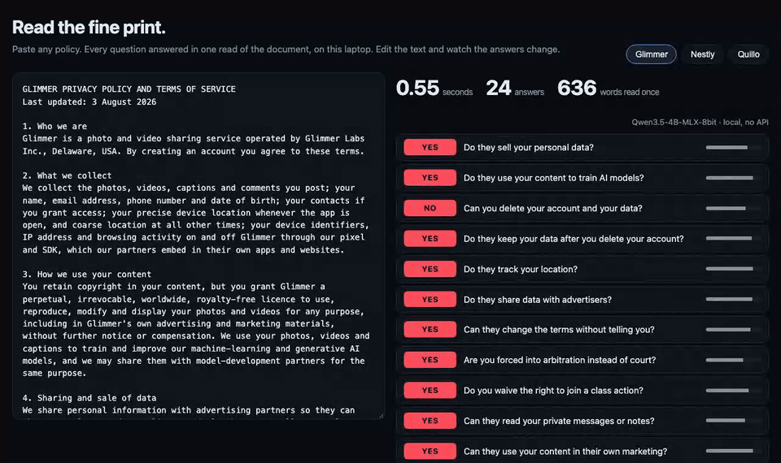

*动图 1：把「出售个人信息」那句改成「从不出售」，「卖不卖你的数据」那一题当场从 YES 翻成 NO，其余不动。读完整份协议、答完 24 题，本机用时 0.55 秒。*

### 一句话，一个页面

输入一句描述，比如「里斯本一家早上六点开门的家庭面包店」。页面用什么配色、多密、主按钮写什么、放哪些版块，拆成 80 个判断，一次答完，拼成页面，用时约 1.1 秒。右栏列出每个决定的概率，把握不到一半的标成黄色。

我们试「ICU 护士站的实时仪表盘」时，它给主按钮选了「申请演示」。这显然不对——但它自己只给了 46% 的把握，标成了黄色。**它选错了，但它知道自己可能选错了。** 后面你会看到，这恰恰是这套东西最值钱的地方。

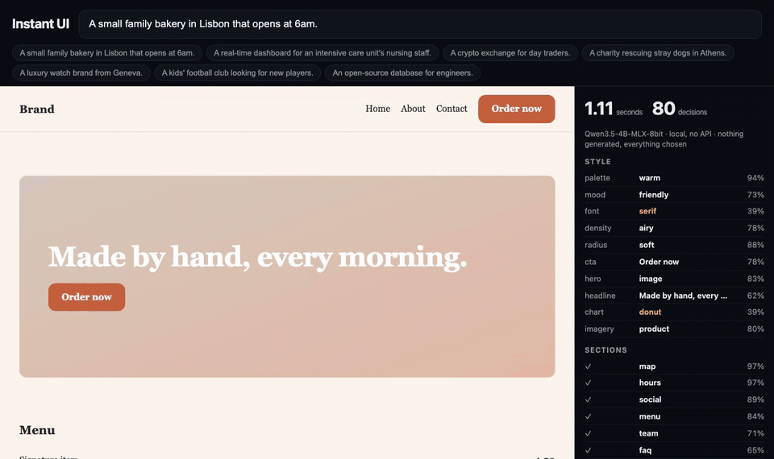

*动图 2：把「面包店」改成「ICU 护士站的实时仪表盘」，80 个决定重做一遍，整页重排，用时 1.1 秒。右栏标黄的「申请演示」，它自己只给了 46% 的把握。*

### 会点网页的 agent

一个模拟电商站，六个任务，比如「把最便宜的蓝色夹克加进购物车并下单」。每一步，agent 从页面上八到十七个可点的元素里挑一个，每一步都是一次判断，不生成任何文字。六个任务全部完成，平均每步 0.26 秒。

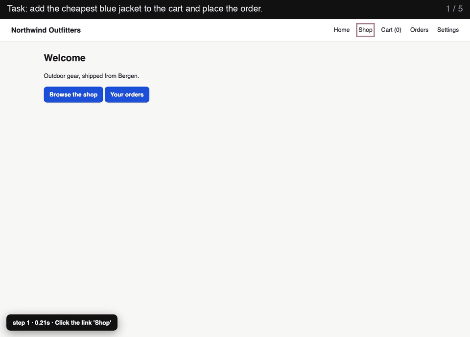

*动图 3：任务是「把最便宜的蓝色夹克加进购物车并下单」。红框是它每一步选中的元素，左下角是这一步的耗时。五步下完单，一共 1.37 秒，动图基本就是实际速度。*

---

## Quire 是怎么搭的

对外，它只接一种请求：**一份材料，加一批带类型的问题。**

```json
{"state": "政策：试用账户可导出 CSV，导出 PDF 需付费。一位试用用户要求导出 CSV。",
 "questions": {
   "allowed": {"type": "noul",
               "instructions": "这次导出是否被政策允许？"},
   "route":   {"type": "choice",
               "instructions": "该转给哪个团队？",
               "criteria": {"support": "产品支持",
                            "billing": "账单",
                            "sales": "销售"}}}}
```

`choice` 是多选一，选项概率加起来等于 1；`noul` 是一组各自独立的是非题，不互相抢概率；`score` 是打分档位。这套格式兼容 TypeSafe 给 Jev 定的接口（`POST /v1/systemone`），所以为 Jev 写的评测不用改一行就能拿它跑。

对内，一次调用走五道工序：

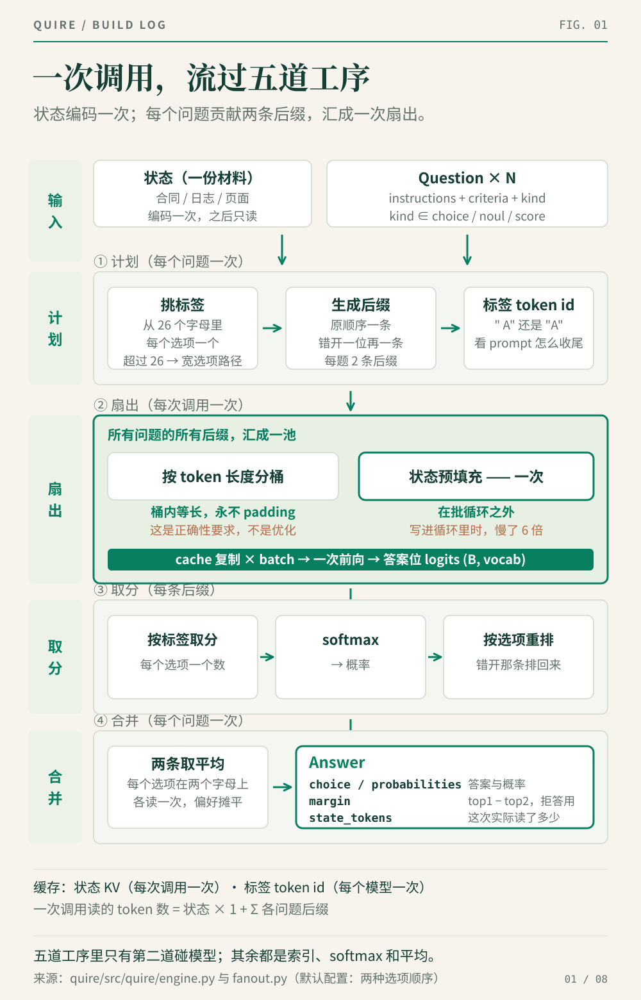

*图 1：五道工序里只有第二道真正碰模型，其余是查表、softmax 和求平均。*

第二个问题问的那几个关键设计，就散落在这五道工序里：答案怎么读、材料怎么共享、概率怎么校准、选项太多怎么办。下面一个一个拆开讲。

---

## 四个关键设计

### 1. 答案怎么读出来

**最终做法**：把问题写成带字母的选择题，让模型把材料和问题过一遍，在答案该出现的那个位置停下，只取候选字母的分，换算成概率。

```python
out = model(tok(prompt).input_ids)
logits = out.logits[0, -1]        # 答案位：词表里每个词一个分
p = softmax(logits[cand_ids])     # 只取候选字母那几个
```

没有解码循环，没有 JSON 解析，没有失败重试。它在物理上答不出不存在的选项，也不可能括号没配平——压根没有括号。

**考虑过的其他做法**：下面几种我们都实现了，放在同一批题上比。

- **直接生成 JSON。** 最省事，也是大多数人现在的用法。问题上篇讲过：慢，会出格，而且模型心里那个概率分布在采样时被压成了一个词。
- **槽位。** 给每个选项在 prompt 里留一个占位 token，读这些位置的内部状态，接一个小分类器。
- **指针。** 把每个选项的描述也过一遍模型，得到一串数字，看它和答案位那串数字谁最像。这是教科书上的标准做法，看起来最「对」。
- **字母 + 一层可训练的变换。** 保留字母读法，在字母的分上再学一层线性调整。
- **先想一想再答。** 让模型先写一段推理，再读答案位。
- **不同的问法。** 读法定了，问题怎么写也有讲究。发布版用的是我们自己写的 prompt：把每个问题写成「对这份材料做的一项检验」，让模型先判断材料能不能通过，再给出对应的字母。它是从三种写法里挑出来的，挑选只用我们自己合成的政策和信息充分性题，不碰 JevBench 的题：482 题里它答对 381 题，另外两种是 375 和 369。在 JevBench 公开题上，几种写法每一档的差别都在一题以内。

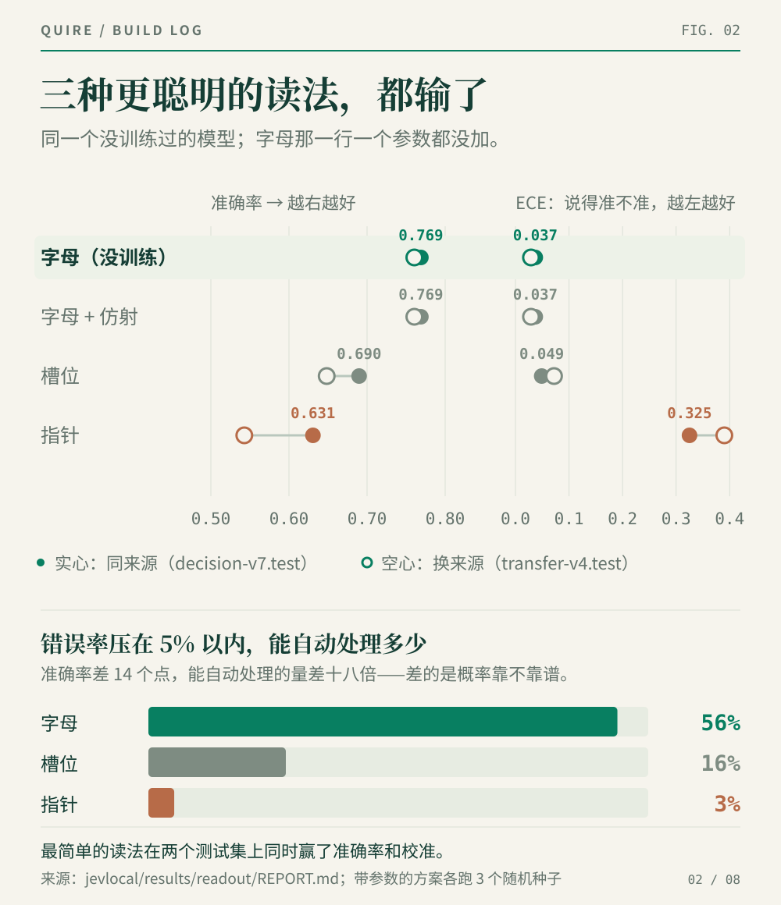

*图 2：上半是准确率和 ECE，实心点是同来源的题，空心点是换了来源的题；下半是错误率压在 5% 以内时，能交给机器自动办的比例。*

**效果**：三种「更聪明」的读法，都输了（问法的影响很小，见上一条）。

上半张图右边的 ECE，量的是「嘴上说的把握」和「实际正确率」差多少。指针那一行是 0.325：它说九成把握时，实际只对了五成七——不是答错，是理直气壮地答错。

下半张图才是账本。假设你定一条规矩：机器自动办的那部分，错误率不能超过 5%，其余转人工。字母读法能交给机器 56%，指针只有 3%。**答对率只差 14 个点，能省的人工差了十八倍。** 区别全在概率靠不靠谱：概率是虚的，门槛就只能提到谁都过不去。前面 ICU 那个「46%」的意义也在这里——知道哪些决定该复查，比多答对几题更值钱。

最笨的为什么赢？字母读法并不是「没有分类器」，它用的是模型自带的那一个：拿几万亿 token 训出来、做过的选择题多到数不清。新接一个头，等于拿 1.4 万条样本从零训一个去和它掰手腕。那层可训练的变换也说明了同一件事：训完学到的是恒等映射，小数点后三位都没变，字母的分里已经没油水可榨了。

「先想一想」也不行。4B 在需要算概率的题上，给 256、512、1,024 个 token 都没能把思考收尾（10 题里 0 题想完），强行截断比不想还差。开头那个网页 agent 我们也拿同一个模型对比过：先想再点，每步慢了十九倍，六个任务只完成三个。

**踩过的坑**：

- **标签必须正好是一个 token。** 读的是一个位置，标签被切成两块就读不全。所以能用的只有 26 个大写字母，第 4 节接着处理这个上限。
- **读哪个 token，由 prompt 怎么收尾决定。** prompt 以 `Answer:` 结尾时，模型下一个要吐的是带空格的 `" A"`；如果答案是助手回合的第一个 token，就是不带空格的 `"A"`。两者是不同的 token。读错了程序不报错，概率照样加起来等于 1，只是准确率悄悄掉十几个点——属于那种让人先怀疑人生、再怀疑模型的 bug。
- **聊天模板会偷偷打开一个「思考」块。** Qwen3.5 的模板默认在助手回合开头放一个 `<think>`。不手动关掉，答案位就落在一段没写完的推理里面。

### 2. 一份材料，怎么问很多个问题

**最终做法**：把 prompt 在「材料结束」那一点切开。前半段（系统提示、材料）每次请求只算一次，把算出来的中间状态留着；后半段（问题和选项，通常 20 到 200 个 token）每个问题一条，接在前半段后面。一份材料分出很多问题，所以这个做法叫**扇出**。

**效果**：在一份 1,431 token 的文档上问 40 个问题，一个一个问要 13.26 秒，扇出只要 0.64 秒，快 **20.7 倍**（MLX，M5 Max）。

**考虑过的其他做法**：

- **每个问题从头读一遍材料。** 最简单，而且按构造一定正确。我们把它留作「标准答案」：扇出的每一个结果都必须和它逐条相等，这个加速才算数。
- **答完一题，把状态倒回去，再答下一题。** 在普通 Transformer 上可行，在 Qwen3.5 上不行，原因见下一条。
- **把长短不一的问题补齐长度，打成一批。** 这是最常见的批处理办法，我们本来指望它再赚一个大倍数。结果只多赚了 1.32 倍。

原因在模型结构：

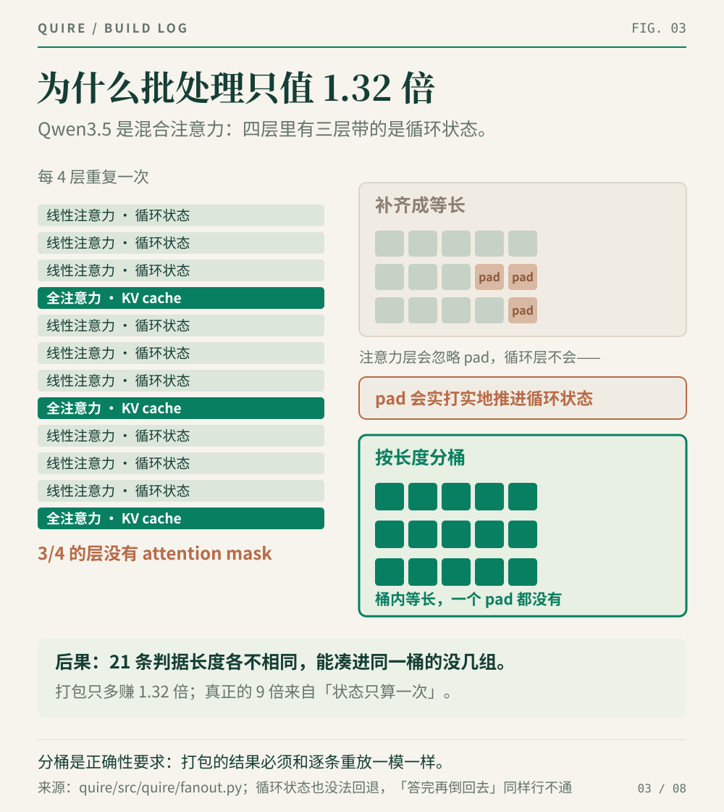

*图 3：Qwen3.5 每四层里有三层是带循环状态的线性注意力，没有 attention mask，补齐长度这条路走不通。*

循环状态有两个特点：一是大小固定，不随长度增长，也就没有逐个 token 的历史可以倒回去；二是没有 attention mask。注意力层会乖乖忽略补进来的 padding，循环层不会，一个 pad 就把状态往前推一格，打包的结果从此不再等于一条一条算。所以只能按 token 长度分桶，桶里长度必须完全一样（CUDA 上每批最多 32 条），而长短各异的问题很少能凑进同一桶。这不是没优化，是模型结构说了算。

**踩过的坑**：

- **预填充写进了循环里。** 一开始把「读材料」写进了分桶循环里面，每个桶都把材料重读一遍。短材料上看不出来，换成一整份日志，「只读一遍」的方案反而比一个一个问**慢了 6 倍**——正好和整个架构想证明的事反着来。
- **缓存快照被后续写入改掉。** MLX 是惰性求值的：注意力层的缓存可能只是写缓冲区的一个切片，不强制求值，后面的写入就会改到「快照」里；循环层的缓存干脆就是那个还在被改写的列表本身，得复制一份才能和后续写入断开。
- **复用中间结果，会让几个答案翻面。** 777 个决策里有 4 个变了，全是本来就在 0.5 附近打平的。8 比特量化下，换一条计算路径，这种擦边的判断就可能换边。

**适用边界**：这个倍数不是常数。

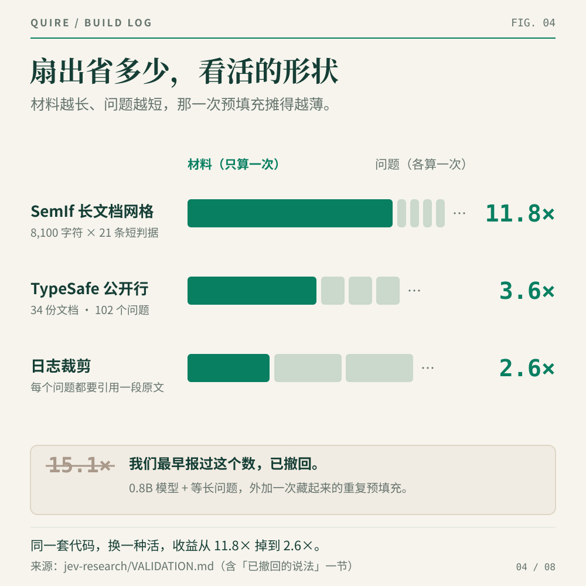

*图 4：同一套代码换三种活，收益从 11.8 倍掉到 2.6 倍。被划掉的 15.1 倍是我们最早报出去的数，已撤回。*

它取决于材料和问题的长度比。材料越长、问题越短，那一次读取摊得越薄；换成一个 12 token 的材料配 66 token 的问题，同样的比较只剩 3.1 倍。那个被划掉的 15.1 倍，是在 0.8B 小模型上、用长度完全一样的问题测的，里面还藏着一次重复计算。

长度比小的活，这条路线就不划算。我们在「日志裁剪」上认真比过：Quire 0.907，一个 0.6B 的嵌入模型 0.867，逐题配对分不出高下（p = 0.38），而 Quire 多花了 37 倍算力。那个场景我们老老实实用了嵌入模型。三个演示全是「一份材料、很多问题」，原因就在这里。

### 3. 怎么让概率靠得住

第 1 节的全部价值都押在概率上，而小模型的概率有一个老毛病：同一个选项排在 A 位和排在 C 位，拿到的分不一样。

**最终做法**：每道题读两遍，第二遍把选项循环错开一位（A B C D 变成 B C D A），两次的分布各自排回原来的选项顺序，再取平均。每个选项都在两个不同的字母上各读了一次，位置带来的偏好就被摊平了。

**效果**：难题那一档的 ECE 从 0.118 降到 0.073，几乎减半。有意思的是，答对的题数一道没变（71 道），变的只是概率——这正是这一步要解决的问题。代价只有每题多一条后缀，材料是共享的，不用重读。

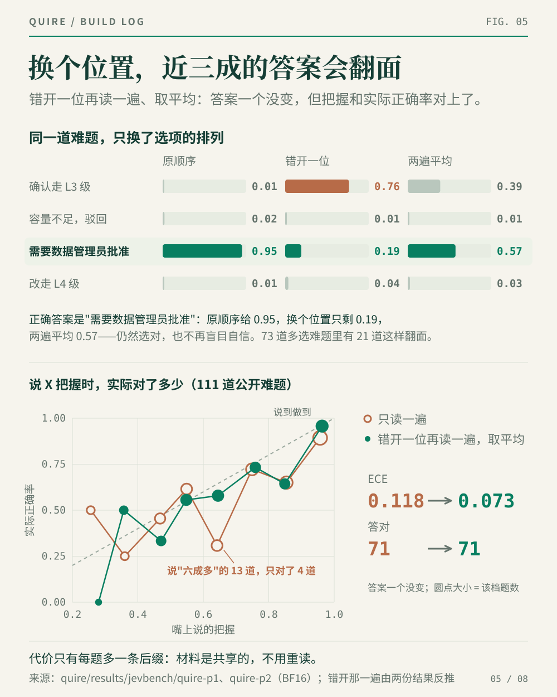

*图 5：上半是一道真实难题，只把选项错开一位，正确答案的概率就从 0.95 掉到 0.19；下半是两种读法的可靠性曲线，越贴近对角线，说的把握和实际正确率越一致。*

位置的影响比想象中大。111 道公开难题里有 73 道是多选题，只把选项错开一位，其中 21 道的答案就翻了面。最扎眼的是只读一遍时「说自己有六成多把握」的那 13 道题：只对了 4 道。错开再读一遍、取平均之后，这一档变成 19 道对 11 道，嘴上说的和实际对上了。

**考虑过的其他做法**：

- **错开更多次。** 3 次、5 次都试了，和 2 次的差别都在一题以内（p = 1.0）。多读一次就多一条后缀的成本，2 次够了。
- **减掉内容无关的先验。** 把同一个 prompt 换成空白材料跑一遍，量出模型对各个字母的「天生偏好」，再从真实结果里减掉。实测和不减没有区别，发布版关掉了。
- **事后拟合一个「温度」**，把所有概率整体调松或调紧。这是教科书做法。我们用一半难题拟合、另一半检验，重复 10 次，没参与拟合的那一半校准反而变差（按 JevBench 的校准分，从 72.7 降到 69.9）。用全部 111 道难题一起拟合能找到一个「最优」温度，但那等于拿考题本身来调，不算数。难度和来源混在一起的题，一个数字管不住。

**顺带的收获**：两次读取之间的分歧本身就是一个信号。两次答案不一致，说明模型在「选哪个」上拿不准；两次都一样平，说明题目本身就模棱两可。这两种情况该有不同的处理，所以 Quire 的返回结果里把它们分开报告。

### 4. 选项超过 26 个怎么办

26 个字母总会用完。现成的做法有两种：拒答，或者截断、过滤掉一部分选项。reflex 的 27B 在 Decision Index 上完整跑过一遍，13 万多个请求里有 14,500 个因为选项超过 26 个被判为「不支持」，记零分。

**最终做法**，我们叫它**宽选项路径**：把每个选项拆成一道「是不是它」的是非题，全部放进同一次扇出里并行跑，再把每题「是」的概率归一成一个分布。这其实就是 Jev 自己描述的高选项数做法：先逐个打分，再做选择。255 个选项也能答，不截断、不过滤、不拒答。

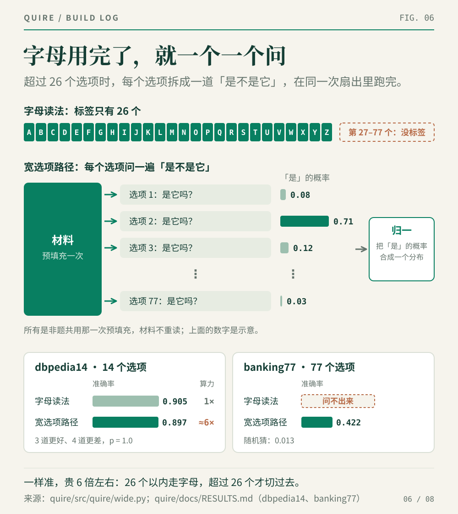

*图 6：字母读法到第 26 个选项就没有标签了。宽选项路径把每个选项拆成一道是非题，共用同一次预填充，再把「是」的概率归一成一个分布。下方两张卡是实测结果：能比的地方一样准，字母读法问不出来的地方它照样能答。*

**效果**：在 14 个选项的 dbpedia14 上，两种办法都能用，准确率一样：字母读法 0.905，宽选项路径 0.897（3 道更好、4 道更差，p = 1.0）。在 77 个选项的 banking77 上，字母读法连题都问不出来，宽选项路径答到 0.422，随机猜是 0.013。

**取舍**：宽选项路径每个选项一条后缀，算力是字母读法的 6 倍左右。既然两者一样准，默认设置就是 26 个以内走字母读法，超过 26 个、字母读法根本答不了的时候才切换过去。

---

## 基准评测结果

自己出题自己考不算数，所以我们用了两个外部榜单。两个都是第三方做的，和 TypeSafe、和我们都没有关系，测法也不一样。

### JevBench

JevBench 是评测网站 Benchmark Heaven 自己出题、自己跑的榜单，专门测 Jev 这一类「材料加选项进、带类型的答案出」的判断模型。v1.3.0 用同一套 534 道题测了 52 个系统：简单 72 道、标准 96 道、需要评判的 146 道、难题 220 道，每个系统都从德国的一台服务器一条一条发请求。

总分由四项构成，各占 25%，取几何平均：**智能**（答得对不对，按高出随机猜多少来算）、**校准**（说 80% 把握时是不是真有 80%）、**速度**、**成本**。几何平均的意思是相乘再开四次方，所以一项塌了，另外三项再高也拉不回来。

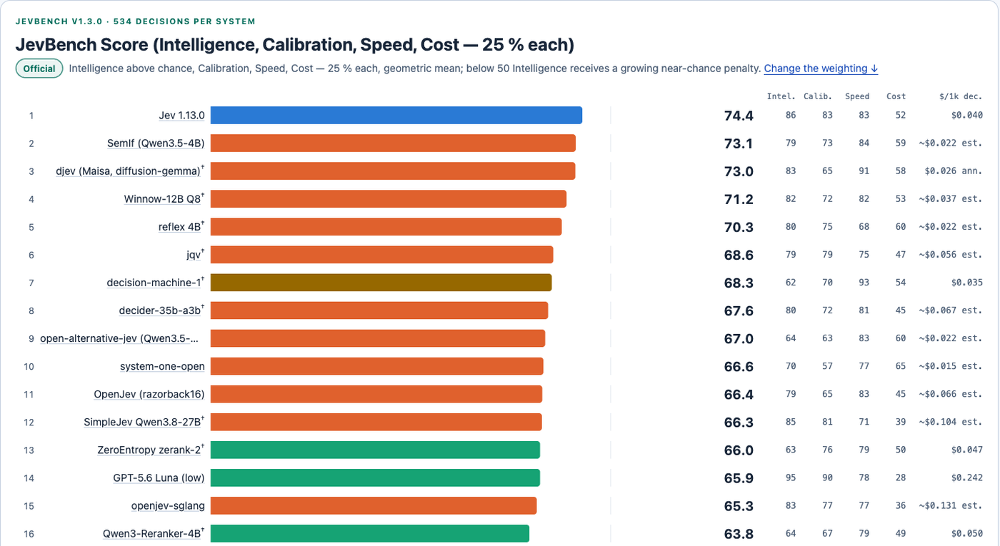

*截图 1：JevBench v1.3.0 的总榜前 16 名（2026 年 9 月 21 日评测）。右侧四列依次是智能、校准、速度、成本。来源：benchmarkheaven.com/jev-models*

534 道题里只有 231 道公开，其余只有维护者能跑，所以谁都没法在本地算出正式分数。提交的方式是开一个 issue，维护者拿你的代码自己跑。

下表取截图里能直接对照的两列：总分和速度。再加一列「公开题答对」：JevBench 公布了每个系统在 231 道公开题上的逐题结果，可以一题一题地比。

| | 总分 | 速度 | 公开题答对（共 231） |
|---|---|---|---|
| Jev 1.13（榜上第 1） | 74.4 | 83 | 200 |
| **Quire** | **73.2–74.2（推算）** | **88.0（自测）** | **183** |

这三列需要说清楚：

- **总分是推算的，不是官方成绩。** 我们用 JevBench 自己的计分公式，在公开题上算：简单、标准、难三档分别答对 48/48、64/72、71/111；校准按它的公式在公开难题和概率题上算；成本按每个决策实际读的 775 个 token 乘以 4B 模型的公开托管价。隐藏的「评判」档占智能分的 28%，我们测不到，只能假设它的正确率在 0.85 到 0.95 之间，所以总分是一个区间。
- **速度是在我们自己的一张 L40 上测的**，中位延迟 124 毫秒。JevBench 在它自己的 GPU 上测，这个数不能直接搬过去。
- **公开题答对直接来自 JevBench 公布的逐题结果**，Jev 那一行是维护者自己跑出来的。

速度这一列回答了第一个问题的前一半：**一个 4B 装上这套架构，速度就能和 Jev 站在同一档。Jev 的快，架构能解释大半，不需要一个神秘模型。**

Quire 已经提交 JevBench 官方评测，发稿时还在排队，所以这里没有官方名次。上表只是我们自己在 231 道公开题上的测量。

### Decision Index

Decision Index 是 Hugging Face 上的 multimodalart 维护的榜单，思路和 JevBench 相反：不自己出题，而是把 37 个现成的 benchmark 统一改写成「材料加选项」的格式，在同一套冻结的题库上横向比较 Jev 和它的 31 个开源复现。题库有 13.2 万个请求，覆盖知识推理、语言理解、检索分类、工具调用、人的判断五个领域；其中 19 个 benchmark 进入计分，五个领域等权，总分 0 到 100。所有复现都在同一张 RTX PRO 6000 上跑。

它有一条规矩对 Quire 很要紧：**没答的题一律算错。** 选项超过 26 个就拒答的系统，要为此实打实地扣分——第 4 节那条宽选项路径，就是为这种题准备的。

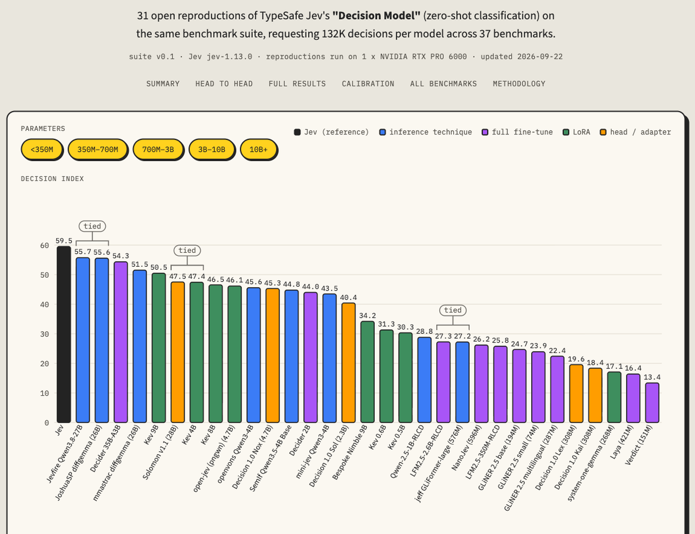

*截图 2：Decision Index 0.1 总榜（2026 年 9 月 22 日更新）。黑色是 Jev 本身，59.5；开源复现最高 55.7。来源：huggingface.co/spaces/multimodalart/jev-decision-index*

Quire 在 Decision Index 上的完整运行还在进行中，结果出来后补上。

### 另一个参照：TypeSafe 自己公布的 102 行

TypeSafe 公开过 102 行题目和各个模型的答案。它的「参考答案」是几个前沿模型答案的平均，所以量的是「像不像大模型」，不是「对不对」。Quire 在这里是 0.799，Jev 公布的是 0.883；逐行配对，Quire 3 行更好、11 行更差（p = 0.057），差距不大，但方向和 JevBench 公开题上一致。

---

## 难题这一档：天花板还在，我们还在试

上面那张表里最弱的一项是难档。Quire 在公开的简单档全对，难档只有 0.64，而且怎么调都不动：换 prompt 措辞能挪几个点，只是在一个窄区间里挪。

我们一度以为是自己没调好，后来翻了别人的数据：

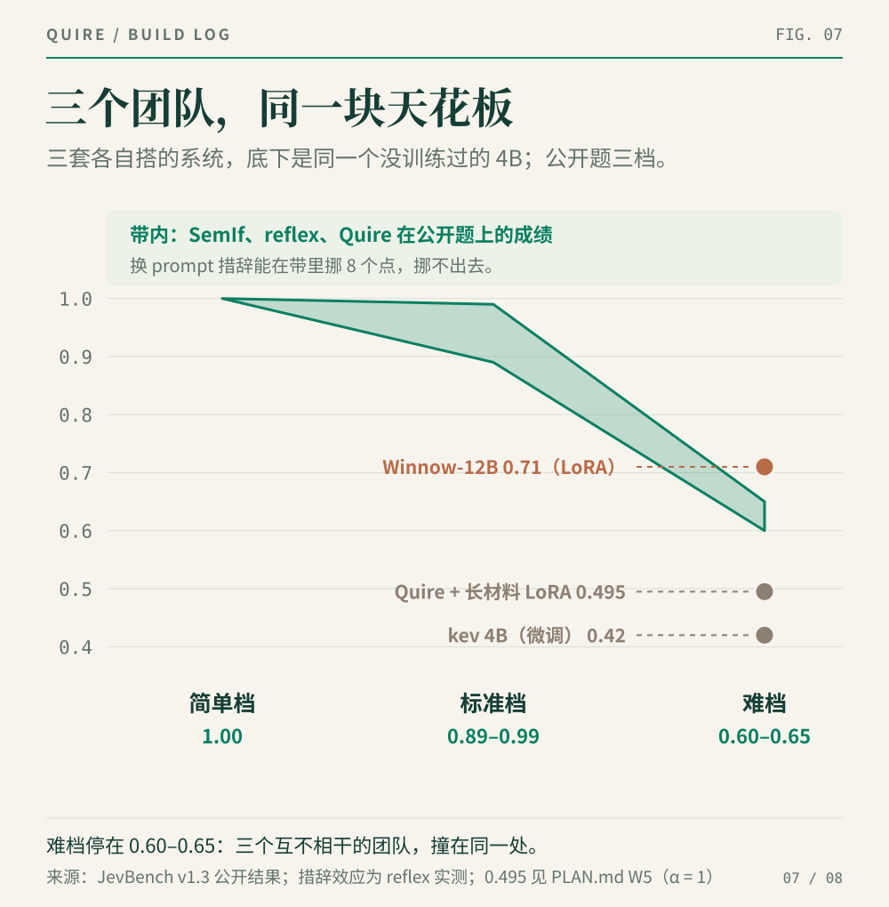

*图 7：三个互不相干的团队，用同一个没训练过的 4B，难档落在同一条带里。右侧三个点是训练过的系统。*

SemIf、reflex 和 Quire 各自搭的系统，底下是同一个没训练过的 4B，难档全部落在 0.60–0.65。这回答了第一个问题的后一半：**难题上的差距主要来自模型本身，不是架构。** 至少在不训练的前提下，架构补不上这一块。

那就训练。

我们用 LoRA 在 4B 上做了一轮微调：只训很小一部分参数，模型主体不动。训练集是我们自己设计的，方向上参照了 Winnow-12B——榜上唯一明确越过这条线的小模型，难档 0.71。它的模型卡提示，训练数据的「形状」可能比训不训更要紧：难档的题恰恰是材料最长、要在一大段上下文里找关键事实的那些。

- **长材料**：写了六类场景生成器（政策条款、多跳查找、证据计数与概率、日期与数字、分流、信息是否充分），一半以上超过 2,000 token，上限 8,192；标准答案由程序算出，精确无误，不经过任何大模型。
- **孪生样本**：每条配一条只改了一个关键事实、答案随之改变的样本，逼模型真的去读那个事实，而不是靠表面特征蒙。
- **学老师的概率分布**：用 27B 模型当老师，只在它答对的题上学它的完整概率分布，让学生学会在该犹豫的地方犹豫。
- **防遗忘**：混入 6 千条旧数据。

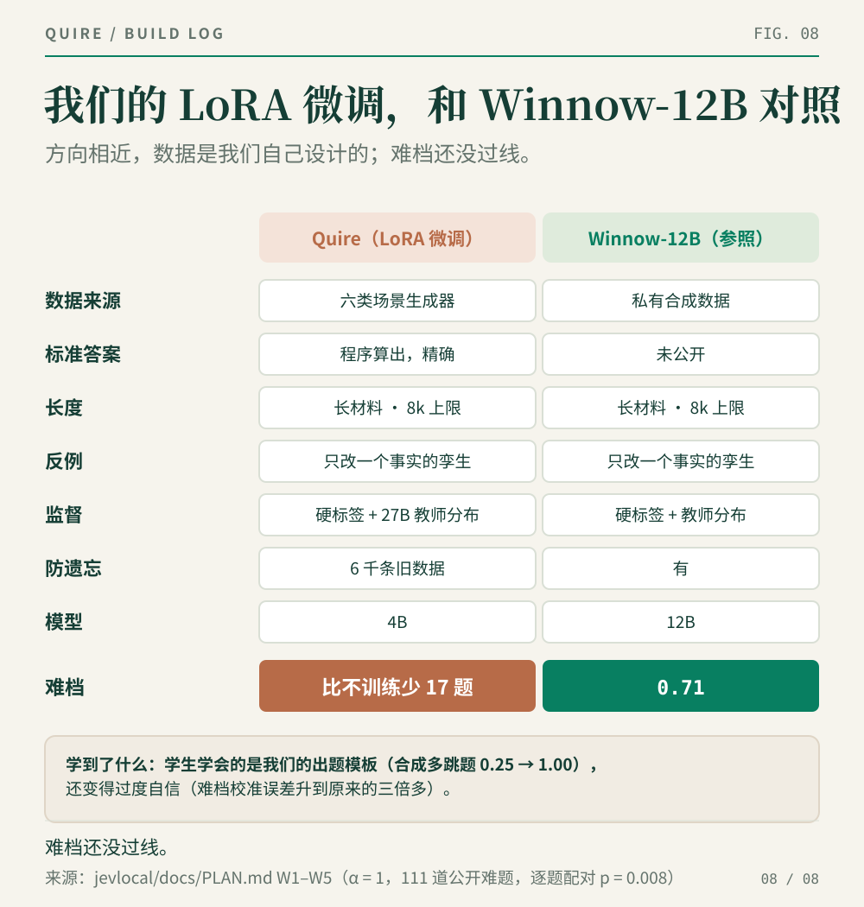

*图 8：我们的 LoRA 微调方法和 Winnow-12B 逐条对照。*

结果难档没涨反降：训练改动叠加得越多，掉得越多。叠满时，和不训练的版本比，111 道公开难题少答对 17 道（逐题配对，p = 0.008），难档的校准误差升到原来的三倍多。（这组实验对照的是换成现在这版 prompt 之前的配置。）

模型并没有忘东西，防遗忘的对照集反而涨了 5.5 个点。它是学偏了：合成题里的多跳推理从 0.25 练到 1.00，学会的是我们出题的套路，外加一身自信。**学生摸清了出题人的口头禅，但没学会这门课。** 那个 27B 老师自己，在最难的几类合成题上也只答对 38%–56%。

---

## 代码和复现

Quire 以 MIT 协议开源：[github.com/aflowx/quire](https://github.com/aflowx/quire)。NVIDIA 显卡和 Apple Silicon 都能跑：

```sh
pip install -e ".[mlx]"
quire-serve --backend mlx \
  --model mlx-community/Qwen3.5-4B-MLX-8bit \
  --port 8778
```

仓库里每个数字都能追到结果文件、生成它的配置和复现命令，包括没成功的微调。Quire 是独立项目，与 TypeSafe AI 没有关系。

---

*主要来源：[TypeSafe 官方发布](https://typesafe.ai/blog/introducing-system-one-models-and-jev)；[JevBench v1.3](https://github.com/fstandhartinger/jevbench)；[SemIf](https://github.com/TheoLeeCJ/SemIf)；[reflex 的训练对照实验](https://github.com/kshetrajna12/reflex/blob/main/docs/results/frozen-vs-trained.md)；[Winnow-12B 模型卡](https://huggingface.co/EldanRing/Winnow-12B)*
