## 先说结论：我们在浪费一个 if

先说结论：现在很多人用大模型的方式，说白了是在用一台超级计算机，干一个 if 语句的活。

听着夸张，展开说说。

你在维护一个客服系统，进来一张工单：「改完密码登不上去了，而且上个月好像被扣了两次钱。」

你要判断三件事：转给哪个组、要不要标急、客户是不是在要退款。

现在通行的做法是，把这段话连同一份 schema 丢给大模型，让它回一段 JSON：

```json
{"queue": "access",
 "urgent": true,
 "refund_requested": true}
```

你的代码解析这个字符串，走对应的分支。

看着挺合理。但把这段 JSON 拿去分词，会看到一件有点荒唐的事——它在 Qwen3.5 的词表里被切成 **17 块**：

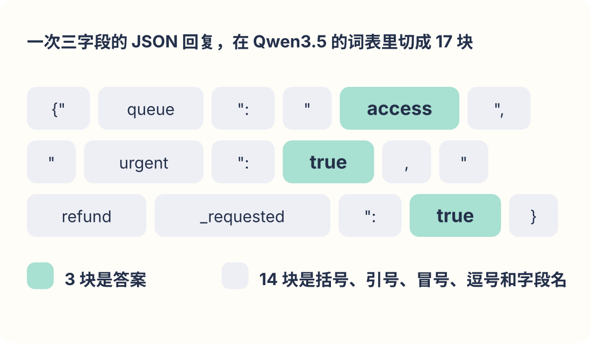

*图 1：真正是答案的只有 `access`、`true`、`true` 这三块。剩下十四块是括号、引号、冒号、逗号和字段名——字段名还是你自己在 schema 里写过一遍的。*

要是这个 API 返回带缩进的格式（很多都这样），那就是 25 块里有 3 块有用。

而这三个答案，在第一次前向传播结束的时候就已经全定了。

从这一个事实出发，浪费至少有三处。

**慢。** 这 17 个 token 是串行吐的，上一个没出来下一个就开不了工。你等待的时间里，八成在等标点。

**贵。** 输出 token 是计价里最贵的那档。你买了 17 个，其中 14 个买的是格式。

**不靠谱。** 它偶尔会写一个你代码里根本没有的标签，或者括号没配平。于是你得加校验、加重试，if 外面又包了三层 try。

这三条大家多少都知道。真正可惜的是第四条，也最容易被忽略。

模型在写出 access 之前，内部是有一个完整的概率分布的：账号 0.58，账单 0.40，物流 0.02。

看着是账号赢了，可它和账单之间只差 0.18——这张工单确实同时提了登录和扣款，模型自己也相当犹豫。

但采样这一步，把整个分布压成了一个词。你拿到的是斩钉截铁的「账号组」，「我其实拿不准」这句话，半路丢了。

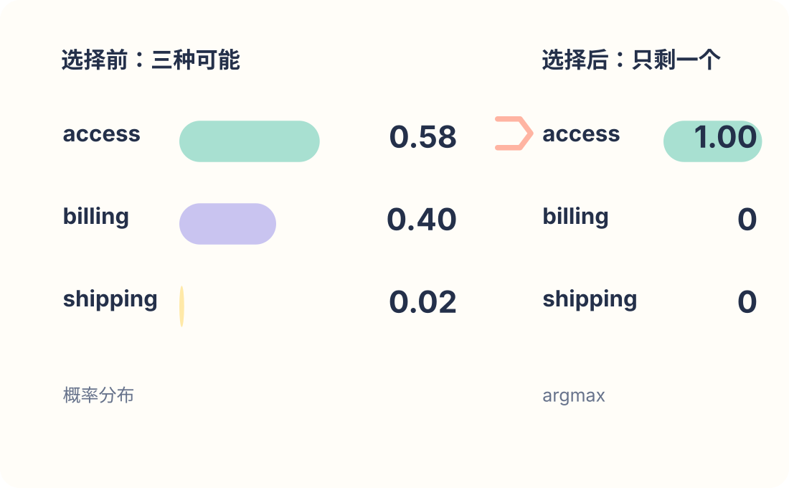

*图 2：同一次前向传播。左边保留了分布，能看出 0.58 和 0.40 挨得多近；右边 argmax 之后，这个「近」就再也看不见了。*

而被丢掉的这个东西，恰好是最近很火的 Jev 模型拿来当卖点的。

## Jev 是个什么东西

2026 年 9 月 15 日，一家叫 TypeSafe AI 的公司发布了 Jev。

官方给它的定位叫 System One 模型，名字取自《思考，快与慢》里的「系统一」：快、直觉、不费力。这几年整个行业都在往系统二使劲，长思维链、多想一会儿再开口，Jev 偏偏反着走。

它最特别的地方是不写字。

你发给它一段「状态」，附上几个「问题」，它返回类型化的答案，外加每个答案的概率。全程一个 token 都不生成。

接口长这样：

```json
{
  "state": "客户改密码后无法登录，并且说上个月被重复扣款了",
  "questions": {
    "queue": {
      "type": "choice",
      "instructions": "这张工单该由哪个团队处理？",
      "criteria": {
        "access":   "登录、密码、账号访问问题",
        "billing":  "扣费、账单、退款、支付问题",
        "shipping": "物流状态、延迟、丢件"
      }
    },
    "urgent": {
      "type": "noul",
      "instructions": "客户现在是否被完全挡住、无法继续使用产品？"
    }
  }
}
```

返回：

```json
{
  "queue": {
    "choice": "access",
    "confidence": 0.71,
    "probabilities": {
      "access": 0.58,
      "billing": 0.40,
      "shipping": 0.02
    }
  },
  "urgent": { "noul": 0.93 }
}
```

问题分三种。Choice 是从几个选项里挑一个，最多 255 个；Score 是在一组有序档位上打分，2 到 10 档；Noul 是回答「这句话为真的概率有多大」。

这三种不是随便凑的。它们的答案住在三种不同的空间里，选错了会很别扭。

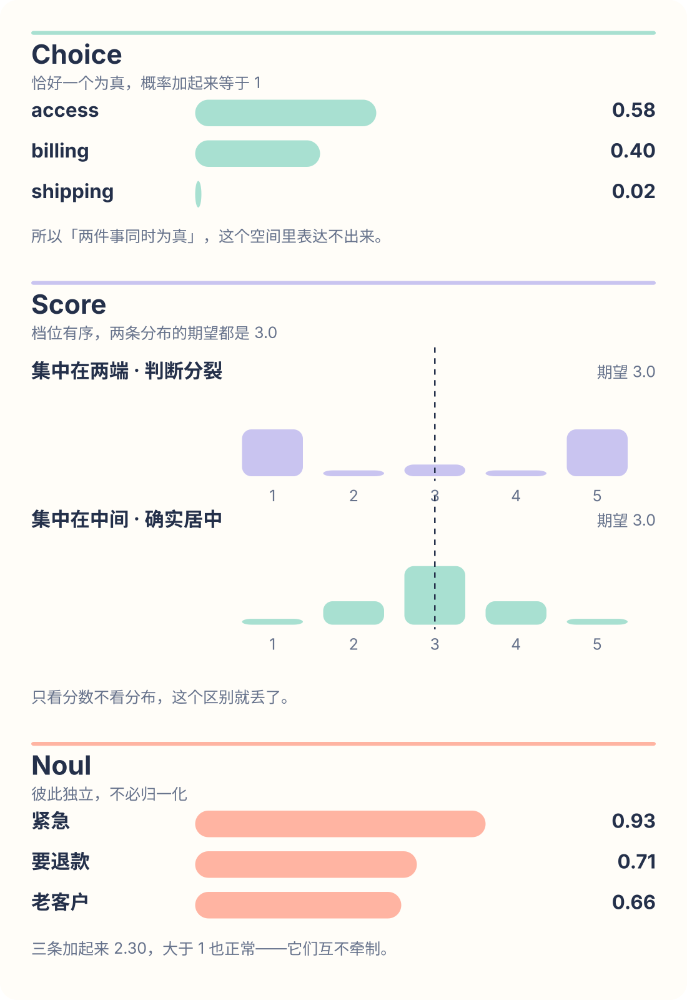

*图 3：三种问题的答案各住一种空间。Choice 的概率加起来等于 1，所以它假设「恰好一个是对的」；Score 的档位是有序的，两条期望值都是 3.0 的分布，形状可以完全相反；Noul 互相独立，是唯一能表达「几件事同时为真」的类型。*

举个例子。一张工单既是账单问题又是登录问题，你要是用 Choice 去问，它只能把概率分掉，给你两个都不到 0.5 的数，你还以为它拿不准。这种时候该问两个独立的 Noul。

Score 也有类似的坑。两端概率高和中间概率高，期望值可以一模一样，意思正好相反：前者是「大家吵起来了」，后者是「确实就在中间」。只看分数不看分布，这个区别就没了。

官方公布的规格，我整理成一张表：

| | |
|---|---|
| 端到端延迟 | 70–500 ms |
| 输入价格 | $0.042 / 百万 token |
| 输出价格 | 免费 |
| 上下文 | 64k，其中「状态 + 最长的一个问题」不超过 32k |
| 选项上限 | 255 |
| 限流 | 250,000 token/秒；1,200 请求/分钟 |
| 当前版本 | `jev-1.13.0` |
| 微调 | 不提供 |
| 模态 | 纯文本 |

官网首页挂着「193.6 倍快、444.6 倍便宜」。这里得替 TypeSafe 说句公道话：他们自己在同一篇文章里给了三条免责声明。这些数字「在真实收益的偏高一端」；测试工作流「由我们模型能力团队的人编写，可能存在偏差」；评测方法「使答案偏向 OpenAI 和 Anthropic 的模型」。

比多数发布稿诚实。第三条后面会变得非常重要，先记着。

## 它有多大？官方不说，但藏不住

架构、参数量、训练数据，TypeSafe 一概不说。他们自己的 FAQ 里列着一条「我们的训练数据从哪来」，底下是空的。

但有些东西藏不住。比如价格。

租一块 H100 大约 2 美元一小时。Jev 的输入价是每百万 token 0.042 美元。做个除法：2 美元能买 4,760 万 token 的处理量，摊到每秒是 13,200 token。这是他们一分钱不赚时必须达到的吞吐。

13,200 token/秒的 prefill 吞吐，对应多大的模型？一个 40 亿参数的稠密模型，批处理调得好，大致就落在 1 万到 3 万这个区间。80 亿勉强能算过来，700 亿差了一个数量级。

这个推断对输入不敏感。H100 租价在 1.5 到 3 美元之间波动，对应的盈亏平衡吞吐是 9,900 到 19,800——还是 4B 那一档。就算他们在亏本抢市场、按成本的一半定价，门槛也只抬到 26,400，仍然够不着 70B。

第二样藏不住的，是 255 这个数。

255 是 2⁸ − 1，一个字节扣掉一个保留位。

如果模型是把选项名字写出来的，限制应该落在字符数上。凭什么落在选项个数上，而且恰好是 2 的幂？只有当答案是一个定长索引、输出端挂着固定数量的槽位时，你才会在个数上撞见这种数字。

这条比价格那条软，但它指的不是规模，是结构。

第三样，是别人已经追到多近了。

Jev 发布之后一周之内，至少有四个开源项目从不同角度复刻它。其中一个叫 SemIf，一块 RTX 3090，拿一个冻结的 Qwen3.5-4B，什么训练都没做，在 TypeSafe 公开的评测里能对齐的 102 行上，跟参照答案的一致率是 0.845。Jev 在同样这 102 行上是 0.883。

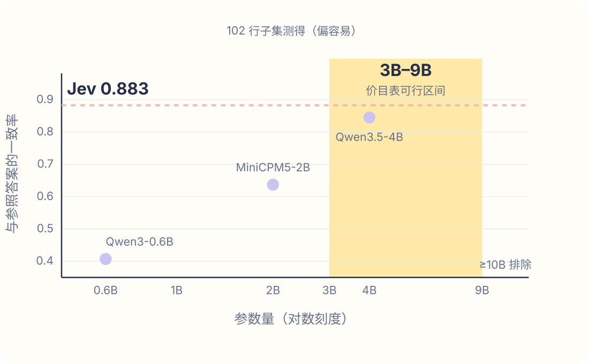

*图 4：横轴是参数量（对数），纵轴是一致率。三个冻结开源模型各是一个点；Jev 只知道纵坐标，所以是一条横线；价目表反推出的 3B–9B 是一条竖带。两条约束一交，Jev 大概在哪就浮出来了。*

这里必须说清楚一件事：**这 102 行是容易的。** Jev 在自家全部评测上的总成绩是 67.8%，在这 102 行上是 88.3%，差了 20 个点，说明能对齐出来的这一小块比整体简单得多。所以「冻结 4B 只差 3.8 分」这个说法，只在一块被挑过的题上成立，而且 n = 102 的时候标准误就有 3.6 个百分点，这 3.8 分本身就在噪声里。

它能说明的是另一件事：一个零训练的 4B 模型，在这条路线上已经能跑出像样的结果。Jev 不是一个靠体量取胜的怪物。

顺着往下推，最省事的解释长这样。

状态进来，由一个双向编码器编码一次。选项描述各自编码成一个查询向量。每个查询向量对状态做一次注意力，得出一个分数。分数过 softmax 就是 Choice，过有序回归头就是 Score，过 sigmoid 就是 Noul。

有意思的是，另一个开源项目 jevlike 只看公开描述，独立收敛到了同一个结构。

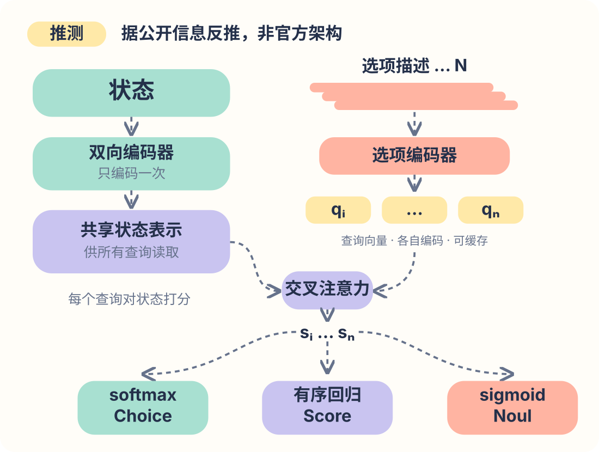

*图 5：据公开信息反推的结构。左边状态只有一份，选项那一路有 N 份；两路在交叉注意力处汇合，再分成三个头。浅色和虚线的部分都是推测。*

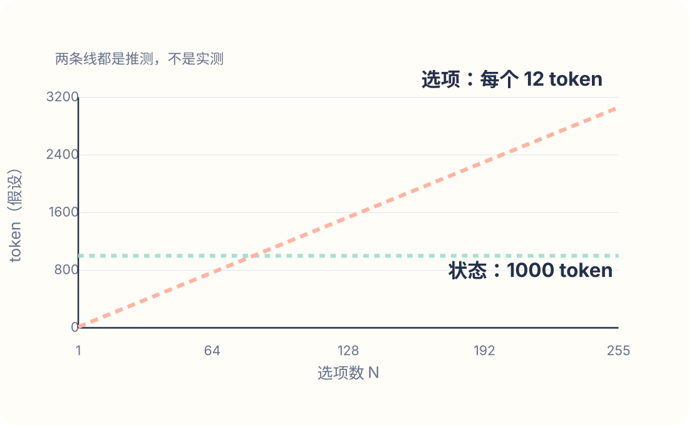

*图 6：推测的结构画成「量」。状态只编码一次，是一条平线；每个选项各打一次分，随选项数线性上升。虚线表示这是推测，不是实测。*

不过这一段你得打个折听。

我对前面「它不大」那个判断挺有把握，因为价格、255、复现者这三条线索来路不同却指向同一个地方。但架构这个猜测不一样，它只是最省事的解释，不是唯一的解释。换个说法：拿一个普通的 decoder，在输出端挂几个特殊的头，同样能解释我们看到的一切现象。

而且从外面根本没法证伪。除非 TypeSafe 哪天自己说，否则这就是个猜测。

## 快在哪：两笔账

这里要先说一句，免得误会：Jev 快，跟它那套神秘的训练方法基本没关系。

快是推理工程带来的，而且是完全公开的工程。你今晚在自己卡上就能跑出来。

一共两笔账，我们一笔一笔算。

### 第一笔：把「打字」这一步删掉

先问个问题：大模型为什么慢？

两个原因。一是它本质上是串行的，第 k+1 个 token 必须等第 k 个算完才能开始——上一个 token 是什么都还不知道，没法接下一个。二是它卡在显存带宽上：每吐一个 token，都得把整个模型的权重从显存里完整搬一遍。算力其实闲着，GPU 在等内存。

prefill 正好相反。整段输入一次矩阵乘算完，能把卡打满，卡的是算力不是带宽。

所以「不生成」这件事，本质上是把一个受带宽限制的串行活，换成了一个受算力限制的并行活。

顺带一提，SemIf 那 21 个判断一共吐了 111 个 token，平均每个 5.3 个。开头那段三字段 JSON 是 17 个 token 装 3 个答案，比例几乎一样——这个壳的开销跑不掉。

SemIf 在同一组 21 个判断上量过这个差别：直接读 logits 用了 1.023 秒；让模型规规矩矩生成一段 JSON，用了 5.332 秒——其中光是吐那 111 个 token 就花掉 4.31 秒。

这个瓶颈有多硬？我们可以自己算一下。

4B 的模型按 BF16 存下来是 8 GB。RTX 3090 的显存带宽是每秒 936 GB。每生成一个 token 都要把这 8 GB 完整读一遍，那理论上限就是每秒 117 个 token。111 个 token，至少 0.95 秒。

注意这个 0.95 秒。它的意思是：**哪怕你把工程优化做到极致、贴着显存带宽跑，光「打字」这一段，就已经几乎等于整条读取路径的全长了**（1.023 秒）。

所以生成慢不是谁代码写得烂，是物理决定的。你优化不掉它，只能绕开它。

### 第二笔：同一段状态，别编码 21 遍

第二笔账更容易被忽略，但省下的更多。

想想看，你拿一张工单问 21 个问题，这 21 次请求里，工单原文是一模一样的。既然一样，为什么要编码 21 遍？

编一次，把 KV cache 广播出去，21 个问题的后缀批量跑就完了。

SemIf 在一个 37 状态 × 21 判据、总共 777 个决策的网格上量了三种做法：每个决策都老老实实重新编码状态，每秒 2.33 个；复用状态、问题一个一个问，每秒 10.75 个；复用状态、问题一起问，每秒 20.03 个。

头尾差 8.6 倍，全部来自一件事——别重复算。

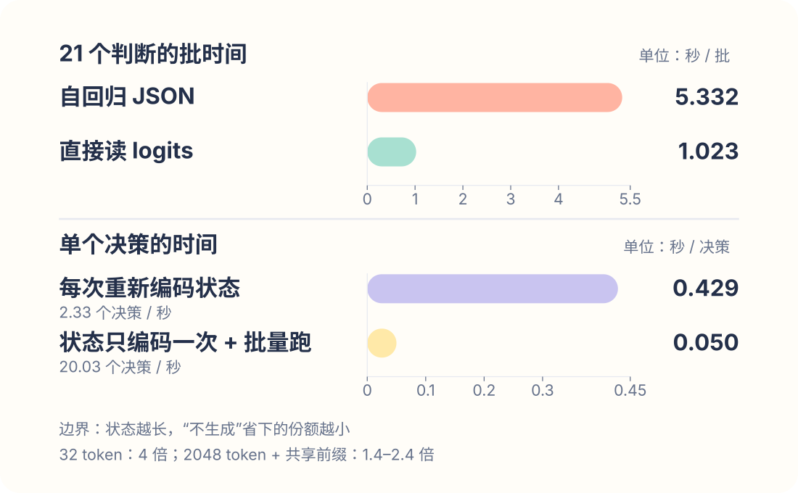

*图 7：两笔账各自的样子。上半是 21 个判断的批时间，下半是单个决策的时间，两组各用各的尺子——它们口径不同，不能直接相乘。*

### 这两笔账不能直接相乘

看到 5.21 倍和 8.6 倍，很容易顺手乘一下得出 45 倍。乘不得。

SemIf 那个 1.023 秒的读取测试，本身就是在共享状态上跑的 21 个判断——21 除以 20.03 是 1.048 秒，和它几乎一样。也就是说第一笔账里已经含了第二笔的一大半。官方那个 40 到 200 倍也是同理，它拿前沿模型比，多出来的一个数量级来自模型大小，不是架构。

还有一条边界更值得记住。

mini-jev 测过：32 个 token 的短文本上，读 logits 比生成快 4 倍；换成 2,048 个 token 的长状态、再开上共享前缀缓存，就只快 1.4 到 2.4 倍了。jevlocal 报过一个 15.1 倍的扇出加速，随后自己更正——那是 2,000 token 状态配 11 token 短后缀的有利比例，真实负载只剩 2.58 倍。

有点讽刺的是，**Jev 的主场恰恰是长共享状态**，也正是「不生成」这条优势最小的地方。

### 落到代码上是什么样

核心就一句话：把 prompt 构造成「下一个 token 就是答案」，然后不采样，直接把那个位置的 logits 读出来。

```python
body = (
    f"<state>\n{state}\n</state>\n\n"
    f"{instructions}\n\n{options}\n\n"
    "只回复一个字母。"
)
prompt = tok.apply_chat_template(
    [{"role": "user", "content": body}],
    tokenize=False,
    add_generation_prompt=True,
) + "答案："

ids = tok(prompt, return_tensors="pt").input_ids
logits = model(ids.cuda()).logits[0, -1]
probs = torch.softmax(
    logits[cand_ids].float(), dim=-1)
```

`cand_ids` 就是那几个选项标签对应的 token id。就这些。

生产上别自己手搓 KV 广播，没必要。把状态逐字节相同地放在每个 prompt 最前面，打开 vLLM 的自动前缀缓存，引擎自己会发现并复用：

```python
llm = LLM(
    model="Qwen/Qwen3-4B-Instruct-2507",
    enable_prefix_caching=True,
)
sp = SamplingParams(
    max_tokens=1,
    temperature=0.0,
    logprobs=len(cand),
    allowed_token_ids=cand,
)
```

这里有两个细节各值不少分，下一节会看到具体数字：标签必须是单个 token，否则概率会散到共享的首 token 上；另外，用字母当标签，别直接用选项名。

### 最后说个坑：串行依赖

这条路线有个真实的约束，设计之前就得想清楚。

Jev 的并行扇出，只对**互相独立**的问题成立。一个需要前一步结果才能做的决策，得再发一次请求。

算笔账就知道有多要命：5 个独立问题，一次请求，70 毫秒；5 个互相依赖的问题，5 次请求，350 毫秒，外加 4 次网络往返。链条一深，延迟优势很快就被往返吃光了。

所以设计的时候第一件事是把决策图压平。能并行问的绝不串行问，宁可把 5 个问题一次全问了、事后把前提不成立的那几个扔掉——反正输出免费。

说到这儿，这一节讲的其实全是「怎么用」。但看到这里你可能已经在想另一件事了：这套东西看着也没多玄，我自己能不能搭一个？

能。而且比你想的容易。**下一篇我们就聊聊怎么手搓一个类似 Jev 的 System One 模型**——从读 logits 开始，一步步加上字母标签、共享状态扇出、置换集成、等温校准，最后跑个分看看离 Jev 还有多远。

## 准不准：三个问题

「准不准」这件事，得拆成三个问题问。因为它们的答案不一样。

### 答得准不准

先看 TypeSafe 自己的评测页 evals.typesafe.ai。四个工作流任务：安全事件、agent 追踪、发票处理、客服。每个模型都用同一套 harness 跑，然后和一个「参照答案」比一致率。

参照答案是怎么来的？原话是：「参照标签由 GPT-6 Astra 和 Claude Fable 5.1 在高推理设置下的回答取平均生成。」

也就是说，这个榜单量的不是「对不对」，是「和两个前沿模型的平均判断有多像」。全程没有人工标准答案。

前面那第三条免责声明——「使答案偏向 OpenAI 和 Anthropic 的模型」——说的就是这件事。定义什么叫「正确」的，正是被拿来比较的那两家。

在这个前提下看数字：

| 模型 | 一致率 | 每例成本 | 延迟 |
|---|---|---|---|
| Sol | 74.1% | $0.0836 | 23.3 s |
| Opus 5 | 73.1% | $0.1761 | 37.8 s |
| Terra | 67.9% | $0.0304 | 10.1 s |
| **Jev** | **67.8%** | **$0.0004** | **0.4 s** |
| Sonnet 5 | 67.8% | $0.1174 | 78.1 s |
| Luna | 66.8% | $0.0033 | 12.9 s |
| DS v4 Pro | 65.5% | $0.0413 | 86.5 s |
| DS v4 Flash | 64.4% | $0.0059 | 51.9 s |
| Haiku 4.5 | 53.6% | $0.0195 | 12.5 s |

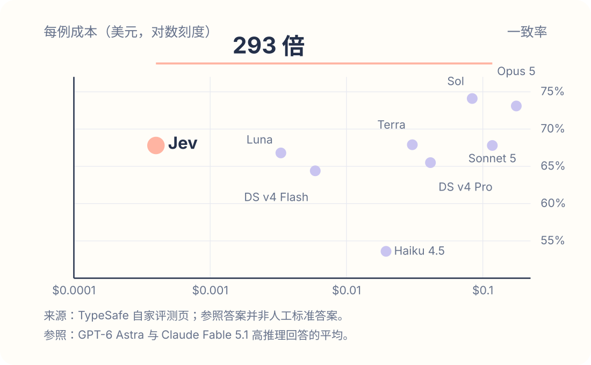

*图 8：九个模型，纵轴一致率，横轴每例成本（对数）。Jev 和 Sonnet 5 在同一高度，横向差了 293 倍。这是供应商自家的表，参照答案是两个前沿模型的平均判断。*

这张表比首页那个 193.6 倍有意思得多，而且可信得多，因为是同一套 harness。Jev 和 Sonnet 5 打成平手，成本是它的 1/293，延迟是 1/195；输给 Sol 和 Opus 5 六七个点。分任务看，发票处理差得最多，61.8% 对 Sol 的 79.1%；客服差得最少，76.0% 对 78.3%。发票落后 17 个点不是噪声，那是「System One」这个名字里就写好的边界：硬抽取、硬推理，它干不了。

独立的评测也有。一个叫 jev-baselines-eval 的项目做了预注册对比，在 Banking77（77 个银行意图）上：有监督的 encoder 0.933，GPT-5.6 Terra 0.875，Jev 0.832，gpt-5.4-nano 0.793，置信区间见图 7 右半。在 CLINC150 上 Terra 0.915、Jev 0.870、nano 0.795。Jev 稳定地落在「小模型之上、前沿模型之下」，而**一个针对固定标签集微调过的小 encoder 直接赢了它**。这条后面要用。

本地这边，jevlocal 用冻结的 Qwen3.5-4B（MLX 8bit，跑在一台 Mac 上）在 CLINC150 的 52 路分类上做到平衡准确率 0.907，对比「嵌入向量取最近选项」的 0.755，配对检验 p < 0.0001。零训练的 4B 在这类路由任务上已经很能打。

### 概率准不准

第二个问题更要紧：它返回的那个概率，是真概率吗？

先说一个原理。任何严格的 proper scoring rule——对数得分、Brier 得分——它的最优解就是真实条件概率本身。举个例子：某类判断你其实只有七成把握，但你系统性地报九成。报 0.9 而实际对了，罚 −ln(0.9) = 0.105；报 0.9 而实际错了，罚 −ln(0.1) = 2.303。按真实的七成算期望，是 0.7 × 0.105 + 0.3 × 2.303 = 0.765。如果老老实实报 0.7，期望是 0.611。

**报真话的损失更低，而且报 0.7 是唯一的最小值点。**

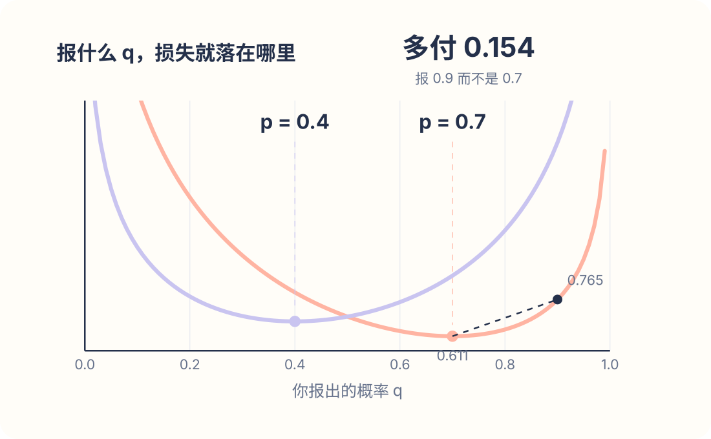

*图 9：两条曲线，真实概率分别是 0.7 和 0.4。每条曲线的最低点都严格落在自己的真实概率上，报高报低都要多付——这就是 proper 的含义。*

所以「校准」不是一个需要额外加的约束，它是这个损失函数的解。在带真实结果标签的数据上做普通的监督训练，本身就是校准训练。TypeSafe 管自己的训练方法叫 RLCD，Reinforcement Learning for Calibrated Decisions，卖点就是「概率针对结果优化」。

那 Jev 实际校准得怎么样？这个我们自己测了一遍。

方法是这样。

有个叫 AnthusAI 的团队，把他们调 Jev 的全部原始返回公开了：8,801 条情感文本，每条问同一个问题「这段文字的整体情感是正面的吗」，模型版本 jev-1.13.0。

我们先用自己写的代码，把他们的原始数据重算一遍，看能不能复现出他们报的数。然后在同一批 8,801 条文本、同一个问题上，用这台 Mac 跑了一个零训练的 Qwen3.5-4B，直接读 logits。

判定标准在看到任何结果之前就写好提交了——也就是预注册，免得事后挑一个好看的口径。

结果，用干净标签的 2,721 条测试集：

| | Jev | 冻结 Qwen3.5-4B |
|---|---|---|
| 准确率 | 0.791 | 0.777 |
| 原始 ECE | 0.114 | 0.116 |
| 等温回归后 ECE | 0.013 | 0.027 |
| Platt 缩放后 ECE | 0.062 | 0.050 |
| AUROC | 0.929 | 0.921 |

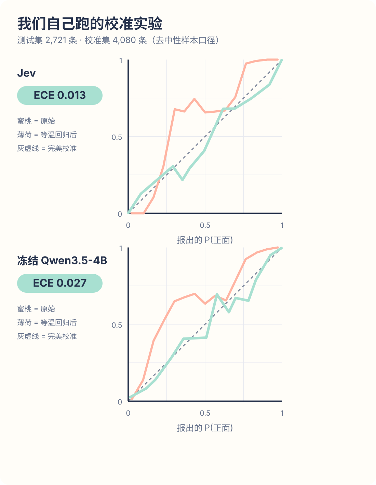

*图 10：我们的复现。左 Jev，右冻结 Qwen。空心是原始曲线，两条都是 S 形、都偏离对角线；实心是等温回归之后，两条都贴回去了。曲线到对角线的竖直距离就是校准误差。*

几件事值得说。

第一，Jev 的概率开箱也不是校准过的。原始 ECE 0.114，跟零训练的 Qwen（0.116）几乎一样。

而且它歪的方式还不是大家想象的那种。很多人以为是「整条趴在对角线下面」，也就是一味过度自信。实际是 S 形：报 0.3 的时候实际有六成多是正面，报 0.9 的时候才略微高估。Qwen 的形状也一样。

第二，歪可以修，而且很便宜。等温回归在 4,080 条校准集上拟合一下，Jev 的 ECE 从 0.114 降到 0.013，Qwen 从 0.116 降到 0.027。AnthusAI 还试过校准集要多大：从 20 条到 5,280 条（他们用的是全量口径），等温回归每一档都不输 Platt。20 条标注就能把 ECE 压下去一大截。

第三，别把这个结论推太远。这是二元、短文本、难度很低的任务。基数一高，后处理就没这么灵了——jevlocal 在 52 路的 CLINC150 上，Qwen 的原始 ECE 是 0.202，温度缩放之后还剩 0.089。至于 Jev 在高基数上校准得怎么样，目前没人量过，我们没有 API key 也补不了。

### 排序准不准

第三个问题：它知不知道自己什么时候不知道？

这跟「概率准不准」不是一回事。概率可以整体偏高，但只要高低顺序是对的，你照样能靠它把该转人工的样本筛出来。

同一个实验里，Jev 的 AUROC 是 0.929，Qwen 是 0.921，配对 bootstrap 的差是 +0.008，95% 区间 [+0.002, +0.013]。把「故意任意」的中立档也算进去，差是 +0.003，区间 [−0.004, +0.009]，跨零。

一个零训练的 4B，把 Jev 的排序能力追到了 0.01 以内。

真正的短板不在排序，在拒答。mini-jev 测过出域样本：约束 JSON 生成正确拒答 47/50，读字母只有 41/50。原因不神秘——token 序列可以在生成过程中反悔，单个位置不能。另外 jevlocal 发现，在 52 路上换一下选项顺序，18% 的样本会改答案。所以这条路线上有两样东西是必需品，不是锦上添花：一个显式的「以上都不是」选项，加一个基于 top1 减 top2 间距的拒答阈值；以及把选项打乱几次取平均。

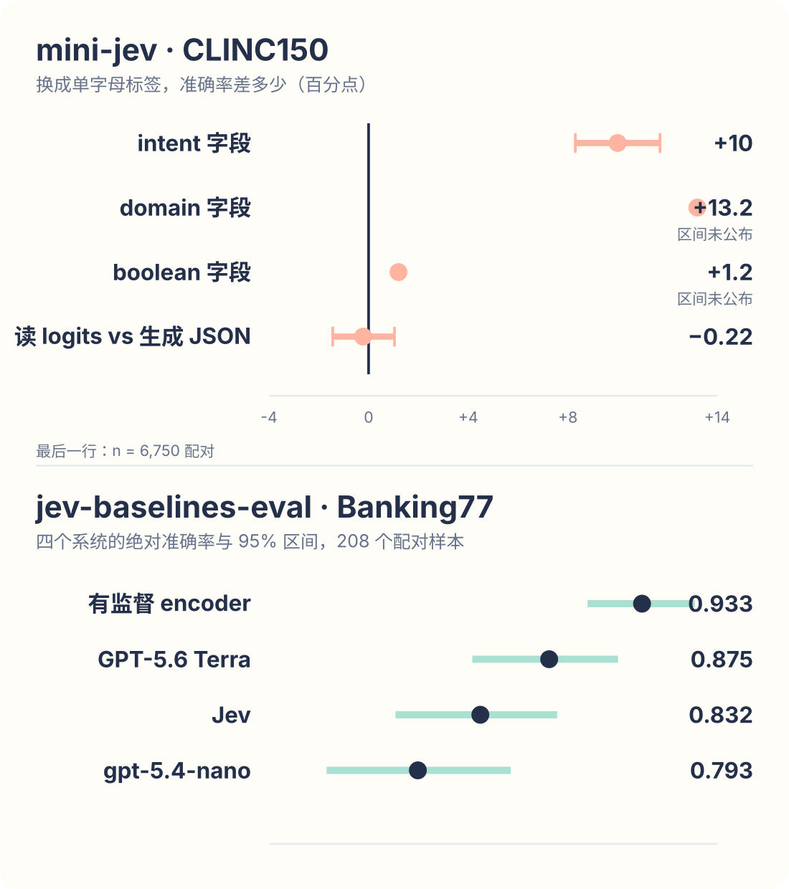

*图 11：左边是 mini-jev 的几个效应量，看点到零线的距离、区间有没有跨零：用字母做标签在 intent 上值 10 个点，在 domain 上值 13 个点，在布尔问题上一分不值；读 logits 对生成 JSON 差 0.22 个点，在噪声里。右边是 Banking77 上四个系统的准确率和置信区间。两个面板各用各的轴。*

顺便把前面欠的两个细节还上。mini-jev 在 CLINC150 上测过：用单字母做标签，比直接写选项名，intent 字段高 10.0 个百分点（95% 区间 8.3 到 11.7），domain 字段高 13.2，布尔字段只高 1.2 而且区间跨零。原因是单字母等长、先验均匀；选项名 token 数不一样，偏向短的那些，还带着预训练里的词汇先验。所以这条建议要写准确：**在多选枚举上换十几个点，在是非题上没用。**

三个问题问完，诚实的总结是：在任何人量过的任务上，Jev 和一个零训练的开源 4B 在准确率、后处理后的校准、排序能力上都很接近；Jev 明确赢的地方是拒答和高基数稳定性这类「毛边」；而没人量过的是难的那一端。

## 它适合干什么，不适合干什么

先说个冷知识。Jev 这名字来自 Jevons，1865 年那个发现「蒸汽机效率提高之后，英国烧的煤反而更多了」的经济学家。

效率让煤变便宜，便宜催生出一堆以前压根不存在的用法，总需求反而涨了。TypeSafe 引这个典故的意思很直白：我们卖的不是让你现在做的事更便宜，是便宜到你会去做以前根本不会做的事。

这话听着像广告，但社区目录还真能印证。jevable.com 收了 359 个用 Jev 做的项目。

不过先说样本偏差：这是个发推自荐、人工审核的目录，反映的是什么好玩、什么适合发推，不是什么跑在生产上。当风向读就行。

翻下来大致三类。

**第一类是热路径上的闸门。** npm 包安全检查、PR 审批、按编码规范审 diff、给工具调用打相关性分。共同点是全都卡在一两百毫秒的路径上——三秒的调用根本塞不进去，一两百毫秒的可以。

**第二类我觉得最值得说：它的主流用法不是替代品，是加速层。** 有浏览器 agent 接进去之后任务耗时明显下降；有人拿它做模型路由；有人拿它做上下文压缩。注意，这些都不是「把 GPT 换成 Jev 省钱」，而是在现有的大模型 agent 里面插一层快判断，让外头那个贵模型少调几次、少读点上下文。

说白了它被当中间件用，不是端点。这也顺带解释了它为什么会同时出现在 Vercel 和 Cloudflare 的模型目录里。

**第三类是批量打分。** 几百份提案在几个维度上分类，几千种商品多维度打分，几十秒跑完，几毛钱。

你看这三类的共同气质：以前没人做这些事，不是想不到，是算不过账。Jevons 在这儿闭环了。

那什么时候别用它？

**第一种，你的标签集是固定的，而且手上已经有几千行标注。** 这种情况去微调一个 encoder，别用 Jev。

还记得前面 Banking77 那组数吗——微调过的 encoder 0.933，Jev 0.832。而且 encoder 在 CPU 上就能跑，10 毫秒出结果。更准、更快、更便宜，三样全占。

Jev 相对这条路唯一的真优势是「schema 在请求的时候才确定」。你要是不需要这个，那你就不需要 Jev。

我的建议是：先花一个下午，用大模型标 2,000 行，微调一个 ModernBERT，看它能到什么水平。很多时候，它就是终点了。跳过这一步直接上 Jev，你可能永远不知道自己多花了钱。

**第二种，你需要给出理由。** 概率没有理由。它不好调试，更不好对客户和监管交代。

**第三种，硬抽取和硬推理。** 发票那个 61.8% 对 79.1% 还记得吧——System One 这个名字里就写着边界。

最后提两个坑，都是真会翻车的。

一是**组合起来就不校准了**。十个各自校准良好的判断，穿过一堆阈值和 if 串起来之后，端到端的错误率不是你校准过的任何东西。所以给整条工作流单独建一个评测集，哪怕只有几百条。单点指标全绿、端到端一塌糊涂，是这类系统最常见的翻车方式，而且只有端到端的集子能发现它。

二是**测试集里一定要有模棱两可的样本**。Jev 的卖点是概率，而概率的价值只在模糊样本上体现。你要是拿一堆好分的题去测，等于把它最大的优势测没了，然后得出一个「跟我现在的方案差不多」的结论。

顺手把经济账也算了。

一次调用按 1,000 token 的状态算，0.042 美分；一百万次调用，42 美元。

自建那边，一块 3090 跑冻结 4B，按每秒 20 个决策算，一天能做 170 万次，电费一块五左右——前提是那块卡已经是你的了。

所以结论很直接：**别为了省钱自建。** 42 美元撑不起一个工程项目。真正值得自建的理由是另外几个——微调（Jev 不提供，而用你自己领域的结果标签训出来的模型会超过它）、数据不出境、锁版本，以及没有那个 255 上限。

## 它该跑在什么芯片上

聊到这里，有个问题自然就冒出来了：这种活，用什么硬件跑最划算？

这不是个无关的话题。前面算过一笔账——大模型生成慢，是因为每吐一个 token 都要把整个权重从显存里搬一遍，算力闲着，卡在带宽上。GPU 这些年堆的那些东西，大容量 HBM、超高显存带宽、为长序列生成优化的调度，本质上都是在伺候「自回归解码」这个特定的负载。

可 Jev 这条路线把解码整个拿掉了。

负载的形状一下就变了。

原来是「算一点、搬一次权重、再算一点」，几百上千轮，串行，带宽吃紧算力闲置。现在是一次前向传播算完，整段序列并行，卡的是算力不是带宽。原来要为几千个 token 的 KV cache 准备大显存，现在一个 4B 模型的权重就 8 GB，装得下就完事。原来延迟的大头在生成，现在延迟的大头在 prefill 和调度开销。

换句话说，**同一块为大模型生成优化过的卡，跑这种负载时，很多昂贵的设计都白买了。**

反过来想想，什么硬件适合这种活？大概是这么几条：算力密度高但不需要巨大显存；确定性的低延迟比峰值吞吐重要（你要的是 p99 稳定在 100 毫秒，不是平均值好看）；对小批量友好，因为决策请求往往是零散来的、攒不成大 batch；最好还能把同一份状态的 KV 常驻，因为「状态编码一次、扇出很多问题」是这条路线的基本盘。

这几条加在一起，画出来的不太像今天的通用 GPU，倒挺像这两年冒出来的那批推理专用芯片——比如主打确定性低延迟的 LPU 那一类架构。

这次我们自己跑的数，其实也能看出点门道。

用的是一台 Mac 上的 M5 Max。二元判断 p50 是 97 毫秒，52 路分类 p50 是 285 毫秒，p99 是 358 毫秒。

这就是块消费级芯片，统一内存，算力谈不上强。可它跑这活跑得相当从容，因为这个负载本来就不怎么吃带宽、不怎么吃显存。

真正值得注意的是 p99 只比 p50 高两成半。做过线上服务的都知道，这种尾延迟的稳定性，恰恰是把一个判断塞进热路径时最需要的东西——你要的是「最慢的那次也不超过 100 毫秒」，不是「平均值很好看」。

当然这一段只是推演，我们没有在专用推理芯片上实测过。但这个方向值得单独挖一挖，以后再聊。

## 最后

回到开头那个被浪费的 if。

TypeSafe 看到的东西是对的。生产环境里大量所谓的「AI 功能」根本不是生成，是一个分支。用几千亿参数的模型逐 token 拼一个枚举值，确实荒谬。把这件事单独做成产品，值得做。

但把它拆开你会发现，这条路线里能公开复现的部分，比想象的多得多。不生成、状态只编码一次、字母标签、单 token 读取、等温回归，每一样都是公开的，一块显卡加一个下午就能凑齐。在目前任何人量过的任务上，这么凑出来的东西和 Jev 分不出高下。

真正还没人量过的有两样。一是难任务、高基数上的表现，这得等有 API key 的人去测。二是你自己业务里那批结果标签能把它推到哪，这个只有你自己能测。

某种程度上，Jev 最大的价值不是它本身有多强，而是它让很多人第一次意识到：那个 if，本来不用这么贵。

---

*主要来源：TypeSafe 官方 blog、文档与 evals.typesafe.ai；[SemIf](https://github.com/TheoLeeCJ/SemIf)；[mini-jev](https://github.com/r-ms/mini-jev)；[jev-baselines-eval](https://github.com/ickma2311/jev-baselines-eval)；[AnthusAI/Jev-Calibration](https://github.com/AnthusAI/Jev-Calibration)；[jevable.com](https://jevable.com)。*
