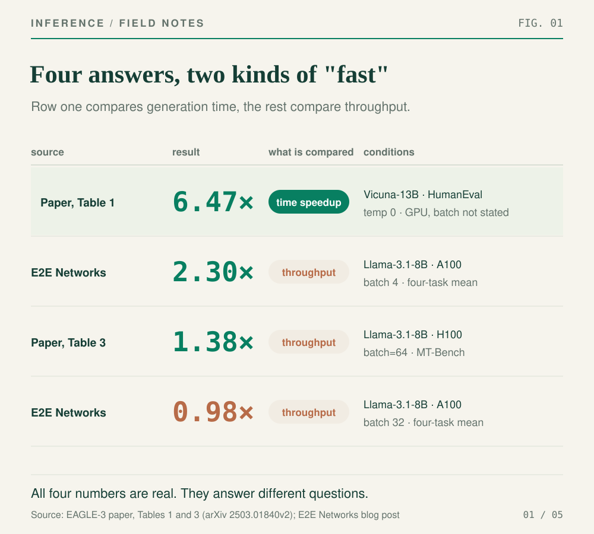
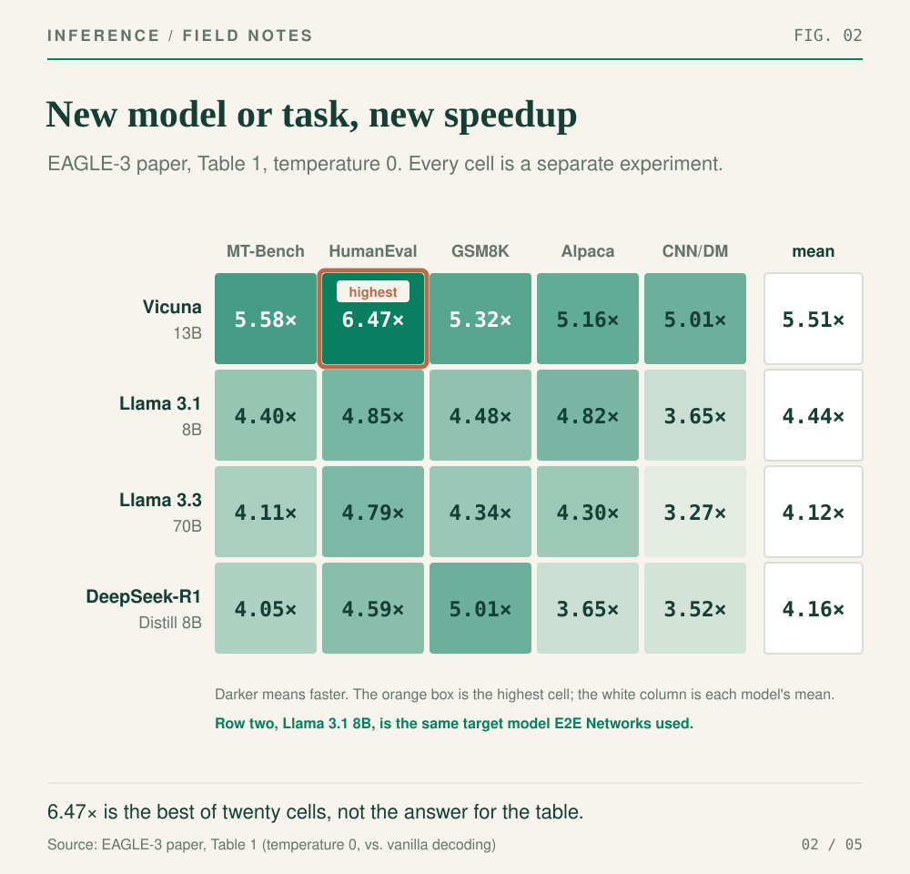
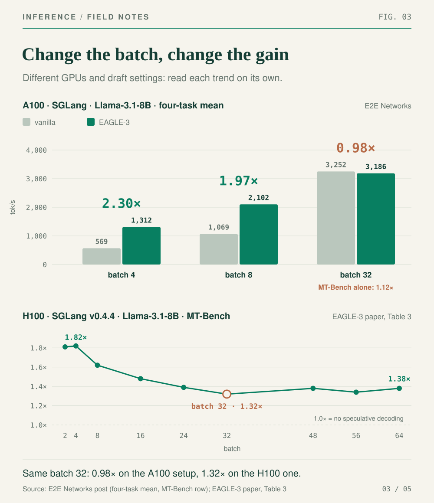
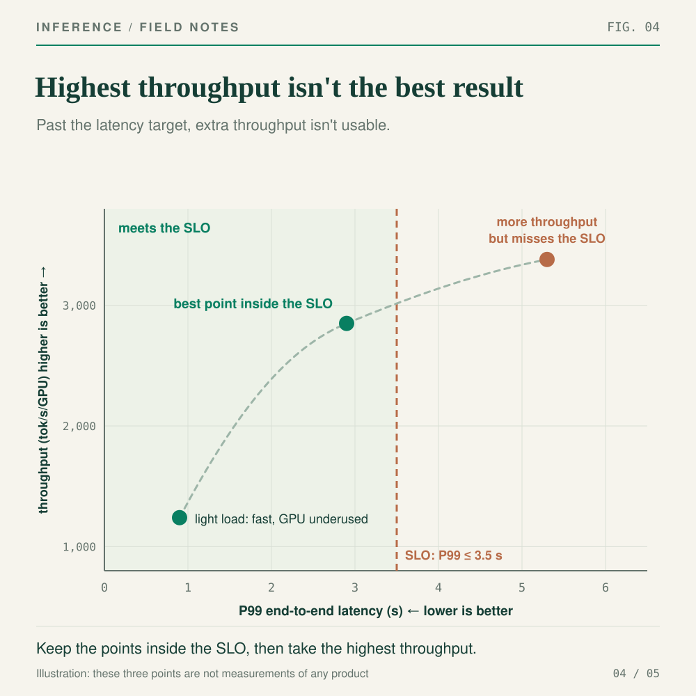
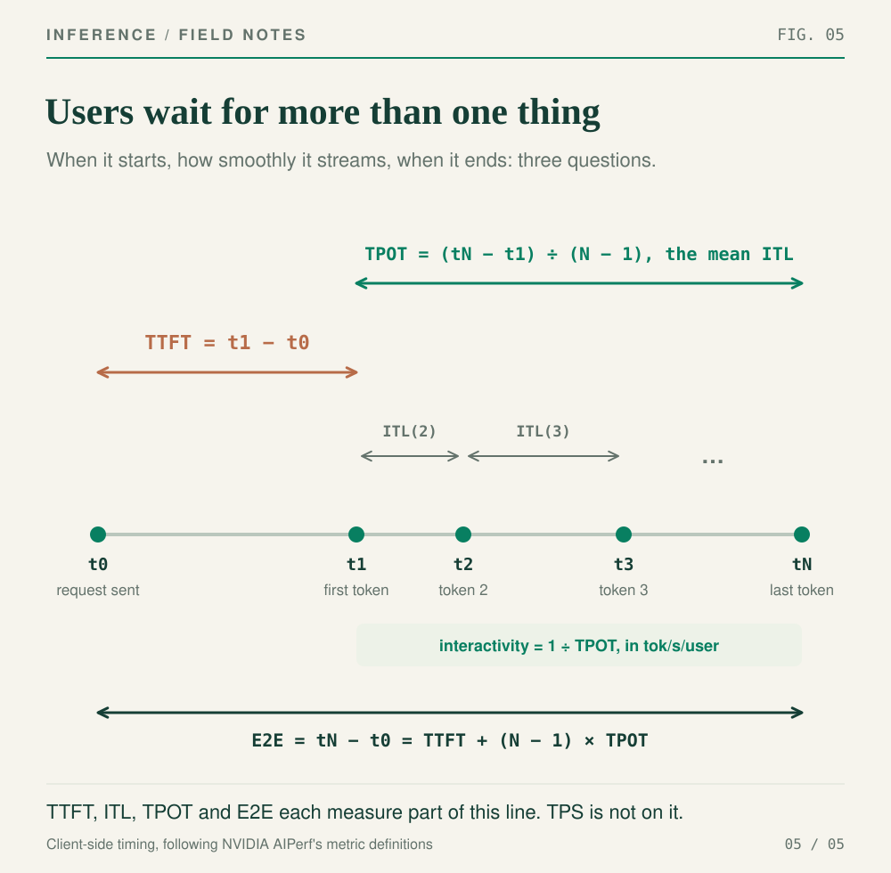

The same inference optimization can be "6.47× faster", "2.30× faster", "1.38× faster" and "2% slower", all at once. None of those numbers is wrong. They're answers to different questions.

This is the first post in a series about inference performance. Before we get to how to make inference fast, we want to pin down what "fast" means, because the numbers in this field are unusually slippery.

If you've ever opened an LLM inference report you'll know the feeling. The headline says `2–6× Faster`. The abstract says up to `6.5×`. A chart somewhere shows `1.38×`, and another shows `0.98×`. Every number comes wrapped in batch sizes, throughput, latency, tokens per second, TTFT, TPS and context lengths.

It's confusing, and that's not your fault. Most of these numbers leave out the conditions under which they're true.

So we're not going to argue about which framework is fastest. We're going to take two real write-ups of the same technique, EAGLE-3, follow each headline number back to the table it came from, and work out what it actually measured.

## Four numbers, all true

EAGLE-3 is a **speculative decoding** method. Normally a language model writes one token at a time, and every token costs a full pass through the big model. Speculative decoding has a much cheaper **draft head** guess several tokens ahead, then asks the big model to check all of them in one pass. When the guesses are right, the big model accepts several tokens for the price of one check. When they're wrong, the rejected draft tokens are thrown away.

You don't need the details for this post. Just remember the goal: **do fewer expensive per-token passes of the big model by guessing first and verifying second.**

Why is it fair to compare EAGLE-3 on speed alone, without a separate quality evaluation? Because the paper uses a strict acceptance rule. Draft tokens are only candidates: the target model verifies them and corrects them, and the output follows the same distribution as ordinary decoding. Quality is held fixed, so the only question left is how long it takes. That "lossless" property isn't automatic for every speculative decoding implementation, though. Loosen the acceptance rule and you have to check quality again.

Now for the numbers.

Our first source is [the EAGLE-3 paper](https://arxiv.org/html/2503.01840v2), published in March 2025 by researchers at Peking University, Microsoft Research, the University of Waterloo and the Vector Institute. It asks: **how much faster is EAGLE-3 than ordinary autoregressive decoding, across different models and tasks?** The abstract's headline is a speedup of up to `6.5×`.

Our second source is an engineering post from E2E Networks, published in November 2025: [EAGLE-3 Speculative Decoding: 2–6x Faster LLM Inference Guide](https://www.e2enetworks.com/blog/Accelerating_LLM_Inference_with_EAGLE). They trained their own EAGLE-3 draft head, plugged it into SGLang and ran four kinds of task on a single A100. That's a different question: **what happens to throughput when you put this into a real software and hardware stack?** The headline answer is `2–6× Faster`.

Look closely at that `6×`, though. It isn't anywhere in their A100 results. Their per-task numbers run from `0.89×` to `2.52×`, and the best is HumanEval at batch size 4. The post also cites the paper's `3.0–6.5×`, and the headline joins the "2" from their own measurements to the "6" from someone else's. Both numbers have a source. They just don't come from the same experiment. That's exactly the kind of omission to watch for in a headline.

So one source leans toward the research ceiling and the other toward engineering reality. More importantly, they aren't even measuring the same kind of "fast". The paper's Table 1 reports how much less time generation takes compared with ordinary decoding. E2E Networks, and the paper's own Table 3, report throughput ratios. Every "why don't these numbers agree" in this post starts from those differences.



*Figure 1: One technique, four setups, four answers. The first row compares generation time; the other three compare throughput. Numbers from the EAGLE-3 paper's Tables 1 and 3 and from E2E Networks' write-up, redrawn by us.*

Start with [Table 1 in the paper](https://arxiv.org/html/2503.01840v2#S4.SS1). It isn't one model on one task. It's four models on five tasks.



*Figure 2: The temperature 0 results from Table 1 of the EAGLE-3 paper. Rows are models, columns are tasks, and every cell is a separate experiment. 6.47× is the best cell, not the answer for the whole table.*

The **four rows are four models**: Vicuna-13B, a chat model with about 13 billion parameters; LLaMA-3.1-8B and LLaMA-3.3-70B, instruction-tuned models with about 8 and 70 billion; and DeepSeek-R1-Distill-LLaMA-8B, which distills DeepSeek-R1's reasoning into an 8B LLaMA. "Try a different model" means moving to a different row.

The **five columns are five tasks**:

- MT-Bench: multi-turn conversation
- HumanEval: OpenAI's code generation benchmark, where the model completes Python functions and unit tests check the result
- GSM8K: grade-school math word problems
- Alpaca: instruction following
- CNN/Daily Mail: news summarization

Each cell is one model on one task, measured separately.

The famous `6.47×` is a single cell: temperature 0, Vicuna-13B, HumanEval. Move to the LLaMA-3.1-8B row and the five tasks give `4.40×`, `4.85×`, `4.48×`, `4.82×` and `3.65×`, for a mean of `4.44×`.

Now the E2E Networks measurements. They used Llama-3.1-8B-Instruct with SGLang on a single A100, and ran GSM8K, HumanEval, MATH500 and MT-Bench at batch sizes of 4, 8 and 32. That Llama-3.1-8B-Instruct is the same target model as the second row of Figure 2.

Two terms get mixed up constantly here, so let's separate them.

**Batch size**, in this experiment, is how many generation sequences the GPU processes together.

**Concurrency** is how many requests the benchmark client keeps in flight at once. Some of them are waiting for their first token and some are streaming output. The two are related, but they aren't the same thing: 100 concurrent requests doesn't mean the GPU is computing 100 sequences in any given step.

Production servers also use **continuous batching**: when a request finishes, a new one can join at the next scheduling step, so the number of sequences the GPU handles changes from step to step. The short version: **concurrency is the pressure from outside; batch size is what the GPU actually computed together in one step.**

With that in mind, here are E2E Networks' averages across the four tasks:

| Batch | Vanilla tok/s | EAGLE-3 tok/s | Speedup |
|---:|---:|---:|---:|
| 4 | 569 | 1,312 | 2.30× |
| 8 | 1,069 | 2,102 | 1.97× |
| 32 | 3,252 | 3,186 | 0.98× |

The same implementation drops from `2.30×` at batch 4 to `1.97×` at batch 8 and `0.98×` at batch 32. That last one is below 1: at batch 32, EAGLE-3 was about 2% *slower* on average.

Those three numbers come from the same post, the same A100 and the same four-task average. The main thing that changed was batch size. The `6.47×` belongs to a different model, different tasks and a different way of measuring. It doesn't belong on this table's trend line.

Here's a cleaner comparison: same model, same task. The paper reports `4.40×` for LLaMA-Instruct 3.1 8B on MT-Bench, as a reduction in generation time. E2E Networks, on the same model and the same MT-Bench at batch 4, measured `562 tok/s → 1,292 tok/s`, a throughput ratio of `2.30×`. (Yes, that's the same `2.30×` as their four-task average. It's a coincidence.) Same model, same task, different numbers, because the metric, the hardware, the batch setup and the draft implementation all changed.

> **Five checks for any speed claim**
>
> ① Go back to the original table. ② Find the baseline. ③ Look at the workload. ④ Look at the load. ⑤ Pin down which metric got faster, and whether it meets the SLO. We've just done the first one. The rest of this post works through the other four.

## Step two: what is it being compared against?

The first thing to find for any speedup is the **baseline**: what it's being compared to.

- For throughput: **speedup = new throughput ÷ baseline throughput**
- For time: **speedup = baseline time ÷ new time**

Written this way, bigger is always better, whether you're comparing throughput or time.

So find the denominator. Without it, "X times faster" means nothing.

The baseline in the paper's Table 1 is vanilla autoregressive decoding. That table answers an algorithmic question: compared with generating one token at a time, how much does the drafting method shorten generation?

E2E Networks also compares ordinary decoding with EAGLE-3, but inside a specific engineering setup: their trained draft head, SGLang, one A100, a chosen set of tasks, 5 speculative steps, top-k of 8 and 32 verification tokens. It answers a different question: **what happened to throughput when this implementation went into this environment?**

The paper has another set of results that's easy to miss. In [Section 4.3 and Table 3](https://arxiv.org/html/2503.01840v2#S4.SS3), the SGLang team ran EAGLE-3 on a single H100 with SGLang v0.4.4 on MT-Bench, with a draft chain length of 3 and no tree drafting. At batch 32 they measured a `1.32×` throughput ratio.

E2E Networks has a batch 32 result for the same model on the same MT-Bench too: `1.12×`, against `0.98×` for their four-task average. So batch size, model and task all line up, and the results still differ. What's left is A100 versus H100, the training and serving stack, and the draft configuration: E2E used 5 draft steps, top-k 8 and 32 verification tokens, while Table 3 used a chain of length 3 with no tree. The only conclusion both results support is this one: **EAGLE-3's gain depends on the whole deployment, and one batch size can't sum it up.**

## Step three: what requests is it serving?

A **workload** isn't "how many requests we ran". It's what those requests look like: input length, output length, the kind of content, whether there's a reusable prefix, and the sampling settings.

EAGLE-3's gains depend heavily on content. Code is full of boilerplate and predictable structure, so drafts get accepted more often. Open-ended conversation and some math reasoning are harder to guess. The paper says so directly: the task affects the **acceptance rate**, which drives the **average acceptance length** (how many draft tokens survive each verification round) and so the final speedup.

That's why "both produce 500 tokens" doesn't make two workloads the same. Filling in Python boilerplate and continuing an open-ended story can have the same output length and very different draft hit rates.

So a paper saying "6.47× faster on HumanEval" is a complete and useful claim. Shorten it to "this system is 6.47× faster" and the evidence no longer supports it.

## Step four: how much load is the system under?

**Load** is how much request pressure the system is under over time. For the E2E Networks runs we know the batch sizes were 4, 8 and 32, but the post doesn't give a matching client concurrency, and as we saw earlier, one can't stand in for the other.

So when you see "batch=32", don't translate it into "32 users online". Ask instead: were 32 sequences loaded all at once, or is 32 the running cap under continuous batching? How many concurrent requests did the client actually send?

Why does speculative decoding usually help less as batch size grows?

At small batch sizes, decoding is mostly limited by memory bandwidth, and the GPU's compute units sit partly idle. Drafting and parallel verification soak up that spare compute almost for free. As batch size grows, the target model itself gets closer to being **compute-bound**, and drafting and verification stop being free. They start competing with the main work for compute.

That's a common mechanism, not a law that says big batches kill the gain. The paper's Table 3, on a different H100 setup, still reports `1.32×` at batch 32 and `1.38×` at batch 64. The framework, the hardware and the draft configuration all move the point where the gain starts to fade.



*Figure 3: Top, E2E Networks' four-task averages on an A100, plus their MT-Bench result at batch 32 (1.12×). Bottom, the EAGLE-3 paper's Table 3 on H100, SGLang and MT-Bench, where batch 32 gives 1.32×. Even with the same model, task and nominal batch size, different hardware and draft settings mean the results aren't interchangeable.*

> **Don't fall for this one**
>
> "This technique is 6.5× faster" and "this technique is useless" can be the same mistake: taking one local experiment and stating it as an unconditional conclusion.

## Step five: fast at what, and is it good enough?

Now we can draw a minimal performance map. Put **P99 end-to-end latency** on the horizontal axis: 99% of requests finish within this time. Put **tokens/s/GPU** on the vertical axis: how many tokens each GPU processes per second. Then draw the highest P99 latency the product can live with. That's the **SLO**, the service level objective.



*Figure 4: An illustration, not a measurement of any product. The horizontal axis is P99 end-to-end latency. A point with more throughput isn't a better choice if it has already crossed the SLO.*

Further left, each request finishes sooner. Further up, each GPU gets more work done per second. At light load latency is low but the GPU may be underused. Add load and throughput rises, and so does latency. A useful comparison doesn't pick two points at random. It sweeps enough load levels under the same conditions to see which points stay inside the SLO, and what the best throughput among them is.

To understand what users are actually waiting for, we need to be precise about what gets timed. For one streaming request, record three moments on the client: `t0` when the client sends the request, `t1` when it receives the first real output token, and `tN` when it receives the last one. The request produced `N` output tokens.



*Figure 5: The timeline of one streaming request. Individual ITLs can vary; TPOT is their average within one request. TPS measures work done by the system per unit of time, so it isn't a segment of this line.*

- **TTFT (time to first token)**: `TTFT = t1 - t0`, from the client sending the request to receiving the first real output token. *How long until text starts appearing.*
- **ITL (inter-token latency)**: from the second output token on, the gap between token `i` and token `i-1` arriving at the client, `ITL(i) = t(i) - t(i-1)` for `i = 2, …, N`. One request produces a whole series of ITLs, usually reported as P50, P95 or P99. *Does the stream stall now and then.*
- **TPOT (time per output token)**: the average time per token after the first. Following AIPerf, `TPOT = (tN - t1) ÷ (N - 1)`, which is the mean of that request's ITLs. *Once it starts, how fast does text arrive on average.*
- **E2E (end-to-end latency)**: `E2E = tN - t0`, from sending the request to receiving the last real output token. For a single request, `E2E = TTFT + (N - 1) × TPOT`. *How long the whole answer takes.*
- **TPS (tokens per second)**: how many tokens the system processes per second. *How much work gets done.* Always ask whether that counts input tokens, output tokens or both, and whether it's per request, per GPU or per cluster.

We're using **client-side timing** here. E2E includes the network, queueing on the server, processing the input (prefill), generating tokens (decode) and sending the result back. It doesn't include time before the benchmark tool actually sent the request, and it doesn't count the final usage metadata or the `[DONE]` marker as output. If you do include the wait for requests that were scheduled but not yet sent, call it **effective latency** rather than just "latency".

**Interactivity** is easiest to think of as: **once the first token arrives, how many tokens per second does each user see?** The unit is `tok/s/user`, and in InferenceX `interactivity = 1 ÷ TPOT`. That's easier to picture than "the reciprocal of TPOT", but don't assume it matches every tool's TPS/user. NVIDIA NIM, for example, divides output tokens by the whole E2E time, so TTFT is in the denominator, and it only approaches `1 ÷ TPOT` for long outputs.

These metrics answer different questions. A low TTFT doesn't mean the whole answer is quick. A low average TPOT can hide a few very long ITLs. High output throughput doesn't guarantee that any individual user sees a smooth stream. Calling all of them "speed" is like describing a restaurant with one number that mixes the wait for a table, the pace of the courses, the length of the meal and the number of tables served that day.

## Performance is a function, not a number

Now we can write the problem out properly:

```text
Performance = f(
  Model,
  Workload,
  Load,
  System,
  Resources,
  Quality,
  SLO
)
```

This isn't about making a simple question complicated. It's a checklist of the conditions behind a comparison. If you compare vanilla decoding with EAGLE-3 at the same batch size, the model, the tasks, the GPU and the framework should stay fixed, and only the decoding method changes. Go from batch 4 to batch 32 and the load has changed too, so the two results no longer describe the same conditions.

This post has focused on three of these. The content and lengths of inputs and outputs make up the workload. Batch size and concurrency help describe the load, but they're different things. The SLO defines what latency and throughput count as good enough. Model, System, Resources and Quality are the conditions to hold steady, and we'll come back to them later in the series.

An SLO is a target the business sets for the user experience. For example: 95% of requests must start producing text within one second, and the gap between later tokens must stay under some limit. Without an SLO, "maximum throughput" is just a benchmark score. With one, the question becomes: **how many requests can these resources handle reliably while the experience still meets the target?**

Model, System, Resources and Quality obviously matter too. But if a write-up changes the model, the precision, the number of GPUs, the framework, the request lengths and the latency target all at once and then reports one overall multiplier, there's no way to tell where the gain came from. The first step of a rigorous benchmark isn't listing as many variables as possible. It's holding still everything that shouldn't move.

## Next time you see "X times faster"

1. Find the original table. Don't stop at the headline and the abstract.
2. Find the baseline. Is it a naive implementation, an older version, or another system that's already been optimized?
3. Find the workload. Which model, which tasks, what input and output lengths, what content, what sampling settings?
4. Find the load. How were batch size, concurrency and request arrivals set up?
5. Find the metric and the SLO. Is it TTFT, TPOT, E2E, per-user speed or system throughput that got faster, and is that operating point usable?

Back to where we started: how much faster is EAGLE-3?

The answer isn't 6.47×, 2.30×, 1.38× or 0.98×. It's this: **under the model, task, hardware, framework and load conditions that the EAGLE-3 paper and E2E Networks each describe, those are the results they each measured.**

That's less satisfying than one big number, but it's much closer to how production systems actually behave. What we care about isn't whether you can pluck out a winning data point. It's where an optimization helps, where it stops helping, and whether it holds up under quality and latency constraints.

For a production inference system, we'd usually want several kinds of number in the same performance table:

- **User experience**: TTFT at P50, P95 and P99, tail ITL, TPOT, interactivity (`1 ÷ TPOT` in InferenceX, in `tok/s/user`) and end-to-end latency
- **Capacity**: total tokens/s/GPU, output tokens/s/GPU, and how many requests the system can take at the target concurrency
- **Whether the results are acceptable**: success rate, error rate, whether quality meets the bar, and goodput, the throughput that actually meets the SLO

And across a before-and-after comparison, we'd want these held constant: the same model version and tokenizer, the same numeric precision and quality bar, the same input and output lengths and sampling settings, the same GPU model and count, and the same resource budget. Only the variable under study should change. If anything else changed too, say so.

In other words, a production system doesn't care about "the most it can possibly do". It cares about **how much useful work it can deliver reliably while quality, success rate and user experience all meet the bar.**

In the next post we'll cover the rest of the rules: why AIPerf and InferenceX fix input and output lengths, sweep load and report tail latency, and what it takes for an inference performance report to be comparable and reproducible.

---

*Sources: [E2E Networks, EAGLE-3 Speculative Decoding: 2–6x Faster LLM Inference Guide](https://www.e2enetworks.com/blog/Accelerating_LLM_Inference_with_EAGLE); [the EAGLE-3 paper](https://arxiv.org/html/2503.01840v2), including [Section 4.1](https://arxiv.org/html/2503.01840v2#S4.SS1) and [Section 4.3](https://arxiv.org/html/2503.01840v2#S4.SS3); [OpenAI HumanEval](https://github.com/openai/human-eval); [NVIDIA AIPerf metrics reference](https://docs.nvidia.com/aiperf/latest/reference/ai-perf-metrics-reference); [AIPerf HTTP trace metrics guide](https://docs.nvidia.com/aiperf/latest/tutorials/metrics-analysis/http-trace-metrics-guide); [NVIDIA NIM benchmarking metrics](https://docs.nvidia.com/nim/benchmarking/llm/latest/metrics.html)*
