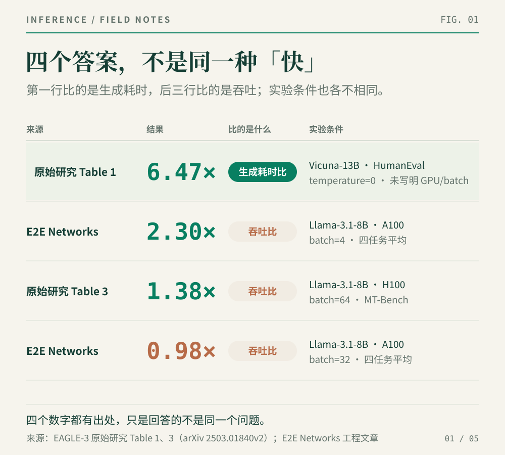
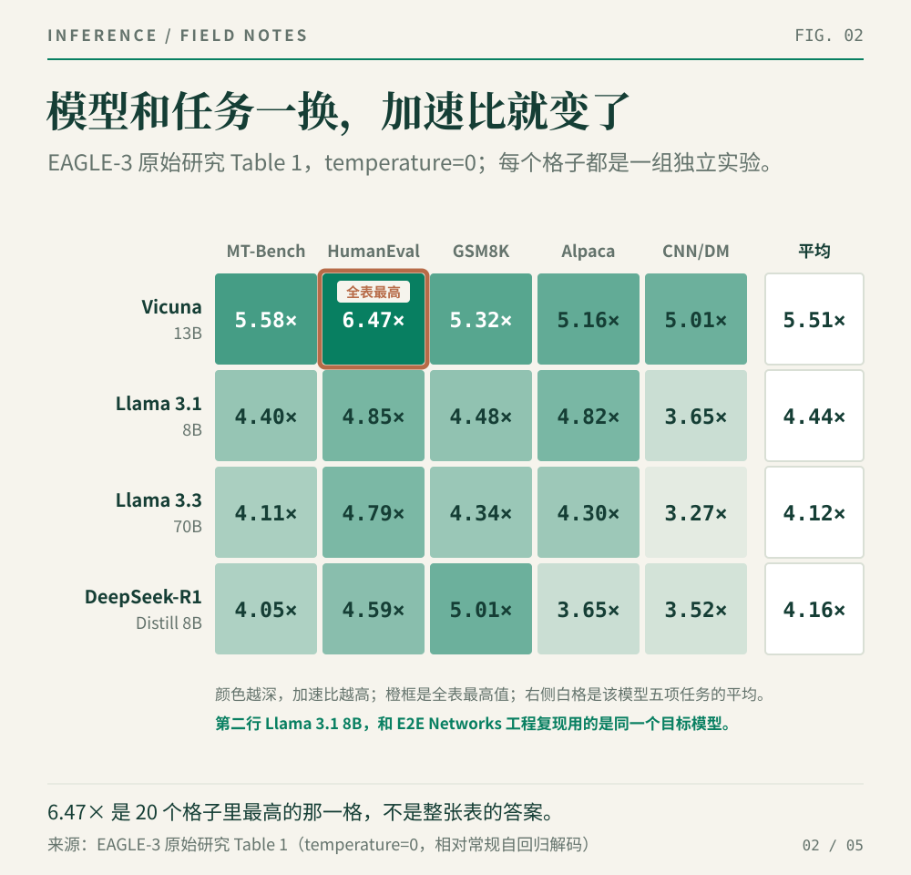
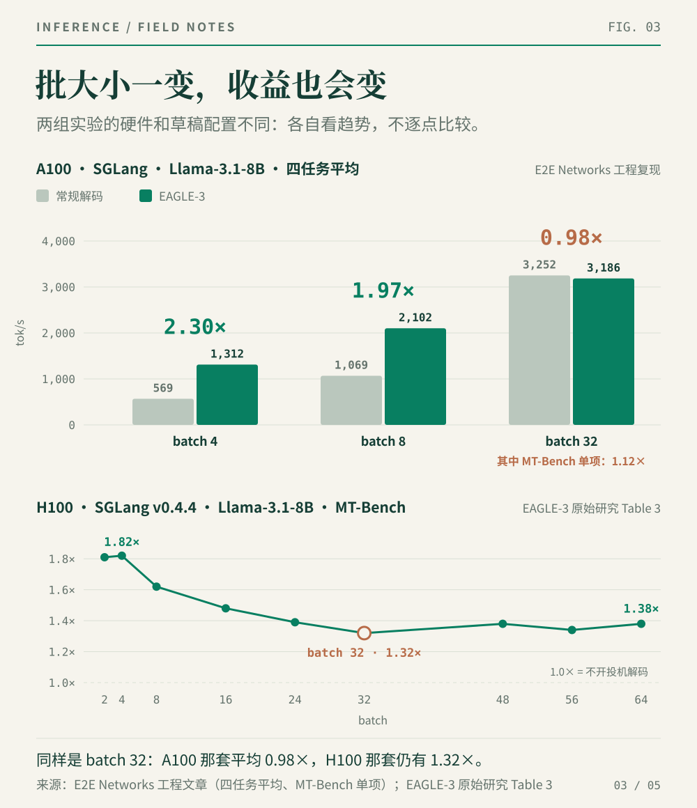
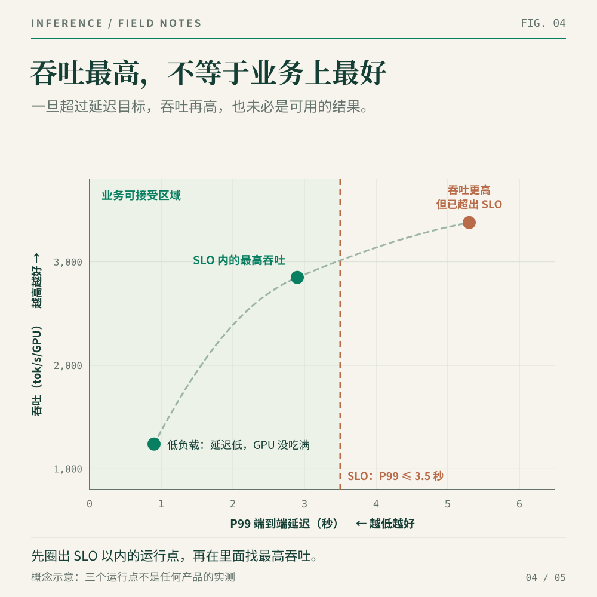
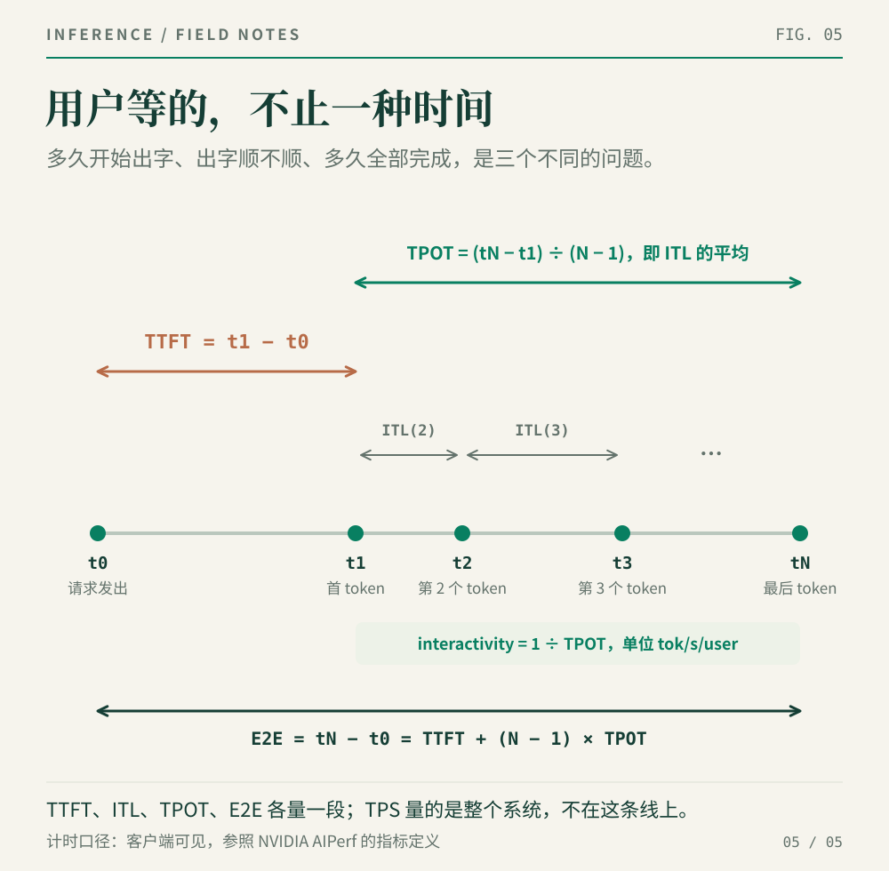

> 同一种推理优化，可以同时“快 6.47 倍”“快 2.30 倍”“快 1.38 倍”，也可以“慢 2%”。这些数字并不一定矛盾；更可能是它们回答的根本不是同一个问题。下面就用两份真实材料，拆开这些数字和难懂的英文缩写。

如果你第一次打开一篇大模型推理报告，常见体验大概是：标题写着 `2–6× Faster`，摘要说最高 `6.5×`，图里又冒出一串 `1.38×`、`0.98×`。每个数字旁边还有批大小、吞吐、延迟、每秒 token 数、TTFT、TPS、上下文长度……像四五种方言同时开会。

看不懂，很正常。真正的问题不是你不懂技术，而是这些数字往往省略了各自成立的条件。

所以这篇先不争哪套框架最快。我们只做一件更实用的事：拿两份真实的 EAGLE-3 材料，从标题追到原始表格，一步一步拆开“快了 X 倍”究竟是怎样算出来的。

## 四个都是真的数字

EAGLE-3 是一种 Speculative Decoding（投机解码）方法。常规解码是大模型自己一个 token、一个 token 地往外写；投机解码则先让一个计算成本更低的 draft head（草稿头）多猜几个 token，再交给大模型集中验证。猜得准，大模型一次验证就能接收多个 token；猜不准，没通过的草稿会被丢弃。

这一篇不需要深入算法细节。先记住它想做的事就够了：**减少昂贵的大模型逐 token 计算次数，用“先猜、再验证”换取更快生成。**

为什么这里可以先只比速度，不另做一轮质量评测？因为 EAGLE-3 原始研究采用严格的 speculative sampling acceptance rule（投机采样接受规则）：草稿 token 只是候选，最终仍由目标模型验证和纠正，生成结果与常规自回归解码保持同一分布。换句话说，这组比较把 Quality（质量）固定住了，再比较谁用时更短。这个“无损”前提并不是所有投机实现都自动拥有；一旦放宽接受条件，就必须重新检查质量。

现在看数字。

第一份材料，是 EAGLE-3 的[原始研究](https://arxiv.org/html/2503.01840v2)。这项研究由北京大学、微软研究院和滑铁卢大学合作完成，于 2025 年 3 月发布。它主要想回答：**EAGLE-3 相对常规自回归解码，在不同模型和任务上能快多少？**摘要报告的最高值约为 `6.5×`。

第二份材料，是 E2E Networks 于 2025 年 11 月发布的工程文章：[EAGLE-3 Speculative Decoding: 2–6x Faster LLM Inference Guide](https://www.e2enetworks.com/blog/Accelerating_LLM_Inference_with_EAGLE)。他们训练了一个 EAGLE-3 草稿头，把它接入 SGLang，并在单张 A100 上跑了四类任务。这份工程复现回答的是：**优化真正放进一套具体软件和硬件后，吞吐会怎样变化？**标题给出的答案是 `2–6× Faster`。

但标题里的 `6×` 并不是这组 A100 实测的最高值。E2E Networks 自己表中的单项结果从 `0.89×` 到 `2.52×`，最高是 HumanEval、batch=4 的 `2.52×`；文章同时引用 EAGLE-3 原始研究的 `3.0–6.5×`，于是标题把工程实测的“2”与研究结果的“6”放进了同一个范围。数字都有出处，但上下限并不是来自同一张实验表——这正是读标题时要警惕的省略。

两份材料都在谈 EAGLE-3，但一个偏研究上限，一个偏工程落地。更重要的是，它们报告的还不是同一种“快”：原始研究 Table 1 给的是相对常规解码的生成耗时加速比，E2E Networks 与原始研究 Table 3 给的是吞吐比。后面所有“数字为什么不一样”，都要从这些区别开始读。



*图 1｜同一种技术，在四组实验条件下得到四个不同答案。第一行比较生成耗时，后三行比较吞吐；数字来自 EAGLE-3 原始研究 Table 1、Table 3 和 E2E Networks 工程复现，图为作者重绘。*

先看 EAGLE-3 原始研究的 [Table 1](https://arxiv.org/html/2503.01840v2#S4.SS1)。它不是只跑了一个模型、一个任务，而是把四个模型放在五类任务上测试。



*图 2｜EAGLE-3 原始研究 Table 1 中 temperature=0 的结果。四行是模型，五列是任务；每个格子都是一组独立实验。6.47× 只是其中的最高值，并不是整张表的统一答案。*

图 2 的**四行是四个模型**：Vicuna-13B、LLaMA-3.1-8B、LLaMA-3.3-70B 和 DeepSeek-R1-Distill-LLaMA-8B。它们分别是约 130 亿参数的聊天模型、约 80 亿参数的指令模型、约 700 亿参数的指令模型，以及把 DeepSeek-R1 的推理能力蒸馏到 LLaMA-8B 上的推理模型。“换一个模型”，就是把整张表从一行移到另一行。

图 2 的**五列是五项任务**：

- MT-Bench：多轮对话；
- HumanEval：OpenAI 发布的代码生成评测集，题目要求模型补全 Python 函数，再用单元测试判断代码是否正确；
- GSM8K：小学数学文字题推理；
- Alpaca：指令跟随；
- CNN/Daily Mail：新闻摘要。

所以，这里的“五项任务”不是图中的五行，而是五列。每一个格子，都代表“一个模型 × 一项任务”的独立实验条件。

全表最高的 `6.47×`，来自 `temperature=0`、Vicuna-13B、HumanEval 这一格。如果我们把模型换成 LLaMA-3.1-8B，就要沿着另一行读：五项任务的 speedup（加速比）分别是 `4.40×`、`4.85×`、`4.48×`、`4.82×` 和 `3.65×`，平均 `4.44×`。

再看 E2E Networks 的工程实测。它使用 Llama-3.1-8B-Instruct、SGLang、单张 A100，把 GSM8K、HumanEval、MATH500 和 MT-Bench 四个任务放在 batch 4、8、32 下运行。这里的 Llama-3.1-8B-Instruct，与图 2 第二行的 LLaMA-Instruct 3.1 8B 是同一个目标模型。

这里先把最容易混淆的一对词说清楚。

**Batch（批大小）**，在这组实验里，可以理解为一次让 GPU 同批处理多少条生成序列。

另一个常见词是 **Concurrency（并发数，也就是客户端并发）**。它指压测客户端在同一时刻维持多少个活跃请求：这些请求可能正在等待首个 token，也可能正在持续接收输出。两者有关，但不相等：有 100 个并发请求，不代表 GPU 当前这一轮就同时计算 100 条序列。

到了生产服务，推理框架通常还会使用 continuous batching（连续批处理）：旧请求生成完或暂时退出后，新请求可以在后续调度轮次加入；因此 GPU 每一步真正处理的序列数会动态变化。简单说：**并发描述外面的请求压力，batch 描述里面某一步实际一起算了多少条。**

理解这一点以后，再看 E2E Networks 的四任务平均结果：

| Batch | 常规解码 tok/s | EAGLE-3 tok/s | 加速比 |
|---:|---:|---:|---:|
| 4 | 569 | 1,312 | 2.30× |
| 8 | 1,069 | 2,102 | 1.97× |
| 32 | 3,252 | 3,186 | 0.98× |

只看这张表，同一套工程实现就从 batch=4 时的 `2.30×`，降到 batch=8 时的 `1.97×`，再到 batch=32 时的 `0.98×`。最后一个数字小于 1，换句话说，就是平均吞吐反而慢了约 2%。

这三个数字来自同一篇工程文章、同一张 A100、同一组四任务平均值，变化的主要变量是 batch。至于前面的 `6.47×`，它属于另一套模型、任务和测试方法，不能硬塞进这张表里连成一条趋势。

现在可以做一个更有说服力的同模型、同任务对照。EAGLE-3 原始研究在 LLaMA-Instruct 3.1 8B、MT-Bench 上报告 `4.40×` 的生成耗时加速比；E2E Networks 在同一目标模型、同一 MT-Bench、batch=4 上测到 `562 tok/s → 1,292 tok/s`，即 `2.30×` 的吞吐比。两个 `2.30×` 恰好相同：它既是 E2E 的 MT-Bench 单项结果，也是四任务平均值。模型和任务相同，数字仍然不同，因为指标、硬件、batch 口径和草稿实现并没有一起固定。

> **读性能数字，可以固定按这五步走**
>
> ① 回到原始图表；② 找比较基线；③ 看工作负载；④ 看系统负载；⑤ 确认快的是哪个指标，以及是否满足 SLO。前面已经完成第一步，下面继续拆第二至第五步。

## 第二步：先找它在跟谁比

看到 speedup（加速比），第一件事是找 baseline（基线），也就是它拿谁当作比较对象。

- 比较吞吐时：**加速比 = 新方案吞吐 ÷ 基线吞吐**；
- 比较耗时时：**加速比 = 基线耗时 ÷ 新方案耗时**。

这样写有一个好处：不论比较的是吞吐还是耗时，只要加速比大于 1，就是往好的方向走；数字越高，代表改善越大。

所以首先要找到这个分母。找不到分母，“快几倍”就无从谈起。

EAGLE-3 原始研究 Table 1 的基线是 vanilla autoregressive decoding（常规自回归解码）。这组实验主要回答一个算法问题：相对一个 token 一个 token 的常规生成，新的草稿方法能把生成过程缩短多少？

E2E Networks 的表同样比较常规解码和 EAGLE-3，但测试已经落在一套具体的工程环境里：训练好的草稿头、SGLang、单张 A100、指定任务集合、5 步投机解码、top-k=8、32 个验证 token。它回答的是：**这套实现放进这套环境后，实际吞吐发生了什么变化。**

EAGLE-3 原始研究还有另一组很容易被忽略的数据。在 [Section 4.3 / Table 3](https://arxiv.org/html/2503.01840v2#S4.SS3) 中，SGLang 团队使用单张 H100、SGLang v0.4.4 和 MT-Bench，草稿链长度为 3，而且没有使用树状草稿。batch=32 时，它测到 `1.32×` 的吞吐比。

E2E Networks 也有 batch=32、同一个目标模型、同一个 MT-Bench 的结果：`1.12×`；它的四任务平均值则是 `0.98×`。名义 batch、模型和任务已经对齐，结果仍不相同，剩下的关键差别包括 A100 与 H100、训练与推理栈，以及草稿配置——E2E 使用 5 步草稿、top-k=8 和 32 个验证 token，Table 3 使用链长 3 且不用树状草稿。它们共同支持的结论只有一个：**EAGLE-3 的收益会随完整部署条件变化，不能只用一个 batch 数字概括。**

## 第三步：再看它处理什么请求

Workload（工作负载）不是“跑了多少条请求”，而是“这些请求长什么样”。它至少包括输入长度、输出长度、内容类型、是否存在可复用前缀，以及使用什么采样设置。

EAGLE-3 的收益尤其依赖内容。代码里有大量固定模板和可预测结构，草稿更容易猜中；开放式对话和某些数学推理则未必如此。EAGLE-3 研究团队也明确指出，任务会影响 acceptance rate（接受率），进而影响 average acceptance length（平均接受长度，即每轮草稿验证能通过多少 token）和最终加速比。

这解释了为什么“都输出 500 个 token”仍然可能不是同一种工作负载。补全 Python 样板代码和续写开放式故事，即使输出长度相同，草稿的命中难度也可能相差很大。

也因此，技术报告说“在 HumanEval 上快 6.47×”，可以是完整而有价值的结论；把它省略成“这个系统快 6.47×”，证据就不够了。

## 第四步：看系统负载有多高

Load（负载）描述系统在一段时间内承受多大的请求压力。对 E2E Networks 这组实验，我们知道 batch 取了 4、8、32，但文章没有因此给出对应的客户端并发数；前面已经解释过，这两个量不能互相代替。

所以，看见“batch=32”时，不要擅自翻译成“线上有 32 个用户”。更稳妥的做法是继续确认：这是一次性静态装入 32 条序列，还是连续批处理过程中的运行上限？客户端实际发起了多少并发请求？

为什么 batch 变大后，投机解码的收益常常下降？

batch 较小时，大模型解码经常受显存带宽限制，GPU 的计算单元没有完全吃满。草稿生成和并行验证可以利用这部分闲置算力。随着 batch 上升，目标模型本身越来越接近 compute-bound（算力受限）；此时草稿生成和验证不再是近乎免费的附加操作，反而会与主任务争抢算力。

但这只是常见机制，不是“batch 大了必然无效”的定律。EAGLE-3 原始研究 Table 3 在另一套 H100 配置下，batch=32 时仍有 `1.32×`，到 batch=64 时仍有 `1.38×`。这说明框架、硬件和草稿配置都会改变收益开始下降的位置。



*图 3｜上：E2E Networks 工程复现的 A100 四任务平均值，并补充 batch=32 的 MT-Bench 单项 `1.12×`；下：EAGLE-3 原始研究 Table 3 的 H100 / SGLang / MT-Bench 数据，batch=32 为 `1.32×`。即使模型、任务和名义 batch 相同，硬件与草稿配置不同，结果仍不能直接互换。*

> **别被这句话骗了**
>
> “某技术快 6.5×”和“某技术完全没用”可能犯的是同一种错误：都把局部实验说成了不带条件的结论。

## 第五步：确认它快在哪里，业务是否可用

读到这里，我们可以先建立一张最小性能地图：横轴放 P99 End-to-End Latency（P99 端到端延迟，即 99% 的请求都能在这个时间内完成），纵轴放 tokens/s/GPU（每张 GPU 每秒处理的 token 数）。再画出一条业务能够接受的 P99 延迟上限，也就是 SLO（Service Level Objective，服务水平目标）。



*图 4｜概念示意，不对应任何产品实测。横轴采用 P99 端到端延迟；吞吐更高的运行点如果已经越过 SLO，就不一定是业务上更好的选择。*

越靠左，单个请求完成得越快；越靠上，单位时间内每张 GPU 完成的总工作越多。低负载时，系统延迟很低，但 GPU 可能没有吃满；提高负载后，吞吐上升，延迟也会增加。真正有用的比较，不是随手挑两个点，而是在相同条件下扫描足够多的负载，看清哪些运行点仍在 SLO 以内，以及其中能交付的最高吞吐。

为了读懂用户究竟在等什么，先把测量边界说清楚。对一次流式请求，记三个客户端时间点：`t0` 是客户端发起请求的时刻，`t1` 是客户端收到首个有效输出 token 的时刻，`tN` 是客户端收到最后一个有效输出 token 的时刻；这次请求共生成 `N` 个输出 token。



*图 5｜一次流式请求的时间线。每段 ITL 可以长短不一，TPOT 是这些间隔在一条请求内的平均值；TPS 描述系统单位时间完成的工作量，不是时间线上的一段。*

- **TTFT（Time To First Token，首 token 延迟）**：`TTFT = t1 - t0`。从客户端发起请求，到客户端收到首个有效输出 token。*多久开始出字。*
- **ITL（Inter-Token Latency，token 间延迟）**：从第二个输出 token 开始，第 `i` 个与第 `i-1` 个 token 到达客户端的时间差，即 `ITL(i) = t(i) - t(i-1)`，其中 `i = 2, …, N`。一条请求会产生一串 ITL，通常再报告它们的 P50、P95 或 P99。*生成过程中会不会突然卡一下。*
- **TPOT（Time Per Output Token，平均每 token 时间）**：首 token 之后，生成每个后续 token 平均花费的时间。按本文和 AIPerf 的口径，`TPOT = (tN - t1) ÷ (N - 1)`，也就是这条请求中所有 ITL 的平均值。*开始以后，平均出字有多快。*
- **End-to-End Latency（E2E，端到端延迟）**：`E2E = tN - t0`。从客户端发起请求，到客户端收到最后一个有效输出 token 的总时间。对单条请求有 `E2E = TTFT + (N - 1) × TPOT`。*整段回答多久完成。*
- **TPS（Tokens Per Second）**：系统每秒处理的 token 数。*一秒钟能完成多少工作。*还要继续问：统计的是输入 token、输出 token，还是两者之和；衡量的是单个请求，还是整张 GPU、整个集群。

这里采用**客户端可见的计时口径**：E2E 包含网络传输、服务端排队、输入处理（prefill）、逐 token 生成（decode）以及结果传回客户端的时间；不包含压测工具尚未真正发出请求之前的等待，也不把最后的 usage 元数据或 `[DONE]` 标记算作有效输出。若把“按计划本应发出、但压测端尚未发出”的等待也算进去，应明确标成 effective latency（有效延迟），不能仍然只写一个含糊的 latency。

Interactivity（交互速度）可以更直观地说成：**首 token 出来以后，每位用户每秒能看到多少个输出 token**，单位是 `tok/s/user`。在 InferenceX 中，`interactivity = 1 ÷ TPOT`。这个说法比“TPOT 的倒数”更好懂，但不要把它与所有工具里的 TPS/user 无条件画等号：例如 NVIDIA NIM 的 TPS/user 用输出 token 数除以整段 E2E，TTFT 也在分母里；只有输出足够长时，它才会逐渐接近 `1 ÷ TPOT`。

这几个指标回答的是不同问题。TTFT 很低，不代表整段回答很快；平均 TPOT 很低，也可能藏着某几次很长的 ITL；输出吞吐很高，更不保证单个用户感觉流畅。把它们统称为“速度”，就像把餐厅的等位时间、上菜节奏、用餐总时长和全天接待桌数写成同一个数字。

## 性能不是一个数，而是一个函数

现在可以把问题写完整一点：

```text
Performance = f(
  Model,
  Workload,
  Load,
  System,
  Resources,
  Quality,
  SLO
)
```

这不是为了把简单问题写复杂，而是给比较条件列一张清单。例如，在同一个 batch 下比较常规解码与 EAGLE-3，模型、任务、GPU 和框架应当保持不变，主动改变的是解码方法；当 batch 从 4 增加到 32 时，负载也跟着变了，就不能再把两组结果当成同一个条件下的比较。

本文重点展开了 Workload、Load 和 SLO：输入输出的内容与长度构成 Workload；batch 和并发帮助我们理解 Load，但它们不是同一个量；SLO 则规定什么样的延迟和吞吐才算业务可用。公式中的 Model、System、Resources 和 Quality 暂时作为需要控制的条件，放在后面一起说明。

SLO 是业务对服务体验设定的目标。比如：95% 的请求必须在一秒内开始出字，后续 token 的间隔不能超过某个值。没有 SLO，“最大吞吐”只是一个跑分数字；有了 SLO，问题才变成：**在用户体验仍然达标的前提下，这套资源最多能稳定处理多少请求。**

Model、System、Resources 和 Quality 当然也重要。只是如果一篇文章同时改变模型、精度、GPU 数量、框架、请求长度和延迟要求，再给出一个总倍数，我们就无法判断收益究竟来自哪里。严谨基准测试的第一步，不是罗列尽可能多的变量，而是先控制好那些不该变化的条件。

## 下一次看到“快 X 倍”，先做这五步

1. 找到原始图表，不停在标题和摘要。
2. 找基线：它是朴素实现、旧版本，还是另一套已经优化过的系统？
3. 找工作负载：模型、任务、输入输出长度、内容和采样设置是什么？
4. 找负载：batch、并发和请求到达方式分别是怎样设置的？
5. 找指标和 SLO：快的是 TTFT、TPOT、E2E、单用户速度还是系统吞吐；这个点业务上可用吗？

回到最初的问题：EAGLE-3 到底快了多少？

正确答案不是 6.47×、2.30×、1.38× 或 0.98× 中的某一个。正确答案是：**在 EAGLE-3 原始研究和 E2E Networks 工程复现分别写明的模型、任务、硬件、框架与负载条件下，它们各自测到了这些结果。**

这听起来没有一个最大数字那么痛快，却更接近生产系统的真实世界。我们关心的不是能不能摘出一个冠军点，而是优化在什么区域有效、在什么地方失效，以及它能否在质量和体验约束下稳定复现。

到了生产级推理系统，我们通常会把几类指标同时放在性能表里：

- **用户体验**：TTFT 的 P50 / P95 / P99、ITL 的尾延迟、TPOT、interactivity（在 InferenceX 中等于 `1 ÷ TPOT`，单位为 `tok/s/user`），以及端到端延迟；
- **系统容量**：总 tokens/s/GPU、输出 tokens/s/GPU，以及在目标并发下能承受多少请求；
- **结果是否合格**：请求成功率、错误率、质量是否达标，以及满足 SLO 的 goodput（有效吞吐）。

而在优化前后，我们通常希望这些条件保持不变：同一个模型版本和 tokenizer、同一种数值精度与质量门槛、同样的输入输出长度和采样设置、同样的 GPU 型号与数量、同样的资源预算。只有正在研究的那个变量应该主动变化；如果其他条件也变了，就必须明确写出来。

换句话说，生产系统真正关心的从来不是“最高能跑多少”，而是：**在质量、成功率和用户体验都达标时，系统还能稳定交付多少有效工作。**

下一篇，我们把剩下的规矩补上：AIPerf 和 InferenceX 为什么要固定输入输出长度、扫描负载、报告尾延迟；以及一份推理性能报告怎样才算建立了可比较、可复现的测试口径。

---

*主要来源：[E2E Networks：EAGLE-3 Speculative Decoding: 2–6x Faster LLM Inference Guide](https://www.e2enetworks.com/blog/Accelerating_LLM_Inference_with_EAGLE)；[EAGLE-3 原始研究：Scaling up Inference Acceleration of Large Language Models via Training-Time Test](https://arxiv.org/html/2503.01840v2)；[EAGLE-3 原始研究 Section 4.1：Effectiveness](https://arxiv.org/html/2503.01840v2#S4.SS1)；[EAGLE-3 原始研究 Section 4.3：EAGLE-3 in SGLang](https://arxiv.org/html/2503.01840v2#S4.SS3)；[OpenAI HumanEval：Evaluating Large Language Models Trained on Code](https://github.com/openai/human-eval)；[NVIDIA AIPerf Metrics Reference](https://docs.nvidia.com/aiperf/latest/reference/ai-perf-metrics-reference)；[NVIDIA AIPerf：HTTP Trace Metrics Guide](https://docs.nvidia.com/aiperf/latest/tutorials/metrics-analysis/http-trace-metrics-guide)；[NVIDIA NIM：LLM Benchmarking Metrics](https://docs.nvidia.com/nim/benchmarking/llm/latest/metrics.html)*
